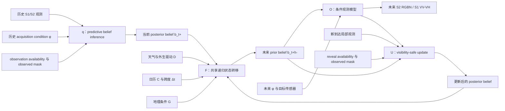

# ObsWorld：遥感世界模型研究与训练总纲

> [!abstract] 文档定位
> 本文是 ObsWorld 后续研究的详细依据。项目始终以完整遥感世界模型为目标：先贯通 `q → F → O → U` 全链条，再逐阶段完成充分训练、机制实验和视觉证据。阶段编号表示学术与系统依赖关系，不表示工期、周次、人员或算力安排。

简明版本见 [ObsWorld 遥感世界模型后续计划](./A02_ObsWorld_遥感世界模型后续计划.md)。本文继承 [07 号主线](./07_ObsWorld主线定稿与实验方案.md)，并根据当前权重、代码和历史结果重新校准。若旧方案与本文冲突，以 [结果真值与限制](../archive/00_START_HERE/RESULT_TRUTH_AND_LIMITATIONS.md)、[Stage2 状态与续研建议](../archive/08_STAGE2_CONTINUATION/STATUS_AND_RECOMMENDATION.md) 和本文为准。

---

## 1. 最终叙事

### 1.1 一句话主线

> 稀疏、云遮挡、多传感器遥感影像不是世界本身，而是持续演化的地表在特定采集条件下形成的局部观测。ObsWorld 从历史观测及其 acquisition condition 推断 predictive belief，在天气、日历和地理条件下递归推进该 belief，在指定未来采集条件下生成未来遥感观测，并在新局部观测到来时校正 belief、继续预测后续未来。

### 1.2 四个核心算子

状态推断：

$$
b_t=q_\theta(X_{\leq t},\phi_{\leq t},a_{\leq t},m^{obs}_{\leq t},\rho^{obs}_{\leq t}).
$$

外生驱动状态转移：

$$
b_{t+h}^{-}=F_\theta\left(b_t^{+},D_{t:t+h},C_{t:t+h},G,\Delta t\right).
$$

条件观测形成：

$$
\widehat X_{t+h}^{(m)}=O_\theta\left(b_{t+h}^{-},\phi_{t+h}^{(m)},m\right).
$$

新观测校正：

$$
b_{t+h}^{+}=U_\theta\left(
b_{t+h}^{-},X_{t+h}^{(m)},\widehat X_{t+h}^{(m)},
\phi_{t+h}^{(m)},a_{t+h}^{(m)},m_{t+h}^{obs,(m)},\rho_{t+h}^{obs,(m)}
\right).
$$

符号含义：

- $X$：S1/S2 等遥感观测；
- $\phi$：传感器、轨道、太阳几何、产品级别等 acquisition condition；
- $a_t^{(m)}$：该时刻、该模态的观测是否真正到达；
- $m_t^{clear,(m)}$：已到达观测中逐像素 clear/valid 区域；
- $m_t^{obs,(m)}=a_t^{(m)}m_t^{clear,(m)}$：模型合法可见的观测 mask；
- $\rho_t^{obs,(m)}=\operatorname{Pool}(m_t^{obs,(m)})$：观测支持度或质量摘要；这里用 $\rho$，避免与状态推断算子 $q_\theta$ 混淆；
- $b_t$：部分观测下的 predictive belief，不宣称唯一真实物理状态；
- $D$：天气等外生驱动；
- $C$：日历和周期条件；
- $G$：静态地理条件；
- $F$：共享递归状态转移；
- $O$：给定目标传感器和采集条件的 observation model；
- $U$：visibility-safe、observation-aligned 的状态更新。

监督 mask 与模型可见 mask 必须分路：$m^{rgb}_{sup}$、$m^{ndvi}_{sup}$ 只进入 loss 和 evaluator；只有已经到达的 $a$、$m^{obs}$、$\rho^{obs}$ 可以进入 $q$、$U$ 和 staleness。未来目标即使存储在 batch 中，只要尚未 reveal，其像素、clear mask、监督 mask 和由它们派生的统计量都不得影响 belief。

### 1.3 输出合同

第一条完整链固定为：

- 主要未来观测输出：Sentinel-2 RGB+NIR，即 RGBN；
- NDVI 由 Red/NIR 确定性派生，不作为唯一观测输出；
- 保留 `O_S1(b, phi_S1) → VV/VH` 接口；
- 第一轮允许 S1 只完成 shape、gradient、checkpoint 与 evaluator 合同；
- S1 的正式动态结果在有对齐观测与公平 baseline 后建立；
- $U$ 必须进入第一轮完整代码链，而不是留作遥远扩展。

### 1.4 世界模型边界

ObsWorld 模拟 supplied forcing 下、EO-observable land-surface evolution。它不声称：

- 从观测恢复唯一真实物理状态；
- 完整 acquisition invariance；
- 严格因果反事实；
- 业务天气预测；
- 完整地球系统模拟；
- 全球 digital twin；
- 通用遥感基础模型的规模或任务覆盖。

“world model”身份来自可执行的状态推断、递归演化、条件观测形成和再观测校正，而不是项目名称。

---

## 2. 论文核心主张

为避免把 `q/F/O/U` 四个字母写成四条松散贡献，建议只保留两个主要主张。

| 编号 | 主张 | 最低可信证据 |
|---|---|---|
| **C1：完整 predictive belief world model** | acquisition-aware 状态推断、外生驱动递归转移和条件 observation model 能共同形成准确、可控、可诊断的开放循环遥感预测 | matched Direct/recursive 主表；state load-bearing；true/no/shuffled forcing；correct/neutral/近同期 paired $\phi$ 与 cross-scene 负对照；RGBN 与 NDVI 轨迹 |
| **C2：再观测校正** | 新的局部、可见遥感观测可以通过 visibility-safe update 校正 belief，并持续改善 reveal 之后的未来预测 | no-update、restart、训练好的 VanillaFilter、matched generic fusion、强 online baseline；day25/day50 paired normalized Gain-AUC；absolute post-reveal error；exact no-evidence identity |

支持性证据包括 S1 云鲁棒、按数据集合法命名的分布外评测、跨传感器、leakage–sufficiency、效率和失败分析。

### 2.1 需要排除的替代解释

1. $q$ 只是普通图像特征，未形成服务未来预测的 belief；
2. $F$ 只是 horizon lookup，递归 rollout 不稳定或不使用天气；
3. $O$ 忽略未来 $\phi$，所谓条件观测只是固定 decoder；
4. $U$ 的收益只是看到了一张新图，而非更好的 latent assimilation；
5. $U$ 只在清晰样本或特定 reveal day 有收益；
6. S1 收益只是因为 baseline 没有 S1；
7. 低 acquisition leakage 来自 representation collapse；
8. 代码测试通过被误写成方法成功。

---

## 3. 完整系统图

核心纪律：

- 预测发生在 belief space，不直接在像素空间绕过 $F$；
- 像素输出是观测出口、训练信号和可视化接口；
- reveal 观测在预测 prior 之后才进入 $U$；
- 未 reveal 的未来观测、$m^{rgb}_{sup}$、$m^{ndvi}_{sup}$ 和任何由评分 mask 派生的 clear fraction 不得进入任何模型输入；
- $O$ 和 $U$ 必须使用一致的传感器、$\phi$ 与 visibility operator。

---

## 4. 当前资产与成熟度

### 4.1 总体判断

ObsWorld 不是“从零开始”，也不是“已经完整成功”。更准确的状态是：

> Stage1/1.5、部分 Stage2、Rollout 和 correction 已有真实代码与权重资产，但真实 $\phi$、conditional renderer、S1 动态接口和正式 correction evaluator 尚未共同形成一个可训练、可复现、可发表的统一 checkpoint。

### 4.2 模块台账

| 部分 | 已有资产 | 当前限制 | 下一步身份 |
|---|---|---|---|
| **Stage1** | 95k ViT-S S1/S2 MAE 权重、训练与加载链 | 只证明观测预训练完成 | $q$ 的初始化 |
| **Stage1.5** | 60k state-bridge 权重；双端 $\phi$、state projector、cross-modal alignment、conditional dual decoder | alignment/reconstruction 改善，但 nonlinear acquisition leakage 未被可信消除 | acquisition-conditioned belief 初始化 |
| **q** | Stage1.5 encoder/state projector；Stage2 context aggregator | Stage2 当前内部构造 neutral S2 $\phi$，真实逐帧 condition 未进入正式状态推断 | 接入真实 $\phi$、valid mask 和 modality |
| **F** | Direct、Rollout、Partition、physical4 driver、20-step 路径和相关测试 | 历史 Rollout 弱于 Direct；存在代码不等于共享动力学有效 | 在 matched protocol 下重建递归主线 |
| **O** | Stage2 RGBN decoder；Stage1.5 S1/S2 conditional dual decoder | Stage2 decoder 当前不读取真实未来 $\phi$；S1 head 未进入 Stage2 | `O_S2(b,φ)` + `O_S1(b,φ)` |
| **U** | `U/no_update/restart/vanilla_filter`、训练 schedule、trainer 接口和基础 evaluator | 没有正式训练结果；当前 evaluator 不是最终 day25/day50 paired normalized Gain-AUC 协议 | 复用现有代码，补齐正式训练和评估 |
| **统一系统** | 大部分组件可组合 | 尚无 q/F/O/U 与真实 $\phi$、统一 checkpoint、正式 evaluator 的共同闭环 | 第一轮贯通目标 |

### 4.3 已恢复权重

[权重索引](../WEIGHTS_INDEX.md) 记录了以下可复现入口：

- Stage1 final：epoch 200 / step 95,000；
- Stage1.5 state bridge：step 60,000；
- `plan_a_s1a_full24/checkpoint_best.pt`（权重索引名 `plan_a_s1a_full24__checkpoint_best.pt`），即该 `plan_a_s1a_full24` run 的 selected/best checkpoint；不在缺少统一 selection provenance 时称其为所有 Plan A run 的 global historical best，也不与 A′ historical best 混写；
- Direct physical4 best；
- Rollout physical4 best。

权重已具有 Release、字节数和 SHA-256。后续所有初始化必须记录权重身份，不能用 B4/TerraState 等不相干权重冒充 Stage1.5 或 ObsWorld 初始化。

### 4.4 当前结果边界

| 路线 | OOD-t $R^2$ | RMSE | 解释 |
|---|---:|---:|---|
| Direct physical4 | 0.52430 | 0.17776 | 历史可加载 baseline |
| Rollout physical4 | 0.50388 | 0.18390 | 历史递归 baseline，当前弱于 Direct |
| A′ 历史最好 | 0.55452 | 0.16877 | 旧最好结果，仍弱于后续 B4 参照 |
| B4 参照 | 0.58252 | 0.14342 | 精度参照，不属于完整 ObsWorld |

这些结果不能被写成完整 q/F/O/U 世界模型结果，只能作为下一轮 matched baselines 和 warm-start 资产。

### 4.5 Stage1.5 的正确解释

现有结果支持：

- 30k 到 60k 的 cross-modal alignment 改善；
- S2 reconstruction 改善；
- 线性 cross-covariance 正则保持低位。

但旧 nonlinear probe 协议自身也存在 neutral $\phi$、随机 projector、token 处理、空间泄漏和 metadata-only 对照不足等问题。因此最稳妥结论是：

> nonlinear acquisition leakage 尚未得到可信消除证明。

后续必须同时测 leakage 与 sufficiency，防止通过常数状态获得“完美不变性”。

### 4.6 当前代码的关键事实

- [Stage2 core](../models/dynamics/obsworld_core.py) 当前明确使用 neutral S2 $\phi$；
- [当前 observation decoder](../models/decoders/earthnet_observation_decoder.py) 接收 state tokens，但不接未来 $\phi$；
- [Correction wrapper](../models/dynamics/obsworld_correction.py) 已实现 predict-before-update；
- [U 与 VanillaFilter](../models/dynamics/observation_correction.py) 已有 visibility-aware 接口；
- [Correction evaluator](../eval/eval_observation_correction.py) 已存在，但正式论文协议仍需重构；
- 当前第一轮不是从零重写全部模块，而是把已有资产整理为真实 $\phi$、conditional $O$、S1 接口、正式 $U$ 评估和统一 checkpoint 的完整系统。

---

## 5. 总体实施原则：先贯通，再做深

### 5.1 第一轮：全链条工程闭环

目标不是论文数字，而是证明：

- 统一数据字段和 mask 能正确流动；
- $q/F/O/U$ 均能 forward/backward；
- S2 RGBN 能在每个 horizon 输出；
- 同一 belief 在不同未来 $\phi$ 下可解码；
- 新观测能形成 prior-to-posterior 更新并改变后续预测；
- S1 renderer 接口存在；
- checkpoint、resume、evaluator 和图表导出完整；
- 不存在未来观测、未来评分 mask 或未 reveal 信息泄漏。

每个阶段先运行少量 step，只用于发现数据、梯度、mask、接口和 checkpoint 问题。少量 step 不构成科学证据。

### 5.2 第二轮：逐阶段科学闭环

完整代码链形成后，逐步证明：

1. $q$ 的 state sufficiency 与 acquisition leakage–sufficiency 权衡；
2. $F$ 的开放循环能力、外生驱动使用和递归稳定性；
3. $O$ 对真实未来 $\phi$ 的条件控制；
4. $U$ 相对强在线同化 baseline 的增量；
5. S1 对云遮、缺测和跨模态的真实贡献；
6. 整个系统在 raw IID/OOD、独立压力轨道、已核验 Green chopped track 和第二数据设置下的外部有效性。

### 5.3 两轮关系

| 第一轮回答 | 第二轮回答 |
|---|---|
| 系统是否存在并能运行 | 方法是否有效 |
| 数据和 mask 是否正确 | 主张是否被证据支持 |
| 每个模块是否有梯度 | 每个模块是否必要 |
| checkpoint 是否完整 | 唯一 checkpoint 是否可复现主结果 |
| evaluator 是否能产出文件 | 指标和统计是否足以说服审稿人 |

---

## 6. 第一轮：完整代码链贯通

### 6.1 P0：冻结统一数据合同

统一样本至少包含：

| 类别 | 字段 |
|---|---|
| 历史观测 | `X_history`、`sensor_id`、`timestamps` |
| acquisition | `phi_history`、`phi_valid`、`target_phi`、`target_modality`；若启用 product-control，再加入 `product_level`、`product_valid` |
| 模型可见性 | `observation_availability` ($a$)、`observed_clear_mask` ($m_obs$)、`observation_support` ($rho_obs$)、`history_staleness` |
| 动力学 | `drivers`、`driver_valid`、`calendar`、`geo`、`delta_t` |
| 未来监督 | `target_rgbn`、`m_rgb_sup`、`m_ndvi_sup`、`target_s1` 与其监督 mask（可缺） |
| 校正 | `reveal_observation`、`reveal_phi`、`reveal_availability`、`reveal_observed_mask`、`reveal_support`、`reveal_schedule` |
| 身份 | `sample_id`、`location_id`、`split`、`dataset_name` |

验收：

- schema 和 manifest 可序列化；
- 缺字段通过 validity mask 表达，不以假值冒充真值；
- $m_{obs}=a\,m_{clear}$，$\rho_{obs}=\operatorname{Pool}(m_{obs})$；字段名中的 `rho_obs` 不是状态推断算子 $q_\theta$；
- `m_rgb_sup`/`m_ndvi_sup` 与 model-visible mask 分路，前者只用于 loss/evaluator；
- reveal 前后的可见性严格区分；
- 未 reveal 未来监督 mask、clear fraction 和 availability 派生量对 belief 做 invariance test；
- 训练、validation 和 OOD 的统计量只从合法 split 计算；
- 每个样本可追溯到原始文件和派生字段规则。

必须隔离两条协议：

- raw EarthNet2021x：用于 RGBN open-loop 和统一系统开发；正式目录名为 IID/OOD，Extreme/Seasonal 只作补充压力诊断；
- GreenEarthNet chopped：作为独立 NDVI 对标轨道；当前 formal anchor 是已经建成并核验 evaluator 的 `ood-t_chopped`，只有对应数据、manifest 和 evaluator parity 都存在后才增加 `ood-s_chopped`/`ood-st_chopped`。

二者的 split、mask、scorer 和结果表不能混写。

### 6.2 P1：真实 acquisition condition 进入 q

改造目标：

- `encode_observations` 接受 per-frame $\phi$、$\phi$ validity 和 modality；
- 不再在 Stage2 内部强制构造 neutral S2 $\phi$；
- 支持 correct、neutral、matched-pair swapped 与 cross-scene wrong $\phi$，但由 evaluator 区分证据等级；
- 缺失字段使用显式 fallback 与 mask；
- 保留 Stage1.5 兼容加载路径。

若把“同 acquisition、不同 product level”纳入 RQ2，必须先在本阶段实现并冻结 `product_level/product_valid`、L1C/L2A normalization 与 band mapping、product embedding，以及 correct/swapped-product evaluator；任一项缺失时，该实验从核心证据中删除，只保留 near-simultaneous acquisition pair。

少量 step 验收：

- correct/neutral/matched-pair/cross-scene-control 路径均可运行；
- 真实 $\phi$ 路径有梯度；
- 缺失 $\phi$ 不产生 NaN 或隐式零值歧义；
- condition 分支梯度/Jacobian 与 paired 差异可导出；零初始化时先以 tiny-overfit controllability 验收，不要求未训练模型立刻出现语义变化；
- checkpoint round-trip 后结果一致。

数据限制必须记录：EarthNet 当前未必具有与 Stage1.5 完全同构的逐帧 acquisition metadata。由时间与位置推算的太阳几何必须标为 derived ephemeris；强 conditional-rendering 证据还应来自 metadata 更完整的 SSL4EO 配对样本或后续第二数据。

### 6.3 P2：贯通递归 F

复用现有 shared transition，支持：

- 单步与多步 rollout；
- 1/2/4/20 等不同 rollout 长度；
- 全 horizon 监督；
- time-aligned physical drivers；
- 中途 weather switch；
- Direct matched baseline；
- 不允许 context 或 future target 绕过 $b_{t+h}$ 直接提高精度。

少量 step 验收：

- 同一组参数被重复调用；
- belief、driver 和输出路径均有梯度；
- driver 分支具有非零梯度/Jacobian，并能在固定 tiny batch 上学会区分 true 与 shuffled/time-shifted driver；
- 未 reveal 的未来观测不影响 rollout；
- 保存/恢复后整个 trajectory 一致。

若 driver/condition 调制层采用零初始化，初始输出相同是允许的；第一轮工程门是梯度连通和 tiny-overfit controllability，不是在未经训练时要求语义响应。

### 6.4 P3：建成 conditional O

主要接口：

$$
O_{S2}(b,\phi_{S2})\rightarrow RGBN,
\qquad
O_{S1}(b,\phi_{S1})\rightarrow VV/VH.
$$

具体改造：

- S2 以 RGBN 为主输出；
- LightDecoder 或等价 decoder 用 FiLM/cross-attention 接入 target $\phi$；
- target-modality router 明确区分 S1/S2；
- NDVI 从 Red/NIR 派生；
- S1 接口在无 target 时可通过 validity mask 跳过 loss；
- correct、neutral、matched-pair 与 cross-scene-control $\phi$ 均能形成输出，并由 evaluator 保留证据等级。

少量 step 验收：

- S2/S1 shape、范围和 mask 正确；
- 同一 belief 在不同 $\phi$ 下的调用与缓存合同正确；
- $\phi$ 路径具有非零梯度/Jacobian，并能在固定 tiny pair 上过拟合 correct/swapped condition 的目标差异；
- RGBN 到 NDVI 的确定性派生一致；
- checkpoint round-trip 通过。

零初始化 FiLM 可能让不同 $\phi$ 在最初 forward 中输出相同；这不构成失败，也不能被当作条件控制成功。语义 controllability 只在 tiny-overfit 后和正式训练后判断。

### 6.5 P4：将 acquisition 与 visibility 接入 U

U 必须比较同一 observation operator 下的 predicted observation 与 revealed observation：

$$
r_{t+h}=E_{obs}(X_{t+h},\phi_{t+h},m^{obs}_{t+h})-
E_{obs}(\widehat X_{t+h},\phi_{t+h},m^{obs}_{t+h}).
$$

更新候选：

$$
b_{t+h}^{+}=b_{t+h}^{-}+g\odot\Delta b(r_{t+h},b_{t+h}^{-},\phi,m^{obs},\rho^{obs}).
$$

必须保留：

- predict-before-update；
- exact no-evidence identity；
- visibility-weighted residual；
- no-update、restart、VanillaFilter、generic fusion 和 learned U 五种策略；
- observation 与 prediction 使用相同 $\phi$ 和 footprint；
- 无有效像素时 posterior 严格等于 prior。

当前 `VanillaFilter` 也显式使用 observation-minus-prediction residual，应准确称为“ungated additive residual filter”；它与 learned U 的比较主要检验结构化 gate 与 factorization。另设的 generic-fusion baseline 不显式做 residual subtraction，才用于检验 observation-aligned residual 这一设计本身是否必要。

少量 step 验收：

- correction quality $q_{corr}=0$ 或 reveal support 为 0 时严格 no-op；
- 只有 reveal 后的 rollout 会被改变；
- 未 reveal supervision mask 不影响 posterior；
- partial support 的更新仅作用于合法区域；
- U、F、O 的冻结/梯度策略符合配置；
- 多种策略可由同一 evaluator 调用。

### 6.6 P5：统一训练 runner 与 checkpoint

统一 runner 至少支持：

- no-reveal open-loop；
- exactly-one-reveal；
- 可配置 reveal day；
- q/F/O/U 的 optimizer groups；
- staged freezing 和受控 joint fine-tuning；
- 全组件 checkpoint；
- optimizer、scheduler、random state 和数据进度恢复；
- deterministic validation export。

少量 step 验收：

- loss 有限且能下降；
- 每个模块梯度符合冻结策略；
- DDP 无意外 unused trainable parameters；
- checkpoint 保存/恢复后预测一致；
- resume 不重置关键 schedule；
- 输出包含模型、数据和协议身份。

### 6.7 P6：统一 evaluator 与图表导出

必须产出：

- per-cube prediction metrics；
- horizon curves；
- day25/day50 correction metrics；
- paired geographic-cluster bootstrap；
- RGBN/NDVI prediction arrays；
- prior/posterior belief trace；
- conditional rendering grids；
- fixed sample manifest；
- no-leakage invariance checks。

第一轮完成标准不是高分，而是上述文件能够在同一 tiny checkpoint 上全部生成并通过结构检查。

---

## 7. 第二轮：完整训练

### 7.1 T1：q + O acquisition-conditioned observation pretraining

**主要数据**：SSL4EO S1/S2 近同期、多季节配对。

**初始化**：

- canonical q/O 分支从 Stage1.5 60k 初始化，迁移 encoder、condition encoder 和 state projector；
- observation bridge 固定选择现有 `StateReconstructionBridge(256→384)`，把 belief 投到 Stage1.5 decoder space；
- `O_S2` 使用与 Stage1.5 S2 `LightDecoder` 兼容的 384→192 trunk（相同 16×16 token grid、depth 4、6 heads），加载 S2 分支的 `decoder_embed`、position embedding、decoder blocks、FiLM 和 norm；S1/S2 两个 decoder 本来相互独立，不称 shared trunk；
- Stage1.5 S2 输出层是 12 bands、256 px/patch16，而动态链是 RGBN 4 bands、128 px/patch8；因此 `decoder_pred` 不加载，显式新建 `192→4×8×8` RGBN head，输出顺序冻结为 Blue/Green/Red/NIR；
- Stage1 95k 只作为 matched initialization baseline，使用相同的新 RGBN head、数据和训练预算；不得与 Stage1.5 60k 同时加载进 canonical 分支后再把收益归因给任一权重；
- S1 VV/VH head 保持为独立 renderer 接口，不与 4-channel S2 head 混权重；
- 新增条件层采用可审计的兼容初始化；
- 不依赖当前仓库无法审计的 Stage1.8 外部声明。

**目标**：

$$
\mathcal L_{qO}=
\mathcal L_{S2-rec}
+\lambda_{S1}\mathcal L_{S1-rec}
+\lambda_{align}\mathcal L_{cross-modal}
+\lambda_{suff}\mathcal L_{sufficiency}
+\lambda_{nuis}\mathcal L_{nonlinear-nuisance}.
$$

候选 nonlinear nuisance 机制可以包括 adversarial/GRL、HSIC 或条件独立正则，但最终只保留形成稳定 leakage–sufficiency Pareto 的简洁版本。

**必须比较**：

- Stage1；
- Stage1.5 60k；
- 新 q/O；
- `-phi`；
- `-alignment`；
- `-state bridge`；
- `-nonlinear nuisance`；
- collapse control。

**评估**：fixed linear、MLP、kNN leakage probe；reconstruction；cross-modal retrieval/alignment；correct/neutral/near-simultaneous paired $\phi$ 与 cross-scene negative control；重新编码后的 state consistency。

若 leakage 仍明显，项目继续推进，但状态统一称 acquisition-conditioned predictive belief，不称 acquisition-invariant physical state。

### 7.2 T2：q → F → O 开放循环训练

**主要数据**：EarthNet2021x raw RGBN；GreenEarthNet chopped 作为独立 NDVI 对标。

**训练逻辑**：

1. 加载 T1 的 q/O；
2. 首先冻结或低学习率微调 q/O，训练 F；
3. 所有预测 horizon 接受监督；
4. Direct 与 Rollout 使用相同初始化、输入、target density 和 observation decoder；
5. F 稳定后进行受控联合微调；
6. checkpoint 只由 development/validation 决定；
7. 唯一 checkpoint 冻结后再运行 OOD。

**损失**：

$$
\mathcal L_{open}^{core}=
\lambda_{rgbn}\mathcal L_{RGBN}
+\lambda_{ndvi}\mathcal L_{NDVI}
+\lambda_{sam}\mathcal L_{SAM}.
$$

RGBN masked loss 是默认主要监督，NDVI 是由 Red/NIR 派生的结构约束；SAM 只在 band definition、归一化和 valid-pixel 口径一致时启用。其余候选项不默认进入 core loss：

- `composition` 只有在同一初始 belief、同一 time-aligned driver、同一端点存在 direct 与 segmented 两条明确定义路径时才启用，并同时检查 factual endpoint，不能只压低 latent distance；
- `driver` 的 primary 证据来自 true/no/shuffled/time-shifted 的冻结评测，不把“输出必须变化”默认写成训练 loss；只有定义了受控 target、符号和尺度后，才能加入额外 calibration loss；
- `state` 在没有明确 target、target encoder、stop-gradient/moving-target 规则和 leakage 边界前排除；不能用当前模型自己移动的 latent 充当未定义真值；
- 任何辅助项都不得建立绕过 $b_{t+h}$ 的精度旁路。

**核心比较**：Persistence、Climatology、Direct、Rollout、一个强时空预测 baseline、不同 q 初始化。

### 7.3 T3：U observation correction 训练

从 T2 唯一 open-loop checkpoint 初始化。

#### 第一步：U-only

- 冻结 q/F/O；
- 只训练 U；
- batch 固定为 50% no-reveal、50% exactly-one-reveal；
- 对长度为 $H$ 的 active rollout，以 zero-based index 定义合法集合 $\mathcal R(H)=\{r:2\leq r\leq\min(15,H-2)\}$；full-20 时即 index 2–15，前两步保留形成 prior，index 15 后仍保留四个受监督 horizon；
- exactly-one-reveal 从 $\mathcal R(H)$ 均匀采样，并与该帧 clear fraction 独立；无有效支持的抽样自然成为 exact no-op 样本；若 curriculum prefix 使 $\mathcal R(H)$ 为空，则该 batch 退化为 no-reveal，不伪造无 post-reveal supervision 的更新；
- day25/day50 只作为固定正式评测位置，不反向决定训练采样；
- reveal 后的未来预测 loss 才监督 U；
- 不以 reveal 当前帧的 posterior reconstruction 作为主要目标；
- no-update 使用同一 checkpoint 关闭 reveal；
- VanillaFilter 必须单独合理训练，不能使用随机初始化充当弱基线；
- 另训练 matched generic-fusion baseline：输入 prior state、分开的 $z_{obs}=E_{obs}(X,\phi,m^{obs})$ 与 $\operatorname{stopgrad}(z_{pred})=\operatorname{stopgrad}(E_{obs}(\widehat X,\phi,m^{obs}))$、support、staleness 和 reveal flag，但不显式构造 subtraction；
- generic fusion 与 U 共用同一 $E_{obs}/O$、encoder forward 数、reveal schedule、forecast loss、训练样本、seed 和 checkpoint selection，并同样满足 exact no-evidence identity；update-cell 参数量控制在 U 的 ±5%，update-only FLOPs 控制在 ±10%，超出时另报非匹配版本而不用于归因。

#### 第二步：受控联合微调

只有 U-only 稳定后，才允许对 F/O 使用较低学习率联合微调。必须监控：

- open-loop 能力是否退化；
- correction gain 是否来自过强 update；
- posterior 是否在低 support 下漂移；
- no-evidence identity 是否仍严格成立。

### 7.4 T4：S1 与云鲁棒扩展

科学问题是：

> 当 S2 历史被云遮或缺测时，S1 是否帮助维持 predictive belief 和未来观测预测？

需要：

- S1 时间与 footprint 对齐；
- S1-equipped Direct baseline；
- S1 persistence 或等价简单基线；
- optical-only、S1-assisted、`-SSL4EO`、`-phi` 消融；
- cloud ratio、valid frames、longest gap、missing modality 分层；
- 可选 `O_S1` 的 VV/VH 预测；
- S1/S2 belief consistency。

只有相对公平的 S1-equipped baseline 仍有收益，才能主张多模态云鲁棒优势。

### 7.5 T5：第二数据与 TIP 强化

TIP 条件路线需要：

- 多光谱未来观测成为论文主体；
- 至少第二个独立数据设置；
- RGBN 报 per-band error、SAM、ERGAS，并在定义一致时报告 PSNR/SSIM；LPIPS 只作用于固定 RGB composite，不直接用于四通道张量；
- RGBN GT/Prediction/Error；
- S1/S2 conditional rendering；
- 图像形成或多维信号预测上的实质方法贡献；
- 完整效率与可复现性分析。

第二数据只应在主链 q/F/O/U 已贯通后接入，避免用多数据集掩盖核心链未成立。

---

## 8. 科学问题与实验合同

| RQ | 核心问题 | 主要对照 | 决定性指标 | 成功边界 |
|---|---|---|---|---|
| **RQ1** | 能否稳定 open-loop rollout | Persistence、Climatology、Direct、强时空 baseline | RGBN/NDVI、horizon curve、OOD | Rollout 相对 matched Direct 不发生实质性崩溃 |
| **RQ2** | O 是否真的受 $\phi$ 控制 | correct、neutral、近同期同地点 paired $\phi$、cross-scene wrong $\phi$ 负对照 | reconstruction、SAM、state re-encoding consistency | correct $\phi$ 更合理，变化不是任意噪声 |
| **RQ3** | 新观测是否改善后续预测 | no-update、restart、trained VanillaFilter、generic fusion、强 online baseline | paired normalized Gain-AUC、absolute post-reveal error | 同时优于强基线，且不是仅清晰样本收益 |
| **RQ4** | 模型是否使用 time-aligned forcing | true/no/shuffled/time-shifted weather | 误差、响应轨迹 | correct-time 优于错误时间；只声称 driver use |
| **RQ5** | belief 是否承载预测 | state removal、不同 q 初始化 | $\Delta$performance、state movement、rank | 状态路径 load-bearing 且非坍塌 |
| **RQ6** | 多模态是否带来云鲁棒 | optical-only、S1-equipped baselines | cloud/gap 曲线 | 对公平 S1 baseline 仍有稳定收益 |
| **RQ7** | 是否跨分布泛化 | raw：IID/OOD + Extreme/Seasonal stress；Green：已核验 chopped tracks；cross-sensor | 各合法 track 指标与 CI | 核心能力不局限单一 split，且不混写命名 |
| **RQ8** | 新模块代价是否合理 | matched systems | 参数、FLOPs、显存、延迟 | conditional O/U 的收益与增量相称 |

### 8.1 RQ1：开放循环

**公平条件**：

- Direct 与 Rollout 使用相同 q、O、driver、target horizon 和训练样本；
- 输出同为 RGBN，NDVI 统一派生；
- 不能让 Direct 看到更多 target density；
- 同一 validation 规则选择 checkpoint；
- 报逐 horizon 而不只报一个 endpoint。

**失败解释**：若 Rollout 明显弱于 Direct，保留完整系统代码，但不能声称共享递归动力学有效；应检查 transition parameterization、teacher forcing/curriculum、state bottleneck 和 loss balance。

### 8.2 RQ2：条件观测形成

必须测试：

- correct $\phi$；
- neutral $\phi$；
- 同一次 acquisition 的不同产品/处理条件配对（仅在 P0/P1 的 product-control 字段、归一化、embedding 与 evaluator 全部实现后启用）；
- same-location、near-simultaneous paired $\phi$，并在运行前冻结最大时间间隔和 surface-stability filtering；
- cross-scene wrong $\phi$，只作为条件通路负对照，不作为物理正确性的真值；
- target modality S2/S1；
- 相同 belief 下的 condition interpolation。

不同日期即使地点相同也可能对应真实地表变化，因此未通过时间间隔和稳定性筛选的 “same-scene swap” 不能作为正确/错误 $\phi$ 的决定性证据。EarthNet 由时间与位置推导的 ephemeris 只提供弱条件证据；强证据优先来自 metadata 完整的 acquisition/product pair。指标同时覆盖 pixel/spectral reconstruction、条件识别、重新编码 state consistency 和 collapse control。只看 PSNR 不能证明 $\phi$ 控制。

### 8.3 RQ3：再观测校正正式协议

正式协议固定：

- 所有合法 cube；
- 5-day step 协议下，day25/day50 分别对应第 5/10 个 forecast step，即 zero-based array index 4/9；
- same-cube/same-seed 配对；
- no-reveal self-gain；
- paired geographic-tile bootstrap；
- absolute post-reveal error 与相对 gain 同时报；
- clear-fraction strata 只做稳定性分析；
- correction quality $q_{corr}=0$ 时 exact identity；
- unrevealed supervision-mask invariance；
- prior 在读取 reveal 前生成；
- reveal 当前时刻重建不作为主要 gain。

对照：

1. no-update；
2. restart；
3. trained VanillaFilter（ungated additive residual）；
4. matched generic fusion（无显式 residual subtraction）；
5. learned U；
6. 强 online 时序 baseline。

主要统计：

- post-reveal MAE/RMSE；
- normalized Gain-AUC（等间隔 future steps 上的平均 gain）；
- gain vs horizon after reveal；
- posterior update magnitude；
- gate/support relation；
- failure rate；
- clear support strata；
- long-gap strata。

令 $r\in\{5,10\}$ 为 1-based reveal step，$k>r$ 为其后的预测 step，$\ell$ 为同一合法像素上的冻结误差。对 cube $i$ 和方法 $m$ 定义：

$$
g_{i,k}^{m,r}=\ell\!\left(y_{i,k},\widehat y_{i,k}^{m,no\mbox{-}reveal}\right)
-\ell\!\left(y_{i,k},\widehat y_{i,k}^{m,reveal@r}\right),
\qquad
G_i^{m,r}=\frac{1}{|\mathcal K_r|}\sum_{k\in\mathcal K_r}g_{i,k}^{m,r}.
$$

两个 reveal day 的 co-primary 汇总在 cube 内等权：

$$
\overline G_i^m=\frac{1}{2}\left(G_i^{m,5}+G_i^{m,10}\right),
\qquad
\Delta\overline G_i^{m-b}=\overline G_i^m-\overline G_i^b.
$$

U 的 co-primary baselines 冻结为 trained VanillaFilter、matched generic fusion 和强 online temporal baseline；no-update/restart 作为必要但 secondary 的参照。主检验对 $\Delta\overline G_i^{U-b}$ 做同 cube、同 seed、geographic-tile paired cluster bootstrap，并对三个 co-primary 比较使用 Holm 控制 family-wise error；day25/day50 分项作为预注册 secondary endpoints 始终报告。不能通过比较两条独立 CI 是否重叠来判断方法差异；同时必须报告各方法的 absolute post-reveal MAE/RMSE，避免低质量方法靠更差 no-reveal 起点获得虚高 gain。

如果 U 不优于 VanillaFilter，结构化 gate/factorization 的新意不成立；如果不优于 generic fusion，显式 observation-aligned residual 的必要性不成立；如果不优于强 online baseline，latent assimilation 优势不成立。

### 8.4 RQ4：外生驱动使用

对固定 history、geo 和 horizon，比较：

- true weather；
- no weather；
- shuffled weather；
- time-shifted weather；
- matched donor weather。

只要没有受控因果真值，结果统一称 forcing-use fidelity 或 time-aligned driver use，不称 causal effect。

### 8.5 RQ5：belief 承载与 leakage–sufficiency

联合报告：

- full vs state removed；
- belief variance、movement 和 effective rank；
- linear/MLP/kNN acquisition probe；
- reconstruction/cross-modal sufficiency；
- Stage1、Stage1.5、新 q、collapse control；
- q 初始化对 open-loop 和 correction 的影响。

最关键图是 leakage–sufficiency Pareto，而不是单个低 nuisance 数值。

---

## 9. 方法消融

### 9.1 q / O 消融

- Stage1 init；
- Stage1.5 init；
- new q/O init；
- `-phi`；
- `-cross-modal alignment`；
- `-state bridge`；
- `-nonlinear nuisance`；
- concatenation vs FiLM/cross-attention；
- RGBN decoder without conditional input；
- collapse control。

### 9.2 F 消融

- Direct；
- Rollout；
- Rollout without driver；
- shuffled/time-shifted driver；
- no calendar；
- no geographic condition；
- one-step shared vs variable-span transition；
- all-horizon vs endpoint-only supervision；
- with/without composition consistency。

### 9.3 U 消融

- no-update；
- restart；
- trained VanillaFilter；
- matched generic fusion；
- learned U；
- U without predicted-observation residual；
- U without $\phi$；
- U without visibility mask；
- U without exact no-evidence constraint；
- U-only vs controlled joint fine-tuning。

### 9.4 简洁性检查

需要比较完整 ObsWorld 与更简单替代：

- direct pixel predictor；
- q/F/O without U；
- latent restart；
- parameter-matched wider Direct；
- fixed decoder without $\phi$；
- fixed alpha blend or VanillaFilter。

若简单系统达到同样的 open-loop、conditional control 和 correction 能力，应优先简化方法，而不是保留装饰性模块。

---

## 10. 图表合同

### 10.1 Figure 1：完整 q → F → O → U

图中同时画：

- history observation、$\phi$ 与 visibility；
- current predictive belief；
- forcing-driven rollout；
- conditional S2/S1 observation model；
- reveal 前 prior；
- observation-aligned residual；
- reveal 后 posterior；
- posterior 继续 rollout。

每个 RQ 在图中标出对应干预点，避免只画网络模块。

### 10.2 Figure 2：开放循环预测轨迹

每个案例展示：

- 历史 RGBN 与 cloud/availability；
- future weather；
- $h\in\{1,5,10,20\}$ 个 5-day step（对应 day5/day25/day50/day100）的 GT；
- Persistence；
- Direct；
- ObsWorld；
- absolute error；
- derived NDVI trajectory。

固定选择普通、重云、长缺测、强变化和失败案例。

### 10.3 Figure 3：acquisition-conditioned rendering

固定同一 belief，改变：

- correct future $\phi$；
- neutral $\phi$；
- 通过最大时间间隔与稳定性筛选的 same-location paired $\phi$；
- cross-scene wrong $\phi$ 负对照；
- S1/S2 target modality。

同时展示图像、光谱差异和重新编码后的 belief consistency，证明输出变化不是任意噪声。

### 10.4 Figure 4：observation correction

时间轴展示：

- reveal 前 prior；
- 新观测与 clear mask；
- posterior belief change；
- no-update、VanillaFilter、generic fusion、强 online baseline 和 ObsWorld 的后续轨迹；
- day25/day50 paired gain curve；
- low-support failure。

### 10.5 Figure 5：S1 云鲁棒

- optical-only 与 S1-assisted 的预测图；
- cloud ratio、valid frames 和 longest gap 曲线；
- 是否存在高云量 crossover；
- S1-equipped baseline；
- 时空错配和失败案例。

### 10.6 Figure 6：能力边界与失败

至少包括：

- $\phi$ 几乎不起作用；
- U 更新过强；
- 低 clear support 下无收益；
- 长期 rollout 漂移；
- S1/S2 时空不匹配；
- state leakage 较低但 sufficiency 同时下降。

### 10.7 主表

| 表 | 内容 | 支持主张 |
|---|---|---|
| **Table 1** | 同协议 open-loop 主表 | C1 factual foundation |
| **Table 2** | $\phi$ controllability 与 leakage–sufficiency | C1 observation model |
| **Table 3** | day25/day50 correction | C2 |
| **Table 4** | q/F/O/U 组件和初始化消融 | C1/C2 isolation |
| **Table 5** | 云、缺测、跨传感器和第二数据 | 支持性泛化 |
| **Table 6** | 参数、FLOPs、显存、延迟 | 简洁性与代价 |

### 10.8 定性样本规则

保存 sample manifest：

- sample/cube ID；
- split；
- land cover；
- cloud ratio；
- valid frames；
- longest gap；
- reveal day；
- clear support；
- checkpoint SHA；
- 选择原因和失败标签。

代表性案例按元数据选，不先看模型误差；机制案例按全量 effect 的中位、分位和失败区间机械选择。所有模型使用相同 crop、mask、horizon 和色标。

---

## 11. Venue 定位

### 11.1 ICLR / NeurIPS 主线

这是完整 belief-state world model、partial-observation update 和机制证据的自然主线。必须让新意落在：

> observation-aligned、visibility-safe 的 belief correction，以及支撑该更新的完整 q/F/O/U 系统。

硬条件：

- open-loop 不显著崩溃；
- conditional $O$ 确实受 $\phi$ 控制；
- U 优于强基线；
- state load-bearing；
- forcing-use 与数据集特定的合法 OOD/压力轨道结果完整；
- 方法价值能抽象到一般部分观测世界模型。

### 11.2 CVPR / ICCV 条件路线

当 conditional multispectral rendering、跨传感器预测和视觉结果足够强时适配。不能只靠漂亮图片；仍需 belief、condition control 和 correction 证据。

### 11.3 TIP 条件路线

需要：

- RGBN/S1 图像预测成为主体；
- 第二数据设置；
- 完整图像、光谱与感知指标；
- conditional observation formation 上的实质方法贡献；
- GT/Prediction/Error 和 cross-render 视觉证据；
- correction 对图像序列的稳定增益。

### 11.4 TGRS / ISPRS JPRS 后备

如果方法一般性不足以支撑顶会，但 EO 实证、跨传感器、云鲁棒、OOD 和完整系统证据充分，可作为遥感期刊后备。

---

## 12. 成败边界

| 结果 | 正确处理 |
|---|---|
| nonlinear leakage 未消除 | 继续世界模型，但统一称 acquisition-conditioned predictive belief |
| Rollout 明显弱于 Direct | 保留系统链，重做 transition/loss/curriculum，不宣称递归动力学成功 |
| $\phi$ 替换没有可解释响应 | conditional observation claim 不成立 |
| U 不优于 VanillaFilter | 结构化 gate/factorization 新意不成立 |
| U 不优于 generic fusion | 显式 observation-aligned residual 的必要性不成立 |
| U 不优于强 online baseline | latent assimilation 优势不成立 |
| S1 只赢 optical-only、不赢 S1 baseline | 不得声称多模态云鲁棒优势 |
| 第二数据不复现 | 明确外部有效性限制 |
| RGBN 好但 belief/Q2/U 不成立 | 只能是条件图像预测，不能支撑完整世界模型 |

### 12.1 禁止主张

- Stage1.5 已得到完整成像不变的物理状态；
- 低 cross-covariance 证明 nonlinear disentanglement；
- 多训练自然消除 $\phi$ leakage；
- 当前 Stage2 已使用真实未来 $\phi$；
- 当前 observation decoder 已实现可控条件渲染；
- Rollout 已优于 Direct；
- U 接口存在等于 correction 有效；
- S1 云鲁棒 crossover 已成立；
- smoke、unit test 或少量 step 是论文结果；
- supplied weather replacement 是因果反事实；
- 通用基础模型、digital twin 或完整地球模拟。

---

## 13. 总任务清单

### 13.1 第一轮：系统贯通

- [ ] 统一数据 schema、manifest 和 mask 视图
- [ ] 真实逐帧 $\phi$ 进入 q
- [ ] shared F 完整多步 rollout
- [ ] conditional `O_S2` 输出 RGBN
- [ ] `O_S1` VV/VH 接口
- [ ] $\phi$ 与 visibility 进入 U
- [ ] no-update/restart/VanillaFilter/generic fusion/U 同一接口
- [ ] no-reveal 与 single-reveal 训练链
- [ ] 全组件 checkpoint 与 resume
- [ ] 统一 evaluator、per-cube JSON、预测数组和 sample manifest
- [ ] 未来信息与评分 mask 泄漏检查

### 13.2 第二轮：科学证据

- [ ] q/O leakage–sufficiency 与 conditional rendering
- [ ] matched Direct vs Rollout open-loop
- [ ] true/no/shuffled/time-shifted forcing
- [ ] state load-bearing 与非坍塌
- [ ] day25/day50 correction 正式协议
- [ ] U vs trained VanillaFilter、generic fusion 与强 online baseline
- [ ] S1-equipped 云鲁棒公平比较
- [ ] raw EarthNet2021x 的 IID/OOD 与 Extreme/Seasonal stress 分栏报告
- [ ] GreenEarthNet 仅评已具备数据、manifest 与 evaluator parity 的 chopped tracks
- [ ] 第二数据设置
- [ ] RGBN/S1 图像与光谱指标
- [ ] q/F/O/U 方法消融
- [ ] 事实预测、condition swap、correction、云鲁棒和失败图
- [ ] 参数与效率统计

---

## 14. 关联资料

- [07：ObsWorld 主线定稿与实验方案](./07_ObsWorld主线定稿与实验方案.md)
- [30：ObsWorld 架构、实验与训练总纲](<./30 ObsWorld 总纲：架构、实验与训练设计.md>)
- [50：整体框架与 Stage2 完成度审计](./50_ObsWorld整体框架与Stage2完成度审计_20260716.md)
- [63：U 与正式评估闭环](./63_ObsWorld_U与正式评估闭环_概念代码审查指标协议与执行指南_20260718.md)
- [65：Stage2 状态同步与代码缺口](./65_ObsWorld_Stage2_状态同步_代码缺口与后续实验决策_20260718.md)
- [73：统一世界模型、S1 云鲁棒与 venue](./73_ObsWorld统一世界模型设计_S1云鲁棒_后续venue_20260722.md)
- [85：A′ 静态审计与精度修复](./85_方案A撇_静态审计_精度对齐修复方案_plan-a-vits_20260723.md)
- [Continuation Narrative](../archive/00_START_HERE/CONTINUATION_NARRATIVE.md)
- [结果真值与限制](../archive/00_START_HERE/RESULT_TRUTH_AND_LIMITATIONS.md)
- [Stage2 状态与续研建议](../archive/08_STAGE2_CONTINUATION/STATUS_AND_RECOMMENDATION.md)
- [Stage2 正式历史结果](../archive/08_STAGE2_CONTINUATION/04_KEY_RESULTS/README.md)
- [权重索引](../WEIGHTS_INDEX.md)
- [Stage2 core](../models/dynamics/obsworld_core.py)
- [Correction wrapper](../models/dynamics/obsworld_correction.py)
- [U 与 VanillaFilter](../models/dynamics/observation_correction.py)
- [Observation decoder](../models/decoders/earthnet_observation_decoder.py)
- [Correction evaluator](../eval/eval_observation_correction.py)
