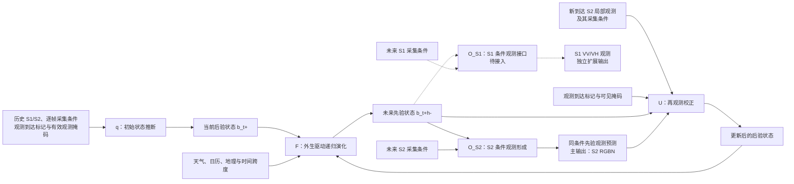

# ObsWorld：完整遥感世界模型的研究目标与后续计划

> [!summary] 核心目标
> ObsWorld 的目标是构建一个完整的遥感世界模型：从稀疏、多传感器且受云遮和采集条件影响的历史观测中推断地表预测性状态，在天气和地理条件下递归推进状态，在指定未来采集条件下生成未来遥感观测，并在新观测到来后校正内部状态、继续预测更远未来。

详细研究依据见 [ObsWorld：遥感世界模型研究与训练总纲](./A01_ObsWorld_遥感世界模型研究与训练总纲.md)。

---

## 研究目标

ObsWorld 将遥感影像视为地表状态在特定传感器、太阳角度、轨道和可见区域下形成的局部观测。模型通过持续维护地表预测性状态，连接历史观测、未来演化和新观测校正。

完整模型由四部分组成：

1. **q：初始状态推断**。从历史哨兵一号/二号（Sentinel-1/Sentinel-2，S1/S2）观测、采集条件和可见掩码中推断预测性状态；
2. **F：状态演化**。根据天气、日历、地理条件和时间跨度递归推进预测性状态；
3. **O：条件观测形成**。在指定未来传感器和采集条件下生成未来遥感观测；
4. **U：再观测校正**。利用新到达的局部有效观测校正预测性状态，并继续推演更远未来。

首个主要未来观测输出为哨兵二号红绿蓝+近红外四波段（RGBN），归一化植被指数（NDVI）由红光和近红外波段确定性派生；系统同时保留哨兵一号 VV/VH 极化观测模型接口。

---

## 现有基础与关键缺口

| 部分 | 当前进展 | 主要问题 |
|---|---|---|
| 观测预训练 | 阶段 1（Stage 1）和阶段 1.5（Stage 1.5）已经完成训练并保留权重 | 阶段 1.5 改善了跨模态一致性，但尚未证明已经消除非线性采集条件泄漏 |
| 状态推断 q | 已有多模态编码器、条件编码器和状态投影器 | 阶段 2 当前主要使用中性采集条件，真实逐帧采集条件尚未进入完整预测链 |
| 状态演化 F | 直接预测（Direct）、递归推演（Rollout）和天气驱动代码已经存在 | 既有递归推演结果弱于直接预测，尚未证明共享递归动力学有效 |
| 观测模型 O | 已有未来 RGBN 解码器，阶段 1.5 具有 S1/S2 双观测解码器 | 阶段 2 的 RGBN 解码器尚未由真实未来采集条件控制，S1 输出尚未进入动态链 |
| 状态更新 U | 不更新、重新推断（restart）、基础残差滤波（VanillaFilter）和学习式更新接口已经存在 | 尚缺完整训练结果，固定再观测位置和配对校正评测仍需完善 |
| 完整系统 | 主要模块已有较完整的代码和权重基础 | 真实采集条件、条件观测形成、再观测校正和统一评测尚未形成共同闭环的检查点 |

现有结果构成了后续研究的基础：既有直接预测优于递归推演；阶段 1.5 的状态仍可能保留非线性采集条件信息；当前观测解码器和阶段 2 状态推断尚未完整使用未来及逐帧采集条件。

后续工作的核心是将已有模块整理为一个完整、可训练、可评估的遥感世界模型。

---

## 后续研究规划

执行上先以少量训练步数依次贯通 `q → F → O → U` 和统一评测，确认各阶段能够运行、反向传播、保存与恢复；完整闭环成立后，再逐阶段扩大训练规模并深化实验。

### 重点执行事项

1. **统一全链数据与可见性合同**。明确历史观测、采集条件、天气、地理信息、再观测位置和监督目标；严格区分模型能够看到的观测掩码与只用于损失计算和评测的监督掩码。该任务用于保证后续状态推断和再观测校正不存在未来信息泄漏。
2. **使 q 使用真实逐帧采集条件**。以阶段 1.5 的 60,000 训练步权重作为主分支初始化，将真实采集条件、模态和有效性信息接入状态推断；阶段 1 的 95,000 训练步权重作为公平匹配的初始化对照。该任务用于确认预测性状态是否正确区分地表信息与采集条件影响。
3. **建立共享递归状态演化 F**。支持单步和多步递归推演、全预测时域监督、时间对齐的天气驱动以及中途替换天气，并与直接预测模型使用相同输入和输出协议。该任务用于确认模型学到的是可继续推进的状态动力学，而不是按预测时长直接查询结果。
4. **完成条件观测模型 O**。保留 256→384 维状态桥接层，迁移阶段 1.5 中兼容的 S2 解码层，新建 4 通道 RGBN 输出头，并保留独立的 S1 VV/VH 接口。该任务用于将内部预测性状态转化为可验证的遥感观测，并检验未来采集条件是否真正控制输出。
5. **完成再观测校正 U**。在相同传感器条件和可见区域内比较新观测与先验预测，形成更新后的后验状态，再继续推演更远未来；同时比较不更新、重新推断（restart）、训练后的基础残差滤波（VanillaFilter）、容量匹配的通用融合和学习式更新。该任务用于证明新观测能否带来持续的预测改进，而不只是改善当前帧重建。
6. **统一完整训练与评测链**。建立包含 q、F、O、U 的统一检查点、训练恢复、梯度控制和评测导出，生成逐样本指标、RGBN/NDVI 预测、状态轨迹和固定可视化样本。该任务用于保证整套世界模型能够稳定训练、恢复和复现。
7. **完成核心能力验证**。依次验证开放循环预测、采集条件控制、天气驱动使用、状态承载、再观测校正、S1 云鲁棒、跨分布泛化和计算效率。该任务用于形成完整方法主张所需的实验和图表证据。

### 任务汇总表

| 工作 | 目标 | 主要内容 |
|---|---|---|
| 统一数据合同 | 建立稳定的全链输入输出 | 分开观测到达标记、模型可见掩码与未来监督掩码，统一天气、地理、采集条件、再观测和目标字段 |
| 贯通 q | 让状态推断使用真实采集条件 | 主分支从阶段 1.5 的 60,000 训练步权重初始化；阶段 1 的 95,000 训练步权重作为公平初始化基线 |
| 贯通 F | 建立共享多步状态演化 | 支持完整递归推演、全预测时域监督和中途替换天气 |
| 完成 O | 生成指定条件下的未来观测 | 保留状态桥接层，迁移兼容的 S2 解码层并新建 4 通道 RGBN 输出头，同时保留 S1 VV/VH 接口 |
| 贯通 U | 在新观测到达后更新状态 | 使用相同采集条件和可见区域比较真实观测与先验预测，更新后验状态并继续递归推演 |
| 统一训练链 | 保存完整世界模型 | 检查梯度、模型检查点、训练恢复、掩码和信息泄漏 |
| 统一评测 | 形成可复现的能力证据 | 导出逐样本指标、预测数组、状态轨迹和固定可视化样本 |

完成上述任务后，系统将形成完整的 `q → F → O → U` 运行闭环，并能够统一输出开放循环预测、条件观测和再观测校正结果。

### 核心能力训练与验证

1. **状态与观测训练**。缓解并严格审计非线性采集条件泄漏，同时保持状态重建、跨模态对齐和未来预测能力。其意义是避免通过丢失有效地表信息来获得表面的采集条件不变性。
2. **开放循环训练**。公平比较直接预测与递归 ObsWorld，报告从短期到长期的预测变化以及天气驱动使用情况。其意义是判断共享递归状态是否能够稳定支持长期预测。
3. **条件观测训练**。比较正确条件、中性条件、近同期同地点配对条件和跨地点错误条件负对照。其意义是确认观测模型确实受未来传感器和采集条件控制，而不是忽略条件输入。
4. **再观测校正训练**。比较不更新、重新推断（restart）、训练后的基础残差滤波（VanillaFilter）、容量匹配的通用融合、强在线时序基线和学习式更新 U。其意义是区分新观测本身带来的收益与状态校正方法的额外价值。
5. **S1 云鲁棒扩展**。比较仅使用光学影像、配备 S1 的公平基线和 S1 辅助 ObsWorld。其意义是检验在重云和长时间缺测条件下，雷达观测是否真正帮助维持预测状态。
6. **跨分布评测**。EarthNet2021x 原始协议分别报告独立同分布、分布外、极端天气和季节压力测试；GreenEarthNet 仅使用数据清单和评测器均已核验的裁切评测子集（chopped tracks）。其意义是确认核心能力不局限于单一数据划分。
7. **多光谱与跨传感器强化**。在完整主链成立后补充第二数据设置、多光谱质量指标和跨传感器视觉证据。该部分主要服务 IEEE 图像处理汇刊（TIP）条件路线。

---

## 核心实验设计

| 能力 | 主要问题 | 关键比较 |
|---|---|---|
| 开放循环预测 | 递归状态演化能否保持事实预测 | 持久性基线（Persistence）、直接预测（Direct）、强时空预测基线与 ObsWorld |
| 条件观测形成 | 未来采集条件是否真正控制输出 | 正确条件、中性条件、近同期同地点配对条件、跨地点错误条件负对照 |
| 再观测校正 | 新观测能否改善后续预测 | 不更新、重新推断（restart）、训练后的基础残差滤波（VanillaFilter）、容量匹配的通用融合、强在线时序基线和学习式更新 U |
| 天气驱动使用 | 模型是否利用正确时间的外生驱动 | 真实天气、移除天气、天气打乱和天气时间错位 |
| 状态承载 | 预测状态是否服务最终输出 | 完整模型、移除状态路径和不同状态初始化 |
| 云与缺测 | S1 是否在光学不可见时发挥作用 | 仅光学输入、配备 S1 的公平基线和 S1 辅助 ObsWorld |
| 跨分布泛化 | 核心能力是否只存在于单一数据划分 | EarthNet2021x 的同分布/分布外与极端/季节压力测试、已核验的 GreenEarthNet 裁切评测子集、跨传感器设置 |
| 计算效率 | 新能力是否主要来自更大计算开销 | 参数量、浮点运算量（FLOPs）、显存和推理延迟 |

再观测校正在第 25 天和第 50 天固定评测，分别对应五天间隔协议中的第 5 个和第 10 个预测步。先对每个样本计算“无再观测”与“有再观测”的后续误差差值，再等权汇总两个再观测位置，并以相同样本、相同随机种子比较 U 与各基线的配对归一化增益曲线下面积（Gain-AUC）。同时报告绝对预测误差，并检查无有效观测时状态严格保持不变。

---

## 预期图表

### 图像与曲线

1. 完整 `q → F → O → U` 遥感世界模型图；
2. RGBN 与归一化植被指数（NDVI）的未来预测序列及误差图；
3. 同一状态在不同采集条件下的条件观测图；
4. 再观测前的先验状态、局部新观测、更新后的后验状态和后续预测轨迹；
5. S1 在云遮和长缺测条件下的鲁棒性曲线；
6. 长期漂移、弱采集条件响应、过强状态更新和低可见性等失败案例。

### 结果表

- 同协议开放循环预测主表；
- 采集条件可控性与“泄漏—信息充分性”平衡表；
- 第 25 天/第 50 天再观测校正表；
- q/F/O/U 组件和初始化消融表；
- 云、缺测、跨传感器和第二数据表；
- 参数量与计算效率表。

所有定性图使用预先固定的样本清单、相同裁剪区域、掩码、预测时域和色标，并同时展示普通、强响应和失败案例。

---

## 投稿定位与证据重点

ObsWorld 的核心定位是完整遥感世界模型。

- **国际学习表征会议（ICLR）/ 神经信息处理系统大会（NeurIPS）**：重点证明预测状态递归推演、条件观测形成和部分观测校正的一般方法价值；
- **计算机视觉与模式识别会议（CVPR）/ 国际计算机视觉大会（ICCV）**：当跨传感器条件生成和视觉结果足够强时，强化视觉方法路线；
- **IEEE 图像处理汇刊（TIP）**：以多光谱图像预测、第二数据设置、图像与光谱指标和再观测校正为主体；学习感知图像块相似度（LPIPS）只评固定的红绿蓝（RGB）合成图，RGBN 使用逐波段误差、光谱角映射（SAM）和相对全局误差（ERGAS）等指标；
- **IEEE 地球科学与遥感汇刊（TGRS）/ ISPRS 摄影测量与遥感杂志（ISPRS JPRS）**：作为更偏遥感实证和系统完整性的后备选择。
