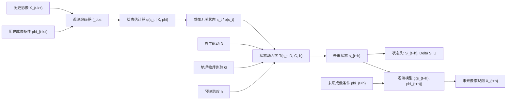

# 06_最新主线方案与实验设计

## 1. 执行摘要

本轮结论：**优先采用方案 B，但不要把它写成单纯的像素预测，也不要写成只在潜状态里预测。最稳的新主线应是：**

> **ObsWorld：从有偏像素观测学习成像无关地表状态动力学的遥感世界模型。**

更准确的论文对象是：

```text
有偏遥感观测 + 成像条件 -> 成像无关地表状态
成像无关地表状态 + 外生驱动 + 地理物理先验 -> 未来地表状态
未来地表状态 + 未来成像条件 -> 未来像素观测
```

因此，最终推荐不是纯 `WorldRS`，也不是纯未来帧生成，而是一个折中但更强的 **ObsWorld-B+**：以 `output/05` 的状态、动力学、观测三柱结构为主线，吸收 `WorldRS` 的外生驱动状态转移作为最关键的 world model 能力验证场。像素预测必须保留，但它的身份是**观测模型出口、对比接口和可视化证据**，不是 world model 本体。

最小可执行版本建议使用 `SSL4EO-S12 v1.1 + EarthNet2021 + DynamicEarthNet + SEN12-FLOOD/Sen1Floods11`。第一版不建议把所有公开数据集全拼起来，也不建议从零手写一个超大模型；应该从中等规模 ViT/MAE/U-Net/ConvLSTM/EarthNet baseline 组件出发，自己写统一 schema、字段补齐、条件注入、状态头、动力学头、观测解码头和评估协议。

## 2. 本轮调研依据

### 2.1 本地资料

| 类别       | 已读资料                                                                                                                  | 用途                                                             |
| -------- | --------------------------------------------------------------------------------------------------------------------- | -------------------------------------------------------------- |
| 最高优先级提示词 | `prompts/01_新主线再调研与06更新提示词.md`                                                                                        | 确定本轮输出目标、章节要求、A/B 比较范围和训练路线要求                                  |
| 写作风格提示词  | `prompts/00_任务提示词_叙事优先.md`                                                                                            | 确定“先定叙事，再定方法”的写作原则                                             |
| 原始主线     | `idea/WorldRS——面向外生驱动条件的遥感地表潜状态动力学世界模型.md`                                                                            | 提供方案 A 的外生驱动、状态转移、物理一致性和基准重构思路                                 |
| 新主线      | `idea/20260608——ObsWorld_主线定稿_v5.md`                                                                                  | 提供方案 B 的状态、动力学、观测模型三柱结构                                        |
| 集成稿      | `idea/08ObsWorld_完整集成稿_v4.md`                                                                                         | 提供主动获取、半物理观测模型和信息增益思路，但本轮不作为主线中心                               |
| 前序输出     | `output/01_叙事审查.md` 至 `output/05_ObsWorld新主线总结与可行性审查.md`                                                              | 确认旧方案、新方案的继承关系与已有风险判断                                          |
| 文献笔记     | `notes/rsworldmodel_*`、`notes/remote_sensingoriented_*`、`notes/skysense_*`、`notes/07_Earth-o1_*`、`notes/03seeing_*` 等 | 辅助梳理已有遥感 world model、视觉 world model、遥感基础模型和 Earth system model |

`literature/` 下 PDF 没有可用的本地 `pdftotext` 工具，本轮按要求没有硬抽取不可读 PDF；对应论文主要通过 `notes/` 和外部官方页面核查。

### 2.2 外部调研依据

| 方向                | 关键来源                                                                                                                                                                                                                                                                                                                                                                                                                                                                                                                                                                                                                                                                                                                        | 对本轮判断的作用                                                  |
| ----------------- | --------------------------------------------------------------------------------------------------------------------------------------------------------------------------------------------------------------------------------------------------------------------------------------------------------------------------------------------------------------------------------------------------------------------------------------------------------------------------------------------------------------------------------------------------------------------------------------------------------------------------------------------------------------------------------------------------------------------------- | --------------------------------------------------------- |
| 遥感 world model    | [RS-WorldModel](https://arxiv.org/abs/2603.14941)、[Remote Sensing-Oriented World Model / RemoteBAGEL](https://arxiv.org/abs/2509.17808)                                                                                                                                                                                                                                                                                                                                                                                                                                                                                                                                                                                     | 证明“遥感 world model”命名已出现，本文必须避免只靠概念命名，要用状态、动力学、观测分离切开      |
| EO 生成基础模型         | [TerraMind](https://arxiv.org/abs/2504.11171)                                                                                                                                                                                                                                                                                                                                                                                                                                                                                                                                                                                                                                                                               | 证明 any-to-any 多模态生成和像素级 EO 生成已很强，本文不能把像素质量作为唯一战场          |
| 地球系统 world model  | [Earth-o1](https://arxiv.org/abs/2605.06337)、[GraphCast](https://deepmind.google/blog/graphcast-ai-model-for-faster-and-more-accurate-global-weather-forecasting/)、[Aurora](https://www.nature.com/articles/s41586-025-09005-y)                                                                                                                                                                                                                                                                                                                                                                                                                                                                                             | 支持“科学/地球系统 world model 可以没有智能体 action，但必须有状态、动力学、约束与预测能力” |
| 视频/视觉 world model | [V-JEPA 2](https://ai.meta.com/research/vjepa/)、[DreamerV3](https://danijar.com/project/dreamerv3/)                                                                                                                                                                                                                                                                                                                                                                                                                                                                                                                                                                                                                         | 支持潜状态预测、action-free 预训练、再接 action/condition 的两阶段思想        |
| 遥感基础模型            | [SkySense](https://openaccess.thecvf.com/content/CVPR2024/html/Guo_SkySense_A_Multi-Modal_Remote_Sensing_Foundation_Model_Towards_Universal_Interpretation_CVPR_2024_paper.html)、[Prithvi-EO-2.0](https://arxiv.org/abs/2412.02732)、[CROMA](https://github.com/antofuller/croma)、[DOFA](https://github.com/zhu-xlab/DOFA)、[SatMAE](https://arxiv.org/abs/2207.08051)、[Scale-MAE](https://arxiv.org/abs/2212.14532)、[SpectralGPT](https://arxiv.org/abs/2311.07113)、[Galileo](https://arxiv.org/abs/2502.09356)                                                                                                                                                                                                              | 决定公平对比方式：冻结编码器、LoRA、统一任务头、以及“大模型编码器 + ObsWorld 机制”        |
| 数据集               | [SSL4EO-S12 v1.1](https://github.com/DLR-MF-DAS/SSL4EO-S12-v1.1)、[EarthNet2021](https://arxiv.org/abs/2104.10066)、[DynamicEarthNet](https://arxiv.org/abs/2203.12560)、[SEN12-FLOOD](https://source.coop/esa/sen12flood/README.md)、[Sen1Floods11](https://openaccess.thecvf.com/content_CVPRW_2020/html/w11/Bonafilia_Sen1Floods11_A_Georeferenced_Dataset_to_Train_and_Test_Deep_Learning_CVPRW_2020_paper.html)、[SpaceNet7](https://arxiv.org/abs/2102.11958)、[xBD](https://ar5iv.labs.arxiv.org/html/1911.09296)、[PASTIS](https://github.com/VSainteuf/pastis-benchmark)、[BigEarthNet](https://bigearth.net/v1.0.html)、[SEN12MS](https://arxiv.org/abs/1906.07789)、[C2S-MS Floods](https://source.coop/c2sms/c2smsfloods) | 决定哪些数据适合预训练、像素预测、状态转移、外生驱动、成像条件和地理先验                      |

## 3. 方案 A 与方案 B 的核心差异

| 维度      | 方案 A：外生驱动状态转移          | 方案 B：ObsWorld 三柱结构                          |
| ------- | ---------------------- | ------------------------------------------- |
| 核心问题    | 给定当前状态、驱动和先验，未来状态如何转移  | 有偏像素观测如何映射为成像无关状态，状态如何演化，状态如何被观测            |
| 世界定义    | 地表状态及其转移               | 地表状态、状态动力学、观测生成过程                           |
| 像素位置    | 主要作为状态估计输入，输出偏状态       | 是观测入口和观测出口，可用于未来像素预测                        |
| 最强创新点   | 外生驱动、状态转移、物理一致性、干预式评估  | 状态和观测分离，未来状态预测和未来观测预测统一                     |
| 最大风险    | 容易像多任务状态转移基准，视觉出口弱     | 若写不好会被认为只是未来帧生成或多模态重建                       |
| 与已有工作冲突 | 与变化检测、状态转移、灾害预测类工作冲突较小 | 与 RS-WorldModel、TerraMind、EarthNet 未来预测正面相邻 |
| 可执行性    | 状态标签明确的数据上更稳           | 数据字段更多，但更能组织成完整 world model                 |

本轮判断：**方案 A 更稳，方案 B 更有思想辨识度。若只选 A，论文像“外生驱动状态转移 benchmark”；若只选 B 且把像素预测放中心，论文会掉进生成赛道。最佳方案是 B 为主，A 为关键能力验证。**

## 4. 哪个方案更符合 world model

world model 的共性不应被单一 RL 定义绑死。综合 Dreamer、V-JEPA、视觉 world model 综述、Earth-o1、GraphCast、Aurora 等工作，较稳的共性是：

1. 从观测中形成内部状态；
2. 学习状态随时间、动作、事件或条件变化的规律；
3. 能进行未来 rollout 或情景推演；
4. 预测对条件替换敏感；
5. 评估不只看外观，还看约束一致性、任务有效性和不确定性。

| 共性 | 方案 A | 方案 B |
|---|---|---|
| 内部状态 | 有，通常是显式或潜在地表状态 | 有，而且强调成像无关状态 |
| 动力学 | 强，核心就是状态转移 | 强，状态动力学是三柱之一 |
| 条件响应 | 强，外生驱动是核心 | 强，同时包含外生驱动和成像条件 |
| 观测模型 | 弱，像素出口不是中心 | 强，显式建模 `g(s, phi)` |
| 可控/可验证观测 | 中，主要验证状态 | 强，可替换未来成像条件生成观测 |
| 与遥感独特性的关系 | 外生驱动和地理先验强 | 观测偏置、模态差异、状态和观测分离更强 |

结论：**方案 B 更符合完整 world model 结构，因为它同时有状态、动力学和观测模型。方案 A 更像方案 B 中的“状态动力学与驱动响应实验核心”。**

## 5. 哪个方案更适合 AAAI 与 CVPR

| 会议 | 方案 A 接受度 | 方案 B 接受度 | 主要原因 | 最大风险 |
|---|---|---|---|---|
| AAAI | 中高 | 高 | AAAI 更容易接受状态空间、世界模型定义、条件动力学、不确定性和可证伪评估；B 的概念结构更完整 | 若实验像工程拼盘，world model 定义会被质疑 |
| CVPR | 中 | 中高 | CVPR 需要视觉输出、强 baseline 和可视化；B 保留像素观测出口，更利于和生成/预测方法对比 | 若像素质量弱，审稿人可能忽视状态和动力学贡献 |

若目标是 AAAI，应把文章写成：

```text
遥感 world model 的状态空间定义 + 条件动力学 + 观测模型 + 可证伪评估协议
```

若目标是 CVPR，应把文章写成：

```text
状态驱动的条件遥感观测预测，而不是直接未来帧生成
```

两个会都想投时，最稳平衡是：标题和 Introduction 主打状态、动力学、观测三柱；实验里保留未来像素预测和视觉可视化，但主评价必须包含状态转移、驱动敏感性、成像条件替换、物理一致性和不确定性校准。

## 6. 最终推荐主线

推荐主线：

> **ObsWorld：从有偏像素观测学习成像无关地表状态动力学的遥感世界模型。**

推荐贡献写法：

1. 提出遥感 world model 的状态、动力学、观测模型三柱定义，明确世界是地表状态而不是图像流；
2. 提出一个从有偏像素观测估计成像无关状态、在状态空间中预测外生驱动下演化、再由观测模型生成未来像素的框架；
3. 构建带字段 mask 的统一 schema，把公开数据组织成像素预测、状态预测、状态转移和驱动响应任务；
4. 通过像素质量、状态转移、驱动敏感性、未来成像条件替换、物理一致性和校准实验验证 world model 能力。

## 7. 完整叙事骨架

1. 现有遥感基础模型主要理解或对齐观测，生成模型主要预测观测，但遥感观测不是世界本身；
2. 遥感图像变化同时来自地表真实变化和成像条件变化，直接预测图像会混淆二者；
3. 遥感 world model 应把地表状态、状态动力学和观测模型分开；
4. ObsWorld 从多源有偏观测中估计成像无关状态，在外生驱动和地理先验下预测未来状态，再用未来成像条件生成未来像素观测；
5. 像素预测用于公平对比和视觉验证，状态转移与条件响应用于证明 world model 能力；
6. 评估必须超出 SSIM/FID，加入驱动敏感性、成像条件可控性、状态一致性、物理一致性和不确定性校准。

## 8. 方法流程



## 9. 输入输出定义

| 类别     | 符号            | 定义                                | 必需性    |
| ------ | ------------- | --------------------------------- | ------ |
| 历史影像   | `X_{t-k:t}`   | 历史 S1/S2/HLS/Planet/Landsat 等观测序列 | 必需     |
| 历史成像条件 | `phi_{t-k:t}` | 传感器、模态、时间、月份、云、太阳角、SAR 极化/入射角、分辨率 | 必需     |
| 当前状态   | `S_t` 或 `s_t` | 当前 LULC、水体、建筑、损毁等级，或连续潜状态         | 强建议    |
| 外生驱动   | `D`           | 季节、未来天气、洪水事件、灾害类型、城市增长强度等         | 任务相关必需 |
| 地理物理先验 | `G`           | DEM、坡度、永久水体、河流距离、道路距离、气候带等        | 强建议    |
| 未来成像条件 | `phi_{t+h}`   | 未来观测的传感器、模态、月份、云状态、分辨率等           | 像素预测必需 |
| 预测跨度   | `h`           | 天、月、事件前后间隔或序列步长                   | 必需     |
| 未来像素   | `X_{t+h}`     | 指定未来成像条件下的像素观测                    | 观测出口   |
| 未来状态   | `S_{t+h}`     | 未来语义状态图或对象状态                      | 主输出    |
| 状态转移   | `Delta S`     | `(S_t, S_{t+h})` 或状态变化类别          | 主输出    |
| 不确定性   | `U`           | 像素、状态或转移预测不确定性                    | 建议     |
| 解释/一致性 | `R`           | 结构化解释、验证器分数、物理一致性证据               | 建议     |

## 10. 输入字段如何从公开数据构建

| 字段            | 可能来源                                                                                       | 初步获取流程                                           | 是否可为空        |
| ------------- | ------------------------------------------------------------------------------------------ | ------------------------------------------------ | ------------ |
| `X_{t-k:t}`   | SSL4EO-S12 v1.1、EarthNet2021、DynamicEarthNet、SEN12-FLOOD、SpaceNet7、xBD                     | 按 AOI 和时间排序，重采样到统一 patch 尺度，保存路径到 manifest       | 不可为空         |
| `phi_{t-k:t}` | 原始元数据、时间戳、传感器信息、云掩膜、轨道信息                                                                   | 读产品元数据；太阳角用时间和经纬度反算；云用 QA/cloud mask；SAR 用极化和入射角 | 不建议为空        |
| `S_t`         | DynamicEarthNet LULC、SpaceNet7 footprint、xBD pre-event building、JRC 水体、ESA WorldCover、模型估计 | 有标签则直接栅格化；无标签则用外部产品裁剪或状态估计器生成弱状态                 | 可弱化，但需 mask  |
| `D`           | EarthNet 天气、洪水/灾害事件元数据、月份/季节、历史增长率、ERA5/GPM                                                | 先用弱驱动字段，后续可外挂 ERA5、GPM、EM-DAT/事件数据库              | 可弱驱动，不应伪造强驱动 |
| `G`           | DEM、坡度、JRC 水体、HydroRIVERS、OSM 道路、Koppen 气候带                                                | 批量裁剪公开地理图层，重投影到影像网格，本地缓存                         | 可部分缺失        |
| `phi_{t+h}`   | 未来帧元数据或实验设定                                                                                | 若有真实未来帧则读取；若做条件生成，则人工指定模态、月份、云态                  | 像素预测不可为空     |
| `h`           | 数据时间戳、事件前后时间                                                                               | 由日期差、月差或事件阶段派生                                   | 不可为空         |

## 11. 输出字段如何构建与评估

未来状态图 `S_{t+h}` 是未来时刻的地表语义或对象状态，例如水体/非水体/洪水、LULC 类别、建筑/非建筑、建筑损毁等级。它来自数据集未来标签、外部产品或由未来影像派生的弱标签。

状态转移图 `Delta S` 是每个像素或对象从当前状态到未来状态的有向变化：

```text
Delta S(p) = (S_t(p), S_{t+h}(p))
```

| 输出        | 构建方法                                                                                      | 主要评估                                           |
| --------- | ----------------------------------------------------------------------------------------- | ---------------------------------------------- |
| `X_{t+h}` | 由观测模型 `g(s_{t+h}, phi_{t+h})` 解码；监督来自 EarthNet、DynamicEarthNet、SEN12-FLOOD、SpaceNet7 等未来帧 | MAE、RMSE、PSNR、SSIM、LPIPS、EarthNetScore，辅以状态一致性 |
| `S_{t+h}` | 由状态头预测；监督来自 LULC、水体、建筑、损毁标签                                                               | mIoU、F1、OA、对象级 F1                              |
| `Delta S` | 由 `S_t` 与 `S_{t+h}` 差分或转移头直接预测                                                            | 转移 F1、变化 IoU、转移混淆矩阵                            |
| `U`       | MC dropout、ensemble、evidential head、分位数回归或 conformal                                      | ECE、AUSE、错误和不确定性相关、拒答覆盖曲线                      |
| `R`       | 验证器输出的物理一致性分数或结构化解释                                                                       | 违规率、坡度/水系/道路一致性、驱动响应合理性                        |

## 12. 数据集组合方案

### 12.1 组合一：最小可行版本

| 项目     | 内容                                                                  |
| ------ | ------------------------------------------------------------------- |
| 数据集    | `SSL4EO-S12 v1.1`、`EarthNet2021`、`SEN12-FLOOD` 或 `Sen1Floods11`     |
| 构造任务   | 自监督预训练；未来像素预测；洪水状态转移                                                |
| 输入输出   | `X, phi -> s_t`；`s_t, D, G, phi_{t+h} -> S_{t+h}, Delta S, X_{t+h}` |
| 需补字段   | 成像条件、永久水体、DEM/坡度、洪水前观测、事件/季节字段                                      |
| 字段获取   | SSL4EO 自带 DEM/LULC；EarthNet 自带天气和未来帧；洪水任务外挂 JRC 水体、DEM、GPM/ERA5 可选  |
| 为什么选   | 三个数据即可覆盖预训练、像素出口、外生事件驱动                                             |
| 为什么不全拼 | 先证明主线能跑通，避免 schema、baseline 和许可复杂度失控                                |
| 证明主张   | 像素观测能学习状态；状态能受洪水驱动转移；观测模型能输出未来像素                                    |
| 最大风险   | 洪水前后配对不完整，驱动字段可能偏弱                                                  |

### 12.2 组合二：顶会完整版

| 项目 | 内容 |
|---|---|
| 数据集 | `SSL4EO-S12 v1.1`、`EarthNet2021`、`DynamicEarthNet`、`SEN12-FLOOD/Sen1Floods11`、`SpaceNet7` |
| 构造任务 | 预训练、未来像素预测、LULC 状态转移、洪水状态转移、城市扩张 |
| 输入输出 | 多任务统一 schema，按 task mask 激活不同 loss |
| 需补字段 | `phi`、月份/季节、DEM、道路距离、永久水体、事件字段、城市增长强度 |
| 字段获取 | 原生标签加公开地理图层裁剪；SpaceNet7 用 OSM 道路和历史建筑增长率构造弱驱动 |
| 为什么选 | 覆盖像素预测、状态图、状态转移、外生驱动、多模态观测、慢变量演化 |
| 为什么不优先加 xBD/PASTIS | xBD 是对象级冲击响应，PASTIS 偏农业专门任务，会显著增加任务头和 baseline 成本 |
| 证明主张 | ObsWorld 不是单任务技巧，而是可迁移的状态、动力学、观测框架 |
| 最大风险 | 多任务异质性强，若 schema 不严谨会像工程拼接 |

### 12.3 组合三：CVPR 视觉强化版

| 项目 | 内容 |
|---|---|
| 数据集 | `EarthNet2021`、`DynamicEarthNet`、`SEN12-FLOOD`、`C2S-MS Floods`、可选 `SpaceNet7` |
| 构造任务 | 未来像素预测、跨模态观测预测、不同未来成像条件生成、状态一致性评估 |
| 输入输出 | 输入历史观测和未来成像条件，输出未来像素、未来状态和状态转移 |
| 需补字段 | 未来 `phi`、云/阴影 mask、S1/S2 模态字段、状态伪标签 |
| 字段获取 | C2S-MS 提供 S1/S2 近同期水体和云标签；EarthNet 提供未来天气；DynamicEarthNet 提供未来 LULC |
| 为什么选 | 更容易产生可视化、像素质量图和跨成像条件对照 |
| 不优先选静态分类数据 | BigEarthNet、SEN12MS 更适合表征预训练，不直接证明未来观测生成 |
| 证明主张 | 状态驱动的条件观测预测优于直接像素预测 |
| 最大风险 | 如果视觉质量输给生成模型，需要用状态一致性和条件可控性补回来 |

### 12.4 组合四：AAAI 概念强化版

| 项目        | 内容                                                                                  |
| --------- | ----------------------------------------------------------------------------------- |
| 数据集       | `SSL4EO-S12 v1.1`、`DynamicEarthNet`、`SEN12-FLOOD/Sen1Floods11`、`xBD`、可选 `SpaceNet7` |
| 构造任务      | 状态估计、状态转移、事件冲击响应、驱动敏感性、物理一致性、不确定性校准                                                 |
| 输入输出      | `S_t, D, G, h -> S_{t+h}, Delta S, U, R`，像素输出作为辅助                                   |
| 需补字段      | 灾害类型/强度、永久水体、DEM/坡度、道路距离、事件前状态                                                      |
| 字段获取      | xBD 原生灾前/灾后、灾害类型和建筑损毁；洪水任务外挂地形水系                                                    |
| 为什么选      | 更强支撑 world model 定义、条件动力学和约束一致性                                                     |
| 不优先选纯生成数据 | 因 AAAI 重点不是图像质量，而是定义、机制和可证伪能力                                                       |
| 证明主张      | 模型对驱动变化敏感，输出遵守地理物理约束，知道何时不确定                                                        |
| 最大风险      | 状态标签异构，需要明确像素级与对象级评估分开报告                                                            |

## 13. 为什么选择这些数据集而不是全部拼接

不建议把所有公开数据集全部合并。原因如下：

| 原因 | 具体影响 |
|---|---|
| 监督目标不同 | 分类、分割、变化检测、未来预测、损毁评估不能无脑共用 loss |
| 时间结构不同 | 单时相、双时相、长时序、事件前后样本混合后容易造成任务语义混乱 |
| 空间分辨率不同 | 3m、10m、20m、30m、高分商业影像混合会增加对齐与公平对比难度 |
| 许可不同 | Planet、Maxar、高分商业影像常有再分发限制，基准只能发布索引和脚本 |
| 驱动字段不同 | 很多数据没有外生驱动，只能作为弱状态或表征数据 |
| baseline 成本过高 | 每加入一个任务就要加入专家模型、公平划分和评估协议 |

原则：**每个数据集必须对应一个不可替代的论文能力。** `SSL4EO-S12 v1.1` 对应从零预训练，`EarthNet2021` 对应像素观测出口，`DynamicEarthNet` 对应状态转移，洪水数据对应外生事件驱动，`SpaceNet7/xBD` 对应慢变量和冲击响应扩展。

## 14. 训练阶段划分与每阶段数据投入

| 阶段               | 使用数据                                                            | 输入                                | 输出/监督                             | 训练目标                        | 需要补充字段                                            | 主要代码工作                                    | 该阶段证明什么                          |
| ---------------- | --------------------------------------------------------------- | --------------------------------- | --------------------------------- | --------------------------- | ------------------------------------------------- | ----------------------------------------- | -------------------------------- |
| 阶段零：数据索引与 schema | 所有入选数据                                                          | 原始文件、AOI、时间戳、标签、元数据               | manifest、字段 mask、坐标对齐缓存           | 不训练模型，建立统一样本协议              | `phi`、`D`、`G`、`S_t`、`S_{t+h}`、`Delta S` 的可用性 mask | manifest 生成、dataloader、坐标重投影、图层裁剪、任务 mask | 数据能被统一组织，缺字段不会被伪造                |
| 阶段一：从零自监督预训练     | SSL4EO-S12 v1.1，扩展可用 SSL4EO-L/HLS                               | 多时相 S1/S2/DEM/LULC/NDVI、`phi`     | 掩码重建、跨模态重建、季节/模态一致性               | 学观测编码器和初始状态空间               | 时间、月份、云、传感器、模态、弱 LULC                             | MAE/ViT 训练脚本改造，条件编码                       | 模型会读遥感多模态观测，但不能证明动力学             |
| 阶段二：状态、观测分离      | SSL4EO-S12 v1.1、SEN12-FLOOD、C2S-MS、DynamicEarthNet              | `X_{t-k:t}`、`phi_{t-k:t}`、弱 `S_t` | 当前状态、当前观测重建、跨模态互预测                | 逼出成像无关状态，训练观测模型 `g(s, phi)` | 云/模态/季节/SAR 极化/入射角、弱状态标签                          | 状态估计头、`phi` 编码器、观测解码器、对抗/互信息消融            | 状态和成像条件可分离                       |
| 阶段三：状态动力学与像素观测预测 | EarthNet2021、DynamicEarthNet、SEN12-FLOOD、Sen1Floods11、SpaceNet7 | `s_t/S_t, D, G, h, phi_{t+h}`     | `S_{t+h}`、`Delta S`、`X_{t+h}`、`U` | 学未来状态和未来观测联合预测              | 天气、事件、季节、地理先验、未来 `phi`                            | 动力学模块、多任务 loss、状态/像素双头                    | 模型具备 world model 的 rollout 和条件响应 |
| 阶段四：下游微调与评估      | EarthNet、DynamicEarthNet、洪水、SpaceNet7、xBD                       | 按任务输入                             | 任务指标、专属 world model 指标            | 公平对比基础模型、专家模型和生成模型          | 固定 train/val/test、AOI/时间/事件划分                     | 评估脚本、baseline 适配、可视化                      | 证明实际任务有效，不只是概念                   |
| 阶段五：大模型编码器接入     | SkySense、Prithvi、CROMA、DOFA、Galileo 可用权重                        | 冻结或 LoRA 编码器输出 + ObsWorld 模块      | 同阶段三/四                            | 验证机制可迁移到强骨干                 | 对齐输入 band、尺度、patch、任务头                            | adapter、LoRA、统一任务头                        | 证明贡献不是自家骨干特例                     |

## 15. 每阶段输入、输出、目的和损失

| 阶段 | 目的 | 主要输入 | 主要输出 | 损失 |
|---|---|---|---|---|
| 阶段零 | 建数据地基 | 原始影像、标签、元数据、外部图层 | manifest、缓存图层、字段 mask | 无 |
| 阶段一 | 学遥感观测基础表征 | 多模态多季节影像、`phi`、DEM/LULC/NDVI | token、初始 `s_t`、重建影像 | Masked reconstruction、跨模态重建、季节一致性、可选对比损失 |
| 阶段二 | 分离状态和观测条件 | `X_t`、`phi_t`、弱 `S_t`、多模态配对 | 成像无关 `s_t`、当前重建 `X_t`、状态图 | 状态监督、观测重建、`phi` 泄漏对抗、跨模态一致性 |
| 阶段三 | 学 world model 动力学 | `s_t/S_t`、`D`、`G`、`h`、`phi_{t+h}` | `S_{t+h}`、`Delta S`、`X_{t+h}`、`U` | 状态 CE/Focal/Dice、像素 L1/SSIM/LPIPS、驱动对比、物理一致性、NLL/校准 |
| 阶段四 | 验证泛化和公平性 | 各任务标准输入 | 指标、图表、可视化 | 下游任务 loss 或仅评估 |
| 阶段五 | 验证机制通用 | 预训练大模型特征 + 本文模块 | 同阶段三/四 | 同阶段三，外加 adapter/LoRA 正则 |

## 16. 每个数据集需要补充的字段

| 数据集 | 原生强项 | 需要补充字段 | 不应强行补的字段 |
|---|---|---|---|
| SSL4EO-S12 v1.1 | S1/S2 四时相、DEM、LULC、NDVI | `phi`、月份/季节、云状态、弱状态 mask | 强事件驱动 `D` |
| EarthNet2021 | 历史/未来 S2、天气、地形 | 粗 LULC/NDVI 状态、未来 `phi`、状态伪标签 | 精细语义状态真值 |
| DynamicEarthNet | 日 Planet、月度 LULC | DEM、气候带、月份、季节、未来 `phi` | 强灾害/洪水驱动 |
| SEN12-FLOOD | 配准 S1/S2 洪水时序 | DEM、坡度、永久水体、河流距离、事件/降雨字段 | 精确水动力真值 |
| Sen1Floods11 | S1 洪水标签、永久水/洪水 | 洪水前观测、DEM、坡度、河流距离、降雨 | 完整长时序动力学 |
| SpaceNet7 | 月度 Planet、建筑 footprint | OSM 道路、永久水体、历史增长率、月份 | 精确城市政策/人口驱动 |
| xBD | 灾前/灾后、建筑损毁、灾害类型 | 灾害强度、DEM、建筑先验、事件时间 | 连续时序 |
| PASTIS/PASTIS-R | 作物时间序列、S1/S2、parcel 标签 | 天气、物候阶段、月份、地块先验 | 泛化到所有 LULC 转移 |
| BigEarthNet | 大规模 S1/S2 多标签 | 可作为预训练/分类辅助，补 `phi`、季节 | 未来状态 |
| SEN12MS | S1/S2/MODIS LULC | 可作为多模态预训练，补 `phi` | 状态转移 |
| C2S-MS Floods | 近同期 S1/S2、水体、云 | DEM、坡度、事件信息、前期观测 | 严格洪水前后完整序列 |

## 17. 字段获取与对齐的初步流程

| 字段 | 可能来源 | 初步获取流程 | 对齐方式 | 失败/缺失时如何处理 |
|---|---|---|---|---|
| 历史影像 `X_{t-k:t}` | 数据集原始影像 | 按 AOI 和时间排序，筛云和质量，生成序列索引 | 重投影到目标 CRS，重采样到任务分辨率 | 降级为短序列或单步样本，记录 `history_mask` |
| 历史成像条件 `phi_{t-k:t}` | 元数据、时间、经纬度、云 mask | 读取传感器/模态/极化；太阳角由 pvlib 或同类算法反算；云由 QA/mask | 与每帧影像一一绑定 | 缺太阳角时保留传感器、月份、云态，不伪造角度 |
| 当前状态 `S_t` | 原生标签、外部 LULC、水体、建筑、模型估计 | 标签栅格化；外部产品裁剪；无标签时由状态估计器生成弱状态 | 最近邻重采样，类别映射到统一本体 | 标记为弱监督，不参与强状态 loss |
| 外生驱动 `D` | 天气、事件、月份、灾害类型、增长率 | 先构造弱驱动：事件类型、时间跨度、季节；再外挂 ERA5/GPM/事件库 | 时间窗口聚合到样本级或像素级 | 缺强驱动时只作弱驱动，不做强因果声明 |
| 地理物理先验 `G` | DEM、JRC 水体、HydroRIVERS、OSM、Koppen | 离线裁剪、坡度/距离变换、缓存为栅格 | 双线性或最近邻重采样到影像网格 | 缺图层则 mask，不用零值冒充 |
| 未来成像条件 `phi_{t+h}` | 未来帧元数据或实验设定 | 真实未来帧读取；条件生成时指定模态/季节/云态 | 与目标未来帧绑定 | 没有真实未来 `phi` 时不做像素监督，只做状态 |
| 未来状态 `S_{t+h}` | 未来标签、未来外部产品、伪标签 | 与 `S_t` 同流程，按时间取未来标签 | 与当前状态同网格 | 只监督有标签区域 |
| 状态转移 `Delta S` | `S_t` 与 `S_{t+h}` | 类别对编码，稀有转移可合并为 `other` | 像素级或对象级对齐 | 缺一侧状态则不计算转移 loss |

## 18. 整体训练框架

整体训练采用“共享状态空间 + 任务 mask + 多头输出”的方式：

```text
共享：观测编码器、成像条件编码器、状态估计器、状态动力学模块
任务特定：像素观测解码头、LULC 头、洪水头、建筑/损毁头、验证器头
损失激活：每个样本只激活其字段 mask 为真的输入、输出和 loss
```

多任务训练不要把所有数据等权混合。建议按 batch 级采样：

1. 预训练 batch：SSL4EO 为主，学习观测表征；
2. 像素预测 batch：EarthNet 和 DynamicEarthNet，激活像素 loss；
3. 状态转移 batch：DynamicEarthNet、洪水、SpaceNet7/xBD，激活状态和转移 loss；
4. 驱动实验 batch：真实、空、错误驱动三路前向，激活驱动敏感性 loss；
5. 校准 batch：保留验证集，不混入训练，做 temperature/conformal。

## 19. 模型设计与代码实现边界

不需要第一版自行设计一个从零到一的超大模型。需要自行设计的是**状态、动力学、观测模型的接口和评估协议**。

| 模块                   | 是否需要自设计 | 是否可复用                                 | 推荐实现方式                                       | 风险                         |
| -------------------- | ------- | ------------------------------------- | -------------------------------------------- | -------------------------- |
| 遥感观测编码器              | 不必完全自设计 | 可复用 MAE/ViT/U-Net/Prithvi/CROMA/DOFA  | 第一版用 ViT-S/B 或 MAE backbone，从零训中等规模；另做大模型冻结版 | 与大模型拼规模不现实                 |
| 成像条件编码器              | 需要轻量自设计 | 可复用 MLP/FiLM/cross-attention          | `phi` 数值和类别字段分开编码，FiLM 注入                    | `phi` 定义过窄会证据不足            |
| 状态估计器                | 需要自设计   | 可复用 segmentation head                 | 语义状态头 + 连续潜状态 bottleneck                     | 状态伪标签噪声                    |
| 状态动力学模块              | 需要自设计   | 可复用 ConvLSTM/Temporal Transformer/SSM | `T(s_t, D, G, h)`，先中等规模                      | 若模型忽略 `D`，world model 叙事失败 |
| 观测解码器/像素预测头          | 需要接线设计  | 可复用 U-Net/MAE decoder/diffusion lite  | 第一版用轻量 decoder，避免扩散大工程                       | 像素模糊                       |
| 不确定性头                | 需要设计    | 可复用 ensemble、MC dropout、evidential    | 先用 ensemble 或 evidential + ECE               | 校准成本增加                     |
| 多任务输出头               | 需要设计    | 可复用 segmentation/detection heads      | 按任务 mask 激活                                  | 输出本体混乱                     |
| 统一 dataloader/schema | 必须自己写   | 可复用 PyTorch Dataset、TorchGeo 思路       | manifest + field mask + task schema          | 工程量大                       |
| 评估协议代码               | 必须自己写   | 可复用指标库                                | 驱动敏感性、成像替换、物理一致性、状态一致性                       | 若不公开协议，贡献变弱                |

## 20. 最小可实现版本与完整顶会版本

### 20.1 最小可实现版本

目标：三个月内证明主线能跑通。

```text
数据：SSL4EO-S12 v1.1 + EarthNet2021 + SEN12-FLOOD/Sen1Floods11
模型：ViT/MAE 编码器 + 状态头 + ConvLSTM/Temporal Transformer 动力学 + U-Net/MAE decoder
字段：X、phi、弱 S、D、G、h、phi_future
实验：有/无状态分离，有/无 D，有/无 G，真实/空/错驱动，未来像素和洪水状态转移
```

最小版本必须自己写：schema、manifest、字段 mask、`phi` 编码、`D/G` 注入、状态转移头、驱动敏感性评估、物理一致性评估。

### 20.2 完整顶会版本

目标：形成 AAAI/CVPR 都可投稿的完整包。

```text
数据：SSL4EO-S12 v1.1 + EarthNet2021 + DynamicEarthNet + 洪水数据 + SpaceNet7/xBD
模型：多模态观测编码器 + 成像无关状态空间 + 条件状态动力学 + 半物理/神经观测模型 + 不确定性
对比：基础模型、未来预测模型、生成模型、专家模型、大模型编码器 + ObsWorld
实验：像素、状态、驱动、成像条件、物理一致性、校准、跨区域/跨事件泛化
```

完整版本可以考虑接入 Prithvi-EO-2.0、CROMA、DOFA、Galileo 作为编码器，但不要把它们变成主贡献。贡献应是**机制与评估协议**，不是“手写了一个更大的模型”。

## 21. 对比方法设计

| 对比类别 | 输入 | 输出 | 为什么公平 | 证明什么 | 可能不公平处 | 无法复现时处理 |
|---|---|---|---|---|---|---|
| 遥感基础模型 | 同样历史影像 | 状态/像素任务头 | 冻结编码器 + 同任务头 | 普通表征是否足够 | 预训练数据规模更大 | 报告权重可用性，用公开权重或相近模型 |
| 未来预测模型 | 历史影像、天气 | 未来像素 | 在 EarthNet 等同任务上比较 | 不是普通视频预测 | 对方不输出状态 | 只比像素，并单列说明 |
| 遥感生成/world model | 历史影像、文本/条件 | 未来影像或描述 | 在可复现子任务上比较 | 与 RS-WorldModel/TerraMind 切割 | 输入条件不同 | 用公开结果加定性切割 |
| 任务专家模型 | 任务标准输入 | 任务标签 | 专家模型按原任务训练 | 实际性能不弱 | 专家不支持统一 schema | 每任务独立比较 |
| 大模型编码器 + ObsWorld | 大模型特征 + 本文机制 | 同本文 | 同骨干对照 | 机制可迁移 | 输入 band/尺度不完全一致 | 对齐到共同 band 和分辨率 |
| 直接像素预测版本 | 历史影像 | 未来像素 | 去掉状态瓶颈，其他相同 | 状态空间是否必要 | 容量可能不同 | 匹配参数量 |
| 无状态、观测分离版本 | `X` 直接到 `X/S` | 像素/状态 | 只删分离结构 | 成像无关状态价值 | 训练更简单 | 报容量和训练步数 |
| 无外生驱动版本 | 去掉 `D` | 同本文 | 同模型少一个字段 | 是否真的用驱动 | 某些任务 D 弱 | 按强/弱驱动任务分开报 |
| 无地理先验版本 | 去掉 `G` | 同本文 | 同模型少先验 | 物理约束贡献 | 先验质量差异 | 做每类先验消融 |
| 无未来成像条件版本 | 去掉 `phi_{t+h}` | 未来像素 | 验证观测模型可控性 | 像素出口是否条件可控 | 若数据未来 phi 弱 | 只在有明确 phi 的数据上评估 |

## 22. 下游任务设计

| 任务 | 必做性 | 数据 | 作用 |
|---|---|---|---|
| 未来像素预测 | 必做 | EarthNet2021、DynamicEarthNet | 证明观测出口有效，便于 CVPR 对比 |
| 土地覆盖/季节状态转移 | 必做 | DynamicEarthNet | 证明状态动力学 |
| 洪水状态转移 | 必做 | SEN12-FLOOD、Sen1Floods11、C2S-MS | 证明外生事件驱动与物理一致性 |
| 跨模态观测预测 | 必做或强建议 | SSL4EO、SEN12-FLOOD、C2S-MS | 证明成像无关状态和观测模型 |
| 城市扩张 | 可选 | SpaceNet7 | 证明慢变量人类活动驱动 |
| 灾害损毁 | 可选 | xBD | 证明事件冲击响应和对象级状态 |
| 作物/物候 | 可选 | PASTIS/PASTIS-R | 证明农业季节动力学 |
| 成像条件可控生成 | 强建议 | EarthNet、C2S-MS、SSL4EO | 证明 `g(s, phi)` |
| 不确定性校准与拒答 | 强建议 | 所有有标签任务 | 证明可信 world model |

第一版不建议同时做城市、损毁和作物三项扩展。建议在 SpaceNet7 和 xBD 中二选一。

## 23. 世界模型能力实验

| 实验 | 证明什么 | 数据 | 输入输出 | 指标 | 失败意味着 |
|---|---|---|---|---|---|
| 驱动敏感性 | 模型是否使用 `D` | 洪水、xBD、DynamicEarthNet | 固定 `X,S,G`，替换真实/空/错 `D` | KL、主转移概率差、不确定性变化 | 动力学只是时序拟合 |
| 错误驱动替换 | 响应方向是否合理 | 洪水、xBD | 洪水样本输入非洪水驱动 | 主转移衰减、`U` 上升 | 驱动编码不可解释 |
| 未来成像条件替换 | 观测模型是否可控 | EarthNet、C2S-MS、SSL4EO | 固定 `s_{t+h}`，替换 `phi_{t+h}` | 像素差异、状态一致性 | 像素头未学观测条件 |
| 状态一致性 | 像素出口是否尊重状态 | EarthNet、DynamicEarthNet | 生成像素再分割，与预测状态比 | mIoU、一致性 F1 | 像素生成脱离状态 |
| 物理一致性 | 是否遵守遥感先验 | 洪水、SpaceNet7 | 输出状态转移 + `G` | 低坡/近水/近路一致性、违规率 | 不是可靠 world model |
| 不确定性校准 | 是否知道何时不可信 | 所有任务 | 输出 `U` 和预测 | ECE、AUSE、拒答曲线 | 可信性不足 |
| 跨模态泛化 | 状态是否成像无关 | SSL4EO、SEN12-FLOOD | 光学/SAR 互预测或跨模态状态估计 | 跨模态掉点、状态一致性 | 状态仍残留成像偏置 |
| 跨区域/事件/季节 | 是否泛化 | 洪水、DynamicEarthNet、SpaceNet7 | 留出区域/事件/季节 | held-out 指标 | 记忆数据集偏差 |

## 24. 消融实验

| 消融 | 目的 |
|---|---|
| 无状态、观测分离 | 证明不是普通多模态预测 |
| 无外生驱动 `D` | 证明状态动力学不是只靠历史图像 |
| 无地理物理先验 `G` | 证明物理先验有实际贡献 |
| 无未来成像条件 `phi_{t+h}` | 证明观测模型可控 |
| 无像素观测出口 | 证明像素出口对监督和对比有帮助 |
| 无状态转移头，只预测像素 | 证明像素预测不能替代状态动力学 |
| 无不确定性头 | 证明可信评估价值 |
| 直接拼接 `phi/D/G` vs 条件注入 | 证明结构化条件注入不是装饰 |
| 单任务训练 vs 多任务 schema | 证明统一 schema 有收益但不靠无脑混合 |

## 25. 评价指标

| 指标组 | 指标 | 用途 |
|---|---|---|
| 像素质量 | MAE、RMSE、PSNR、SSIM、LPIPS、EarthNetScore、可选 FID | CVPR 视觉接口和未来观测对比 |
| 状态准确性 | mIoU、F1、OA、对象级 F1、变化 F1 | 主任务性能 |
| 状态转移 | 转移 F1、转移混淆矩阵、稀有转移召回 | world model 动力学 |
| 驱动响应 | KL、真实/空驱动概率差、错驱动主转移衰减 | 条件敏感性 |
| 成像可控 | 条件替换一致性、跨模态状态一致性 | 观测模型能力 |
| 物理一致性 | 坡度/水系/道路一致性、违规率、经验转移矩阵似然 | 遥感先验 |
| 不确定性 | ECE、NLL、Brier、AUSE、错误不确定性相关、拒答覆盖 | 可信性 |
| 泛化 | 跨 AOI、跨事件、跨季节、跨模态掉点 | 外推能力 |

## 26. 可视化建议

必须准备以下图组：

1. 历史影像、真实未来像素、预测未来像素；
2. 当前状态图、预测未来状态图、真实未来状态图、状态转移图；
3. 固定状态、替换未来成像条件后的多版本像素观测；
4. 真实驱动、空驱动、错误驱动下的预测差异；
5. 加/不加地理先验的物理一致性热图；
6. 不确定性热图与错误区域对齐；
7. 状态一致性图：预测像素经外部分割器得到的状态与模型预测状态对比；
8. 跨区域、跨事件失败案例，明确说明失败原因。

## 27. 主要风险与应对

| 风险 | 严重程度 | 应对 |
|---|---|---|
| 被认为只是未来帧生成 | 高 | 主指标放在状态转移、驱动响应、状态一致性；像素是观测出口 |
| 与 RS-WorldModel/TerraMind 冲突 | 高 | 明确本文不做文本引导未来场景生成，而做状态、动力学、观测分离 |
| 成像无关状态难证明 | 高 | 必做跨模态、跨季节、未来成像条件替换和 `phi` 泄漏消融 |
| 外生驱动字段弱 | 高 | 区分强驱动和弱驱动；不把月份/时间跨度包装成强因果驱动 |
| 多任务工程拼接 | 高 | 每个数据集只服务一个能力，所有 loss 由字段 mask 激活 |
| 像素质量不够好 | 中高 | 不把 FID 作为核心，强调状态一致性和条件可控性 |
| 数据许可复杂 | 中高 | 发布索引、脚本、schema，不重分发受限原始影像 |
| 从零训练风险 | 中 | 中等规模先行，大模型编码器接入作为机制验证 |
| 物理一致性验证器过硬 | 中 | 用软先验和独立评估，不把规则写死为绝对约束 |

## 28. 与 output/01-04 的差异简述

`output/01-04` 推荐的核心是 `WorldRS`：外生驱动条件下的遥感地表状态转移世界模型。它的优点是稳、可证伪、任务清楚；不足是观测模型弱，像素出口弱，容易像状态转移 benchmark。

本轮相较于 `output/01-04` 的变化是：把 `WorldRS` 从第一主线调整为 ObsWorld 的关键能力验证场。外生驱动状态转移仍然非常重要，但它不再独自承担整个 world model 定义。

## 29. 与 output/05 的继承和修正简述

本轮继承 `output/05` 的判断：新主线应以 ObsWorld 为中心，准确表述为“潜在状态建模 + 状态动力学预测 + 像素观测预测”。

本轮修正点有三项：

1. 更明确把像素预测限定为观测模型出口，不让它吞掉 world model 叙事；
2. 更细化从零到一训练阶段、数据投入、字段补齐流程和代码边界；
3. 更强调整个 schema 必须带字段 mask，不能默认公开数据天然支持所有字段。

## 30. 最终建议

最终建议推进 **ObsWorld-B+**：

```text
主线：成像无关地表状态 + 状态动力学 + 条件观测模型
核心验证：外生驱动状态转移、未来成像条件替换、状态一致性、物理一致性
第一版数据：SSL4EO-S12 v1.1 + EarthNet2021 + DynamicEarthNet + 洪水数据
第一版模型：中等规模可验证模型，不做超大模型规模竞争
第一版代码：重点写 schema、字段补齐、状态/动力学/观测接口和评估协议
```

如果目标偏 AAAI，强调定义、状态空间、条件动力学、可证伪评估和不确定性。若目标偏 CVPR，强化未来像素预测、跨成像条件可视化和强 baseline。无论投哪个会，都不要把贡献写成“从零训练了一个大模型”，也不要把“预测未来像素”写成 world model 本体。真正的贡献应是：**遥感世界模型应把地表状态、状态演化和成像观测分开，并用公开数据上可复盘的 schema 和实验协议证明这一点。**
