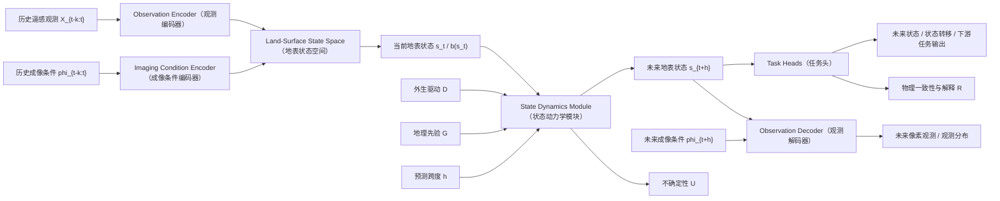
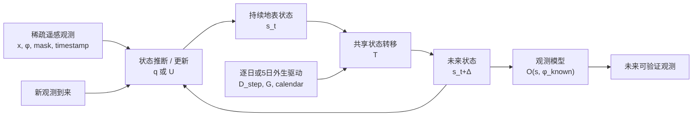
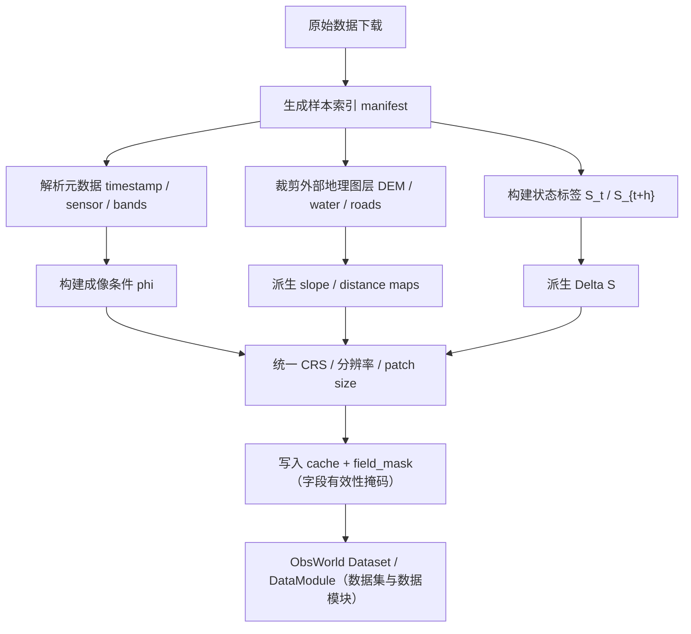

# 07 ObsWorld 主线定稿与实验方案

## 0. 英文术语速查

后文保留英文模块名，是为了方便未来写英文论文和代码目录；括号中的中文是阅读时应优先理解的含义。

| 英文术语                      | 中文意思         | 在本文中的直观解释                           |
| ------------------------- | ------------ | ----------------------------------- |
| Observation Encoder       | 观测编码器        | 把历史遥感影像编码成可用于估计地表状态的特征              |
| Imaging Condition Encoder | 成像条件编码器      | 编码传感器、云、时间、太阳角、视角等“怎么拍”的信息          |
| Land-Surface State Space  | 地表状态空间       | 表示水体、植被、建筑、土地覆盖、灾害状态等“地表本身”的空间      |
| State Dynamics Module     | 状态动力学模块      | 根据当前状态、外生驱动和地理先验预测未来状态              |
| Observation Decoder       | 观测解码器 / 观测模型 | 把未来地表状态按指定成像条件还原成未来像素观测             |
| Task Heads                | 任务头          | 接在状态空间上的洪水、土地覆盖、建筑变化等任务输出头          |
| External Drivers          | 外生驱动         | 降雨、洪水、灾害、季节、人类活动 proxy 等导致地表变化的外部因素 |
| Geographic Prior          | 地理先验         | DEM、坡度、水体距离、道路距离、土地覆盖先验等地理背景        |
| field_mask                | 字段有效性掩码      | 标记某个样本哪些字段真实存在，哪些字段缺失               |

## 1. 一句话版本

**ObsWorld 是一个成像条件解耦的地表状态动力学遥感世界模型：它从多源、有偏、带成像条件的遥感像素观测中估计更稳定的地表状态，在外生驱动和地理先验约束下预测未来地表状态，再用未来成像条件把未来状态渲染为可验证的未来像素观测。**

最核心的建模链条固定为：

```text
有偏遥感像素观测 + 成像条件 -> 成像无关地表状态
成像无关地表状态 + 外生驱动 + 地理先验 -> 未来地表状态
未来地表状态 + 未来成像条件 -> 未来像素观测
```

英文题目暂定为：

**ObsWorld: Imaging-Decoupled Land-Surface State Dynamics for Remote Sensing World Models**

这个题目里最重要的词不是 `World Models`，而是 `Imaging-Decoupled Land-Surface State Dynamics`。论文要让审稿人看到：本文不是普通未来帧预测，也不是把多个遥感任务拼起来，而是在遥感场景中明确区分了**世界状态**、**状态动力学**和**观测模型**。

## 2. 为什么这条主线现在成立

这条主线成立，是因为遥感世界模型方向已经到了一个需要重新切分问题的位置。

一方面，遥感基础模型已经很强。SkySense、Prithvi-EO-2.0、CROMA、DOFA、SatMAE、Scale-MAE 等工作证明，多源遥感表征学习、跨模态预训练、下游迁移都已经有成熟路线。继续单纯拼规模，不是最稳的第一篇论文位置。

另一方面，遥感 world model 的名字也已经出现。RS-WorldModel 把遥感变化理解和文本引导未来场景预测放进统一生成框架；Remote Sensing-Oriented World Model / RemoteBAGEL 把遥感 world modeling 形式化为方向条件空间外推；Earth-o1 则说明在地球系统中，world model 可以不依赖智能体 action，而以观测、潜状态、预测和反演来构成科学世界模型。

因此，本方案不能再写成“遥感还没有 world model”。更稳的 research gap 是：

> 已有遥感 world model 多以图像生成、空间外推、语言指令或观测理解为中心，但还没有系统地把遥感影像的成像偏置、地表状态动力学、外生驱动响应、地理先验和条件观测模型统一到同一个可执行框架中。

ObsWorld 的机会就在这里：把遥感图像从“世界本身”降回“对世界的有偏观测”，把地表状态、状态演化和观测生成拆开。这样既能继承遥感基础模型的表征能力，也能避开单纯生成模型的像素质量红海。

## 3. 与 WorldRS 叙事的继承关系

WorldRS 的核心价值是把遥感 world model 的重点放在**外生驱动条件下的地表状态转移**上。这个判断仍然正确，但在本轮定稿中，WorldRS 不再作为与 ObsWorld 并列竞争的另一条主线，而是被吸收到 ObsWorld 的状态动力学部分。

关系可以这样理解：

| 维度      | WorldRS 原叙事         | ObsWorld 定稿中的位置                      |
| ------- | ------------------- | ------------------------------------ |
| 世界是什么   | 地表潜状态及其转移           | 地表状态空间 `s_t` / `S_t`                 |
| 核心问题    | 外生驱动下状态如何转移         | `State Dynamics Module（状态动力学模块）` 的核心 |
| 主要输入    | 历史观测、当前状态、外生驱动、地理先验 | `s_t + D + G + h`                    |
| 主要输出    | 未来状态转移、不确定性、解释      | 未来状态、状态转移、不确定性、物理一致性                 |
| 最大贡献    | 驱动敏感性和可证伪评估         | 世界模型能力实验中的主战场                        |
| 在论文中的角色 | 原本可做第一主线            | 现在作为 ObsWorld 的动力学心脏                 |

因此，07 的最终写法应是：

```text
ObsWorld 提供完整三柱结构：
状态估计 + 状态动力学 + 观测模型。

WorldRS 的外生驱动状态转移思想
成为第二柱“状态动力学”的核心设计和核心验证。
```

这能同时保留两条思路的优点：ObsWorld 负责概念完整性和遥感独特性，WorldRS 负责条件动力学和可证伪实验。

## 4. 与 output/06 的关系

`output/06_最新主线方案与实验设计.md` 已经完成了方向收敛：推荐采用 ObsWorld-B+，即以 ObsWorld 的状态、动力学、观测三柱结构为主线，吸收 WorldRS 的外生驱动状态转移能力。

本文件在 06 基础上做三件事：

1. **把方向判断改写成可执行方案**：减少 A/B 方案比较，固定主线。
2. **把训练、数据、字段、代码边界写细**：后续可以直接按阶段开工。
3. **把顶会版和最小版分开**：避免第一版工程过重，也避免完整论文证据不足。

如果 06 是“为什么选择这条路”，那么 07 是“沿这条路怎么做”。

## 5. 核心科学问题

ObsWorld 要回答的不是“如何生成更清晰的未来遥感图像”，而是以下五个问题。

**问题一：遥感像素观测如何还原为更稳定的地表状态？**

同一地表在不同传感器、太阳角、云状态、季节、分辨率下会呈现不同像素。模型需要从 `(X, phi)` 中估计 `s`，而不是把像素变化直接当成地表变化。

**问题二：地表状态如何在外生驱动下演化？**

洪水、降雨、灾害、城市扩张、季节转换和人类活动 proxy 都不是智能体 action，但它们会改变地表未来。模型要学习：

```text
p(s_{t+h} | s_t, D, G, h)
```

**问题三：未来状态如何在指定成像条件下变成未来观测？**

未来像素不是 world model 的本体，而是观测模型出口：

```text
p(X_{t+h} | s_{t+h}, phi_{t+h})
```

**问题四：模型是否真的使用了驱动、先验和成像条件？**

必须通过真实驱动、空驱动、错误驱动、未来成像条件替换、无地理先验等实验来证伪“模型只是记住数据集偏差”。

**问题五：该状态空间是否对下游任务有用？**

如果状态空间只服务重建图像，不服务洪水、土地覆盖、建筑变化、灾害损伤等任务，那么 world model 叙事会变弱。

## 6. 核心方法概述

ObsWorld 可以写成三个条件分布的组合：

```text
状态估计：
q_theta(s_t | X_{t-k:t}, phi_{t-k:t})

状态动力学：
p_theta(s_{t+h} | s_t, D_{t:t+h}, G, h)

观测模型：
p_theta(X_{t+h} | s_{t+h}, phi_{t+h})
```

其中：

- `X_{t-k:t}` 是历史遥感观测序列，可以包含 Sentinel-1、Sentinel-2、Planet、Landsat/HLS 等。
- `phi` 是成像条件，包括传感器、波段、时间、季节、云、太阳高度角、视角、SAR 极化或入射角等。
- `s_t` 是成像条件尽量解耦的地表状态表示。
- `D` 是外生驱动，包括天气、极端事件、灾害类型、时间跨度、人类活动 proxy 等。
- `G` 是地理先验，包括 DEM、坡度、水体距离、道路距离、土地覆盖先验、气候带等。

模型可以同时输出三类结果：

1. 未来状态或状态转移：`S_{t+h}`、`Delta S`；
2. 未来像素观测：`X_hat_{t+h}`；
3. 不确定性与一致性证据：`U`、`R`。

## 7. 完整方法流程





这个流程有一个关键约束：**状态动力学发生在地表状态空间中，而不是直接在像素空间中。**像素出口是为了训练、对比和可视化，不能把它写成唯一目标。

## 8. 模型架构设计

### 8.1 Observation Encoder（观测编码器）

**输入：**

- 多时相光学影像；
- Sentinel-1 SAR；
- 多光谱波段；
- 云、阴影、缺测区域；
- 不同季节、不同传感器、不同分辨率的观测。

**输出：**

- 空间 token 或 feature map；
- 多时相上下文表征；
- 可用于状态估计的观测证据。

**推荐实现：**

- 第一版用 ViT-S/B、MAE-style encoder、U-Net encoder 或轻量时序 Transformer。
- 完整版加入 Prithvi-EO-2.0、SkySense、CROMA、DOFA、SatMAE 等冻结或 LoRA 编码器作为对比和增强。
- 不建议第一版直接从零训练 2B 级模型。

### 8.2 Imaging Condition Encoder（成像条件编码器）

**输入字段：**

```text
sensor
bands
spatial_resolution
timestamp
season
cloud_mask / cloud_ratio
sun_elevation
view_angle
SAR polarization / incidence angle
product_level
```

**作用：**

解释为什么同一个 `s_t` 会产生不同的像素观测。它不能只是普通 metadata 拼接，而要通过 FiLM、cross-attention 或条件归一化注入状态估计器和观测解码器。

**第一版做法：**

- 类别字段走 embedding；
- 数值字段标准化后走 MLP；
- 空间字段如 `cloud_mask` 与 `valid_mask` 作为 image-level mask 或 pixel-level mask；
- 输出 `c_phi`，通过 FiLM 调制编码器或解码器特征。

### 8.3 Land-Surface State Space（地表状态空间）

地表状态空间不能写成完全不可解释的普通 latent。建议采用双层结构：

| 层级 | 内容 | 作用 |
|---|---|---|
| 连续潜状态 `z_t` | 植被活力、湿度、纹理、隐含变化趋势等 | 支撑像素重建和细粒度动力学 |
| 显式语义状态 `S_t` | 水体、洪水、LULC、建筑、损毁等级、作物、灾害状态等 | 支撑监督、评估和论文解释 |

论文可以把 `s_t` 定义为二者的组合：

```text
s_t = {z_t, S_t, U_t}
```

其中 `U_t` 是当前状态估计不确定性。

### 8.4 State Dynamics Module（状态动力学模块）

**输入：**

```text
s_t
s_{t-k:t} 或历史状态序列
D_{t:t+h}
G
h
field_mask
```

**输出：**

```text
s_{t+h}
S_{t+h}
Delta S
U_{t+h}
```

**候选结构：**

| 结构 | 适合场景 | 第一版建议 |
|---|---|---|
| ConvLSTM | 小规模、规则网格、短序列 | 可作为最小版本 |
| Temporal Transformer | 多时相、多字段、长依赖 | 推荐主线 |
| State-space model | 长序列、低成本 rollout | 完整版可试 |
| U-Net + temporal blocks | 像素级状态图预测 | 对洪水和 LULC 友好 |

**条件注入方式：**

- `D` 和 `G` 不建议简单拼通道后结束；
- 第一版可以使用 FiLM + cross-attention；
- 完整版可以增加 driver-token attention 和 geographic-prior adapter。

### 8.5 Observation Decoder（观测解码器 / 观测模型）

**输入：**

```text
s_{t+h}
phi_{t+h}
target sensor / bands
valid_mask
```

**输出：**

- 未来像素观测；
- 观测分布参数，例如均值和方差；
- 可选的多模态输出，例如 S1/S2 互预测。

**定位：**

Observation Decoder（观测解码器 / 观测模型）不是论文唯一目标。它证明：

1. 状态不是死 latent，而能解释像素；
2. 未来成像条件可以控制观测外观；
3. 像素预测可用于与 EarthNet、时序预测和生成模型比较。

第一版建议使用轻量 U-Net decoder 或 MAE decoder，不建议一开始上扩散模型。

### 8.6 Task Heads（任务头）

Task Heads（任务头）负责把状态空间接到下游任务：

| Head | 输出 | 数据集 |
|---|---|---|
| LULC head | 土地覆盖类别 | DynamicEarthNet、PASTIS、BigEarthNet |
| Flood head | 洪水/永久水体/非水体 | Sen1Floods11、SEN12-FLOOD、C2S-MS Floods |
| Building-change head | 建筑/新增建筑/消失建筑 | SpaceNet7 |
| Damage head | 建筑损毁等级 | xBD |
| Pixel head | 未来像素观测 | EarthNet2021、DynamicEarthNet |
| Uncertainty head | 像素/状态/转移不确定性 | 所有任务 |

不同任务通过 `field_mask` 和 `task_id` 激活对应 head，不把所有数据集强行映射到一个过细的统一标签空间。

## 9. 输入输出定义

| 类别       | 字段 / 符号       | 定义                          | 必需性    |
| -------- | ------------- | --------------------------- | ------ |
| 历史影像     | `X_{t-k:t}`   | 历史遥感像素观测序列                  | 必需     |
| 历史成像条件   | `phi_{t-k:t}` | 每帧观测的传感器、时间、云、角度、模态等        | 必需     |
| 当前状态     | `s_t` / `S_t` | 当前连续潜状态和显式语义状态              | 强建议    |
| 外生驱动     | `D`           | 天气、灾害、洪水、季节、人类活动 proxy 等    | 任务相关必需 |
| 地理先验     | `G`           | DEM、坡度、水体、道路、气候带、LULC prior | 强建议    |
| 未来成像条件   | `phi_{t+h}`   | 未来目标观测的传感器、波段、云、时间等         | 像素输出必需 |
| 预测跨度     | `h`           | 未来天数、月份或事件后间隔               | 必需     |
| 未来状态     | `S_{t+h}`     | 未来地表状态图或对象状态                | 主输出    |
| 状态转移     | `Delta S`     | `S_t -> S_{t+h}` 的变化        | 主输出    |
| 未来像素     | `X_hat_{t+h}` | 指定成像条件下的未来观测                | 辅助主输出  |
| 不确定性     | `U`           | 状态、转移、像素或模型不确定性             | 建议     |
| 解释 / 一致性 | `R`           | 物理一致性分数、结构化解释或验证器输出         | 建议     |

## 10. 状态变量、观测变量、驱动变量和地理先验

### 10.1 状态变量

状态变量描述地表本身，不应直接等同于像素。

推荐状态类型：

- 土地覆盖；
- 植被状态；
- 水体 / 洪水状态；
- 建筑存在与变化；
- 灾害损伤等级；
- 作物或物候阶段；
- 连续潜状态，例如湿度、绿度、纹理、扰动强度。

### 10.2 观测变量

观测变量描述“这次看到的样子”：

- Sentinel-1 backscatter；
- Sentinel-2 多光谱反射率；
- Planet / HLS / Landsat 像素；
- 云、阴影、缺测；
- 光谱指数，如 NDVI、NDWI；
- SAR 极化、speckle 噪声等。

### 10.3 驱动变量

驱动变量描述“为什么状态会变”：

- 降雨、温度、极端天气；
- 洪水事件、灾害类型；
- 时间间隔；
- 源月、目标月、季节转换；
- 城市扩张强度、人类活动 proxy；
- 可选的政策、人口或道路扩展 proxy。

第一版要诚实区分强驱动和弱驱动。月份、季节、时间跨度可以作为弱驱动，但不能包装成强因果驱动。

### 10.4 地理先验

地理先验描述“状态变化在哪里更合理”：

- DEM；
- 坡度；
- 永久水体；
- 距河流距离；
- 距道路距离；
- 距已有建筑距离；
- 气候带；
- 土地覆盖先验；
- 城市区域或保护区 mask。

地理先验既可作为模型输入，也可作为独立评估器。不要把规则写死为绝对真理，应作为软先验或验证指标使用。

## 11. 数据集选择与分工

不要把所有数据集简单拼成一个大锅。每个数据集必须服务一个清楚能力。

| 数据集                                                                                                                                                                            | 推荐角色      | 主要作用                      | 是否第一版必做 |
| ------------------------------------------------------------------------------------------------------------------------------------------------------------------------------ | --------- | ------------------------- | ------- |
| [SSL4EO-S12 v1.1](https://github.com/DLR-MF-DAS/SSL4EO-S12-v1.1)                                                                                                               | 预训练主数据    | 多模态、多季节、多字段表征预训练          | 必做      |
| [EarthNet2021](https://www.earthnet.tech/) / [arXiv](https://arxiv.org/abs/2104.10066)                                                                                         | 像素观测出口主数据 | 未来 Sentinel-2 观测预测，天气条件辅助 | 必做      |
| [DynamicEarthNet](https://arxiv.org/abs/2203.12560) / [代码](https://github.com/aysim/dynnet)                                                                                    | 状态动力学主数据  | 月度 LULC、季节状态转移            | 强建议     |
| [Sen1Floods11](https://openaccess.thecvf.com/content_CVPRW_2020/html/w11/Bonafilia_Sen1Floods11_A_Georeferenced_Dataset_to_Train_and_Test_Deep_Learning_CVPRW_2020_paper.html) | 下游与洪水验证   | 洪水识别、SAR 洪水标签、事件响应        | 必做或强建议  |
| [SEN12-FLOOD](https://cmr.earthdata.nasa.gov/search/concepts/C2781412140-MLHUB.html) / [C2S-MS Floods](https://source.coop/c2sms/c2smsfloods)                                  | 洪水多模态增强   | S1/S2 洪水、水体、云 mask        | 强建议     |
| [SpaceNet7](https://arxiv.org/abs/2102.11958)                                                                                                                                  | 可选扩展      | 月度建筑变化和城市扩张               | 二选一扩展   |
| [xBD](https://ar5iv.labs.arxiv.org/html/1911.09296)                                                                                                                            | 可选扩展      | 灾前/灾后建筑损毁冲击响应             | 二选一扩展   |
| [PASTIS / PASTIS-R](https://github.com/VSainteuf/pastis-benchmark)                                                                                                             | 语义/作物辅助   | 作物时序、农业物候、S1/S2 扩展        | 可选增强    |
| [BigEarthNet](https://bigearth.net/)                                                                                                                                           | 预训练/分类辅助  | 大规模 S1/S2 多标签表征           | 可选预训练   |
| [SEN12MS](https://arxiv.org/abs/1906.07789)                                                                                                                                    | 多模态预训练辅助  | S1/S2/MODIS LULC 多模态对齐    | 可选预训练   |

第一版推荐组合：

```text
SSL4EO-S12 v1.1
+ EarthNet2021
+ DynamicEarthNet
+ Sen1Floods11 / SEN12-FLOOD / C2S-MS Floods 中至少一个洪水数据
```

完整顶会版再加入：

```text
SpaceNet7 或 xBD
+ PASTIS / BigEarthNet / SEN12MS 作为辅助
+ 大模型编码器对比
```

## 12. 每个数据集需要补充或派生的字段

| 数据集 | 原生强项 | 需要补充 / 派生字段 | 不建议强补 |
|---|---|---|---|
| SSL4EO-S12 v1.1 | S1/S2、多季节、DEM、NDVI、LULC | `timestamp`、`season`、`sensor`、`cloud_mask`、弱 `state_label` | 强事件驱动 |
| EarthNet2021 | S2 历史/未来、天气、地形 | 粗 LULC、NDVI 状态、`phi_future`、状态伪标签 | 精细语义真值 |
| DynamicEarthNet | 日 Planet、月度 LULC | DEM、气候带、月份、季节、天气 proxy | 强灾害驱动 |
| Sen1Floods11 | S1 洪水标签、11 次洪水事件 | 洪水前观测、永久水体、DEM、坡度、距河流、降雨 | 完整长序列动力学 |
| SEN12-FLOOD | S1/S2 洪水序列 | DEM、坡度、水体距离、事件/降雨字段 | 精确水动力真值 |
| C2S-MS Floods | 近同期 S1/S2、水体、云 mask | DEM、坡度、事件信息、前期观测 | 严格连续时序 |
| SpaceNet7 | 月度 Planet、建筑 footprint | 道路距离、已有建筑距离、增长率、永久水体 | 精确社会经济因果 |
| xBD | 灾前/灾后、建筑损毁 | 灾害类型、强度 proxy、建筑先验、DEM | 连续时序 |
| PASTIS | Sentinel-2 作物时序、parcel 标签 | S1 扩展、天气、物候阶段、地块先验 | 泛化到所有 LULC |
| BigEarthNet | 大规模多标签、S1/S2 | `phi`、季节、弱状态标签 | 未来状态 |
| SEN12MS | S1/S2/MODIS LULC | `phi`、季节、LULC prior | 状态转移 |

## 13. 字段构建与对齐流程

推荐采用离线构建、训练时读取缓存的方式。



字段对齐原则：

1. 坐标系统一到数据集原生 CRS 或指定投影；
2. 光学和 SAR 不强行完全同分布，只保证空间 patch 对齐；
3. 类别标签最近邻重采样，连续先验双线性重采样；
4. 缺字段时不填假值，而是写入 `field_mask=0`；
5. 每个 loss 只在对应字段有效时激活；
6. 数据划分要同时考虑 AOI、时间、事件，避免泄漏。

## 14. 训练阶段划分

除非后续实验发现明显更优路线，推荐采用四阶段训练。

### 阶段 1：观测编码与成像解耦预训练

目标：学习多源遥感观测表征，并初步把地表状态信息和成像条件信息分开。

数据：

- SSL4EO-S12 v1.1；
- BigEarthNet / SEN12MS；
- PASTIS 可作为时序语义辅助。

核心损失：

- masked reconstruction；
- 跨传感器对齐；
- 对比学习；
- 语义辅助损失；
- 成像条件去相关或条件重建损失。

### 阶段 2：状态动力学训练

目标：在状态空间中学习地表演化规律，并引入外生驱动与地理先验。

数据：

- EarthNet2021；
- DynamicEarthNet；
- PASTIS；
- SpaceNet7 可作为建筑变化补充。

核心损失：

- 状态预测损失；
- 未来观测辅助损失；
- 变化一致性损失；
- 外生驱动敏感性约束；
- 地理先验一致性约束。

### 阶段 3：观测模型训练

目标：学习从未来地表状态和未来成像条件生成未来像素观测。

数据：

- EarthNet2021；
- DynamicEarthNet；
- SSL4EO-S12 v1.1 中可构造的多观测样本；
- C2S-MS Floods 可用于 S1/S2 条件观测验证。

核心损失：

- L1 / L2 / Charbonnier；
- SSIM；
- 光谱角；
- masked pixel loss；
- feature loss；
- 观测条件一致性损失。

### 阶段 4：任务微调与世界模型评估

目标：证明状态表示和状态动力学对任务有用，并证明模型具备 world model 能力。

数据：

- Sen1Floods11；
- SEN12-FLOOD 或 C2S-MS Floods；
- SpaceNet7；
- xBD；
- DynamicEarthNet；
- PASTIS。

核心评估：

- 洪水识别；
- 建筑变化；
- 灾害损伤；
- 土地覆盖；
- 未来状态预测；
- 跨成像条件泛化；
- 外生驱动扰动实验。

## 15. 每个阶段的输入、输出、损失和产物

| 阶段        | 主要输入                   | 主要输出                          | 主要损失                                              | 阶段产物               |
| --------- | ---------------------- | ----------------------------- | ------------------------------------------------- | ------------------ |
| 1 观测编码预训练 | `X`、`phi`、mask、弱标签     | token、初始 `s_t`、重建观测           | MAE、对比、跨模态一致、语义辅助                                 | 观测编码器、条件编码器、初始状态空间 |
| 2 状态动力学   | `s_t`、历史状态、`D`、`G`、`h` | `s_{t+h}`、`S_{t+h}`、`Delta S` | CE/Focal/Dice、状态 L1、驱动敏感、先验一致                     | 动力学模块、状态头          |
| 3 观测模型    | `s_{t+h}`、`phi_{t+h}`  | `X_hat_{t+h}`、观测不确定性          | L1/L2、SSIM、SAM、masked pixel、condition consistency | 观测解码器、像素出口         |
| 4 微调评估    | 任务标准输入、状态、驱动、先验        | 任务输出、指标、可视化                   | 任务 loss、校准、评估协议                                   | 主实验表、消融表、可视化和失败案例  |

## 16. 整体训练框架

整体训练采用“统一 schema + 字段 mask + 任务头激活”的方式。

总损失可写为：

```text
L_total =
  L_masked_rec
+ lambda_state * L_state
+ lambda_dyn * L_dynamics
+ lambda_obs * L_observation
+ lambda_task * L_task
+ lambda_driver * L_driver_sensitivity
+ lambda_geo * L_geo_consistency
+ lambda_unc * L_uncertainty
+ lambda_decor * L_phi_decorrelation
```

其中每一项都要受 `field_mask` 控制：

```text
if field_mask["future_state"] == 0:
    不计算 L_state_future

if field_mask["precipitation"] == 0:
    D 中该字段不参与编码或以 mask embedding 表示

if field_mask["future_image"] == 0:
    不计算像素观测 loss
```

batch 采样建议：

| Batch 类型 | 主要数据 | 激活损失 |
|---|---|---|
| 预训练 batch | SSL4EO、BigEarthNet、SEN12MS | `L_masked_rec`、跨模态一致 |
| 像素预测 batch | EarthNet、DynamicEarthNet | `L_observation`、`L_state` |
| 状态转移 batch | DynamicEarthNet、SpaceNet7、xBD | `L_state`、`L_dynamics` |
| 洪水驱动 batch | Sen1Floods11、SEN12-FLOOD、C2S-MS | `L_task`、`L_driver`、`L_geo` |
| 校准 batch | 各验证集 | ECE、NLL、temperature scaling |

不要把所有 batch 等权混合。应按阶段和任务设置采样比例，并记录每个数据集对总 loss 的贡献。

## 17. 推荐基础模型与可复用代码

可复用方向：

| 类别 | 推荐对象 | 用法 |
|---|---|---|
| MAE / ViT | SatMAE、Scale-MAE、普通 MAE | 观测编码器预训练或 baseline |
| 遥感基础模型 | [Prithvi-EO-2.0](https://github.com/NASA-IMPACT/Prithvi-EO-2.0)、SkySense、CROMA、DOFA、Galileo | 冻结编码器 + ObsWorld 模块 |
| 生成基础模型 | [TerraMind](https://github.com/ibm/terramind) | 相关工作和像素生成对比，不作为第一版依赖 |
| 时序预测 | ConvLSTM、PredRNN、Earthformer、EarthNet baseline | 像素预测 baseline |
| 分割框架 | segmentation_models_pytorch、U-Net、DeepLab、UPerNet | 任务头和状态头 |
| 遥感数据 | torchgeo、rasterio、xarray、geopandas、shapely | 数据读取、裁剪、重投影、矢量栅格化 |
| 训练框架 | PyTorch、Lightning / Lightning Fabric、timm、einops | 训练、模型组件、实验复现 |

外部核查中确认可作为当前背景的关键来源：

- [RS-WorldModel](https://arxiv.org/abs/2603.14941)
- [Remote Sensing-Oriented World Model / RemoteBAGEL](https://arxiv.org/abs/2509.17808)
- [Earth-o1](https://arxiv.org/abs/2605.06337)
- [OpenWorldLib](https://arxiv.org/abs/2604.04707)
- [TerraMind](https://arxiv.org/html/2504.11171v1)
- [Prithvi-EO-2.0](https://arxiv.org/html/2412.02732v3)

## 18. 哪些代码必须自己写

必须自己写的不是“大模型所有零件”，而是让 ObsWorld 成立的接口、schema 和评估协议。

| 模块 | 是否必须自写 | 原因 |
|---|---|---|
| 统一 manifest 和 field schema | 必须 | 这是多数据集训练的地基 |
| `field_mask` 与 loss 激活 | 必须 | 防止缺字段变假监督 |
| 成像条件编码器 | 必须 | `phi` 是主线关键 |
| 状态空间接口 | 必须 | 状态不是普通 latent，需要显式输出和评估 |
| `D/G` 条件注入 | 必须 | 外生驱动和地理先验是 world model 能力核心 |
| 状态动力学模块 | 必须 | 论文心脏 |
| 观测模型接线 | 必须 | 未来像素是观测出口 |
| 驱动敏感性评估 | 必须 | 证明不是普通时序拟合 |
| 成像条件替换评估 | 必须 | 证明观测模型可控 |
| 物理一致性评估 | 必须 | 遥感独特性证据 |
| 不确定性与校准评估 | 强建议 | 可信世界模型证据 |

可以复用的：

- ViT、MAE、U-Net、ConvLSTM；
- segmentation heads；
- 公开基础模型权重；
- 常规指标库；
- geospatial I/O 工具；
- Lightning 训练循环框架。

## 19. 最小可实现版本

最小版目标不是完整顶会所有证据，而是证明主线能跑通。

```text
数据：
SSL4EO-S12 v1.1
+ EarthNet2021
+ Sen1Floods11 或 C2S-MS Floods

模型：
ViT/MAE encoder（观测编码器）
+ imaging condition encoder（成像条件编码器）
+ state head（状态头）
+ ConvLSTM / Temporal Transformer dynamics（状态动力学模块）
+ light U-Net decoder（轻量观测解码器）

字段：
X, phi, S/weak S, D, G, h, phi_future, field_mask

实验：
像素预测
洪水状态转移
有/无 D
有/无 G
有/无 phi
真实/空/错误驱动
未来成像条件替换
```

最小版必须达成四个闭环：

1. 从历史观测估计状态；
2. 在状态空间预测未来；
3. 用未来成像条件解码像素；
4. 用驱动和先验消融证明模块不是装饰。

第一版不要做的事：

- 不要训练 2B 级模型；
- 不要一开始引入扩散解码器；
- 不要同时做所有数据集；
- 不要把主动获取作为核心主线；
- 不要把自然语言问答写成贡献。

## 20. 完整顶会版本

完整版本目标是让 AAAI/CVPR 审稿人都能看到足够证据。

```text
数据：
SSL4EO-S12 v1.1
+ EarthNet2021
+ DynamicEarthNet
+ Sen1Floods11 / SEN12-FLOOD / C2S-MS Floods
+ SpaceNet7 或 xBD
+ PASTIS / BigEarthNet / SEN12MS 作为辅助

模型：
多模态观测编码器
+ 成像条件解耦状态空间
+ 条件状态动力学
+ 条件观测模型
+ 多任务 heads
+ 不确定性 head

对比：
遥感基础模型
像素未来预测模型
任务专家模型
遥感 world/generative model
大模型编码器 + ObsWorld 机制

实验：
像素质量
状态转移
驱动响应
成像条件替换
物理一致性
不确定性校准
跨区域 / 跨事件 / 跨季节泛化
```

完整版本的贡献重点仍然是机制和评估协议，不是“我们训练了最大模型”。

## 21. 对比方法

| 对比类别 | 代表方法 | 对比方式 | 证明点 |
|---|---|---|---|
| 遥感基础模型 | SkySense、Prithvi-EO-2.0、CROMA、DOFA、SatMAE、Scale-MAE | 冻结/LoRA + 同任务头 | 普通表征是否足够 |
| 像素未来预测 | Persistence、ConvLSTM、PredRNN、Earthformer、EarthNet baseline | EarthNet / DynamicEarthNet | 不是普通未来帧预测 |
| 遥感生成 / world model | RS-WorldModel、RemoteBAGEL、TerraMind | 可复现子任务 + 定性切割 | 与图像/语言生成区别 |
| 任务专家 | 洪水、LULC、建筑变化、损毁模型 | 各任务标准设置 | 实际任务性能 |
| 自身消融 | w/o state、w/o D、w/o G、w/o phi、w/o obs decoder | 同数据同训练 | 每个模块必要性 |

对基础模型建议三档：

1. 冻结编码器 + 线性/轻量任务头；
2. LoRA 或部分微调；
3. 大模型编码器 + ObsWorld 状态/动力学/观测模块。

第三档非常重要，因为它能证明 ObsWorld 机制不依赖自家小骨干。

## 22. 下游任务

| 任务 | 数据 | 必做性 | 证明点 |
|---|---|---|---|
| 未来像素预测 | EarthNet2021、DynamicEarthNet | 必做 | 观测出口有效 |
| 土地覆盖状态转移 | DynamicEarthNet | 必做 | 状态动力学有效 |
| 洪水识别 / 状态转移 | Sen1Floods11、SEN12-FLOOD、C2S-MS | 必做 | 外生事件驱动和地理先验 |
| 跨模态观测预测 | SSL4EO、C2S-MS、SEN12-FLOOD | 强建议 | 成像无关状态 |
| 建筑变化 | SpaceNet7 | 可选 | 慢变量人类活动 |
| 灾害损伤 | xBD | 可选 | 单步冲击响应 |
| 作物 / 物候 | PASTIS | 可选 | 农业季节动力学 |

第一版推荐三主任务：

```text
EarthNet2021 未来像素
DynamicEarthNet 状态转移
洪水数据 外生驱动
```

SpaceNet7 和 xBD 二选一即可，不要第一版全做。

## 23. 世界模型能力实验

| 实验 | 做法 | 指标 | 证明点 |
|---|---|---|---|
| 驱动敏感性 | 固定 `X,S,G`，替换真实/空/错误 `D` | KL、主转移概率差、F1 变化 | 模型是否使用 `D` |
| 错误驱动替换 | 洪水样本输入非洪水驱动 | 主转移衰减、不确定性上升 | 响应方向是否合理 |
| 未来成像条件替换 | 固定未来状态，替换 `phi_future` | 像素变化、状态一致性 | 观测模型是否可控 |
| 状态一致性 | 生成像素再用分割器估计状态，与预测状态比 | mIoU、F1、一致性误差 | 像素是否尊重状态 |
| 物理一致性 | 检查洪水/建筑/土地转移与先验关系 | 违规率、先验一致分数 | 遥感世界约束 |
| 不确定性校准 | 比较错误区域和 `U` | ECE、NLL、AUSE、Brier | 是否知道何时不可信 |
| 跨模态泛化 | 光学/SAR 互预测或跨模态状态估计 | 掉点、跨模态一致 | 状态是否成像无关 |
| 跨区域/事件/季节 | 留出 AOI、事件、季节 | held-out 指标 | 外推能力 |

## 24. 消融实验

必须包含：

| 消融 | 目的 |
|---|---|
| w/o state-observation separation | 证明不是普通多模态预测 |
| w/o external driver `D` | 证明状态动力学不是只靠历史图像 |
| real/null/wrong `D` | 证明驱动响应方向 |
| w/o geographic prior `G` | 证明地理先验有实际贡献 |
| w/o future imaging condition `phi_{t+h}` | 证明观测模型可控 |
| direct pixel prediction | 证明状态瓶颈必要 |
| no observation decoder | 证明像素出口对监督和可视化有帮助 |
| no uncertainty head | 证明可信性贡献 |
| concat condition vs FiLM/cross-attention | 证明结构化条件注入价值 |
| single-task vs schema multi-task | 证明统一 schema 不是无脑拼接 |

## 25. 评价指标

| 指标组 | 指标 | 用途 |
|---|---|---|
| 像素质量 | MAE、RMSE、PSNR、SSIM、LPIPS、EarthNetScore、SAM | 未来观测预测 |
| 状态准确性 | mIoU、F1、OA、对象级 F1 | 状态图与下游任务 |
| 状态转移 | transition F1、变化 F1、转移混淆矩阵、稀有转移召回 | 动力学能力 |
| 驱动响应 | KL、真实/空驱动概率差、错驱动主转移衰减 | world model 条件敏感性 |
| 成像可控 | 条件替换一致性、跨模态状态一致性 | 观测模型能力 |
| 物理一致性 | 坡度/近水/近路一致性、违规率、经验转移似然 | 遥感先验 |
| 不确定性 | ECE、NLL、Brier、AUSE、拒答覆盖 | 可信性 |
| 泛化 | 跨 AOI、跨事件、跨季节、跨模态掉点 | 外推能力 |

不要只报 SSIM/FID。像素指标可以占 CVPR 视觉展示的一部分，但不能作为 world model 的唯一证据。

## 26. 可视化设计

必须准备以下图组：

1. 历史观测、真实未来像素、预测未来像素；
2. 当前状态、预测未来状态、真实未来状态、状态转移图；
3. 固定状态、替换未来成像条件后的多版本像素观测；
4. 真实驱动、空驱动、错误驱动下的预测差异；
5. 加/不加地理先验的物理一致性热图；
6. 不确定性热图与错误区域对齐；
7. 跨模态状态一致性图；
8. 失败案例：云、极端灾害、稀有转移、跨区域失败。

可视化原则：

- 每张图都要回答一个实验问题；
- 不展示纯好看图片；
- 像素图旁边必须放状态图或状态一致性证据；
- 失败案例要保留，反而能增强可信度。

## 27. 风险与备选路线

| 风险 | 严重程度 | 应对 |
|---|---|---|
| 被认为只是未来帧生成 | 高 | 主指标放在状态、驱动响应、物理一致性；像素是观测出口 |
| 与 RS-WorldModel / TerraMind 冲突 | 高 | 明确本文不是文本引导图像生成，而是状态—动力学—观测分离 |
| 成像无关状态难证明 | 高 | 做跨模态、跨季节、成像条件替换、`phi` 泄漏消融 |
| 外生驱动字段弱 | 高 | 区分强/弱驱动，不做强因果声明 |
| 多任务工程拼盘 | 高 | 每个数据集服务一个能力，field mask 激活 loss |
| 像素质量不够好 | 中高 | 轻量 decoder 先跑通，用状态一致性弥补视觉指标 |
| 数据许可复杂 | 中高 | 发布索引、脚本、schema，不重分发受限影像 |
| 从零训练风险 | 中 | 中等规模先行，大模型编码器作为机制验证 |
| 物理先验过硬 | 中 | 作为软约束和独立指标，不写成绝对规则 |

备选路线：

1. 如果像素预测弱，把论文偏 AAAI，强化状态转移、驱动敏感性和可信评估。
2. 如果状态转移弱，把第一篇缩成成像条件解耦状态表征 + 观测模型，动力学作为未来工作。
3. 如果外生驱动字段弱，优先做洪水和 DynamicEarthNet，不强行做城市/xBD。
4. 如果工程时间不足，保留 `SSL4EO + EarthNet + 洪水` 三件套，砍掉 SpaceNet7/xBD/PASTIS。

## 28. 最终论文贡献点

建议贡献写成四条以内。

1. **范式贡献**：提出遥感 world model 的状态—动力学—观测三柱定义，明确遥感影像是地表状态在成像条件下的有偏观测。
2. **方法贡献**：提出 ObsWorld，从有偏多源观测估计成像无关地表状态，在外生驱动和地理先验下预测未来状态，再用未来成像条件生成未来观测。
3. **数据与工程贡献**：提出带 `field_mask` 的统一 schema，把公开遥感数据组织为状态估计、状态动力学、观测预测和驱动响应任务。
4. **评估贡献**：设计像素质量、状态转移、驱动敏感性、未来成像条件替换、物理一致性和不确定性校准共同构成的 world model 能力评估协议。

不要把“从零训练大模型”写成主要贡献。可以写成实现设置：

> We train a medium-scale ObsWorld instance from public EO datasets and further verify the mechanism with frozen foundation model encoders.

## 29. 初步实验优先级

### 第一优先级：最小闭环

1. SSL4EO 预训练 dataloader 和 manifest；
2. EarthNet 未来像素预测 baseline；
3. 洪水数据的 `S_t/S_{t+h}/Delta S` 构造；
4. `phi/D/G/field_mask` 最小字段；
5. ViT/MAE encoder + state head + light dynamics + decoder；
6. w/o `D`、w/o `G`、w/o `phi` 消融。

### 第二优先级：world model 能力

1. 真实/空/错误驱动；
2. 未来成像条件替换；
3. 状态一致性；
4. 不确定性校准；
5. 跨区域/事件划分。

### 第三优先级：顶会增强

1. DynamicEarthNet 完整状态转移；
2. SpaceNet7 或 xBD 扩展；
3. 大模型编码器 + ObsWorld；
4. 更强像素 decoder；
5. 统一基准脚本和复现实验。

## 30. 结论

最终建议推进的主线是：

```text
ObsWorld：成像条件解耦的地表状态动力学遥感世界模型。
```

它不是纯像素预测，不是普通 latent prediction，也不是 WorldRS 的简单改名。它的核心是把遥感世界模型拆成三个可训练、可评估、可复现的部分：

```text
地表状态
状态动力学
条件观测模型
```

第一版应以最小闭环为先：跑通 `SSL4EO-S12 v1.1 + EarthNet2021 + 洪水数据`，证明状态—动力学—观测链条成立；完整顶会版再加入 DynamicEarthNet、SpaceNet7/xBD、PASTIS、BigEarthNet/SEN12MS 和大模型编码器对比。

最重要的写作纪律是：

> 像素预测要保留，但不能让像素预测统治论文。状态动力学和条件观测模型才是 ObsWorld 的骨架。

## 附录 A. 推荐数据字段表

| 字段 | 类型 | 来源 | 是否必需 | 缺失处理 |
|---|---|---|---|---|
| `sample_id` | string | 生成 | 必需 | 不可缺 |
| `dataset_name` | string | 生成 | 必需 | 不可缺 |
| `location_id` | string | 元数据 / 生成 | 强建议 | 生成临时 ID |
| `timestamp` | datetime | 元数据 | 必需 | 无时间则仅做静态任务 |
| `time_delta` | float | 时间戳派生 | 必需 | 单步任务设为事件间隔 |
| `sensor` | categorical | 元数据 | 必需 | unknown + mask |
| `bands` | list | 数据描述 | 必需 | 按数据集默认 |
| `spatial_resolution` | float | 元数据 | 强建议 | 数据集默认 |
| `cloud_mask` | raster | QA / 数据集 | 强建议 | 用 `field_mask` |
| `valid_mask` | raster | 数据质量 | 必需 | 由 nodata 生成 |
| `sun_elevation` | float | 元数据 / pvlib | 可选 | mask，不反造 |
| `view_angle` | float | 元数据 | 可选 | mask |
| `season` | categorical | timestamp | 强建议 | timestamp 缺失时 mask |
| `lat` / `lon` | float | 元数据 / AOI | 强建议 | AOI 中心 |
| `dem` | raster | DEM 图层 | 强建议 | mask |
| `slope` | raster | DEM 派生 | 强建议 | mask |
| `land_cover_prior` | raster | LULC 产品 / 标签 | 强建议 | weak label + mask |
| `distance_to_water` | raster | JRC / HydroRIVERS | 洪水强建议 | mask |
| `distance_to_urban` | raster | OSM / 建筑标签 | 城市强建议 | mask |
| `precipitation` | raster/float | ERA5/GPM/数据集 | 洪水可选增强 | mask |
| `temperature` | raster/float | ERA5/数据集 | 可选 | mask |
| `extreme_event_flag` | bool | 事件元数据 | 任务相关 | false 需区分 unknown |
| `disaster_type` | categorical | xBD/事件库 | 任务相关 | unknown + mask |
| `human_activity_proxy` | float/raster | OSM/增长率 | 可选 | mask |
| `state_label` | raster/object | 标签/外部产品 | 强建议 | weak / missing |
| `task_label` | raster/object | 数据集标签 | 任务必需 | 对应 loss 不激活 |
| `field_mask` | dict | 生成 | 必需 | 不可缺 |

## 附录 B. 推荐训练配置表

| 配置项 | 最小版 | 完整版 |
|---|---|---|
| 输入 patch | 128-256 px | 256-512 px |
| 主编码器 | ViT-S/B 或 U-Net encoder | ViT-B/L + foundation encoder |
| 时序模块 | ConvLSTM / small Transformer | Temporal Transformer / SSM |
| decoder | U-Net / MAE decoder | 条件 decoder，可选 diffusion-lite |
| batch 组织 | 单数据集轮换 | 多任务采样器 |
| optimizer | AdamW | AdamW + layer-wise lr |
| 预训练 | masked reconstruction | masked + cross-modal + semantic |
| 动力学 loss | CE/Focal/Dice | 加 driver/geo/uncertainty |
| 不确定性 | MC dropout / ensemble-lite | ensemble + evidential / NLL |
| 训练框架 | PyTorch Lightning | Lightning / Fabric + distributed |
| 日志 | TensorBoard / WandB | WandB + artifact manifest |

## 附录 C. 推荐代码目录结构

```text
configs/
  data/
  model/
  train/
  eval/
data/
  datasets/
    ssl4eo.py
    earthnet.py
    dynamicearthnet.py
    floods.py
    spacenet7.py
    xbd.py
  transforms/
  field_builders/
    build_phi.py
    build_geo_priors.py
    build_state_labels.py
    build_drivers.py
  datamodules/
models/
  encoders/
  condition_encoders/
  state_space/
  dynamics/
  decoders/
  heads/
losses/
  reconstruction.py
  state.py
  dynamics.py
  observation.py
  driver.py
  geo.py
  calibration.py
tasks/
  pixel_forecast.py
  flood.py
  lulc_transition.py
  building_change.py
  damage.py
eval/
  metrics/
  protocols/
    driver_sensitivity.py
    imaging_condition_swap.py
    physical_consistency.py
    calibration.py
scripts/
  build_manifest.py
  cache_fields.py
  train_stage1.py
  train_stage2.py
  train_stage3.py
  finetune_task.py
  evaluate.py
notebooks/
  sanity_checks/
  visualizations/
```

目录职责：

- `data/field_builders/` 是工程地基，负责所有字段补齐；
- `models/state_space/` 维护状态空间定义，避免状态散落在各 head 里；
- `eval/protocols/` 是论文贡献的一部分，必须写得可复现；
- `configs/` 要把每个阶段、每个数据集、每个 loss 权重显式记录。

## 附录 D. 可复用论文、模型和代码清单

| 类别 | 名称 | 链接 | 用法 |
|---|---|---|---|
| 遥感 world model | RS-WorldModel | https://arxiv.org/abs/2603.14941 | 关键竞品，切割图像/语言生成 |
| 遥感 world model | Remote Sensing-Oriented World Model | https://arxiv.org/abs/2509.17808 | 空间外推竞品 |
| 地球系统 world model | Earth-o1 | https://arxiv.org/abs/2605.06337 | 科学 world model 参考 |
| world model 定义 | OpenWorldLib | https://arxiv.org/abs/2604.04707 | 相关工作定义参考 |
| 生成 EO 基础模型 | TerraMind | https://github.com/ibm/terramind | 生成模型对比 |
| 遥感基础模型 | Prithvi-EO-2.0 | https://github.com/NASA-IMPACT/Prithvi-EO-2.0 | 冻结/LoRA 编码器 |
| 遥感 MAE | SatMAE | https://sustainlab-group.github.io/SatMAE/ | 预训练 baseline |
| 数据 | SSL4EO-S12 v1.1 | https://github.com/DLR-MF-DAS/SSL4EO-S12-v1.1 | 预训练主数据 |
| 数据 | EarthNet2021 | https://www.earthnet.tech/ | 未来像素主数据 |
| 数据 | DynamicEarthNet | https://github.com/aysim/dynnet | LULC 状态转移 |
| 数据 | C2S-MS Floods | https://source.coop/c2sms/c2smsfloods | 洪水 S1/S2 多模态 |
| 数据 | SpaceNet7 | https://arxiv.org/abs/2102.11958 | 建筑变化扩展 |
| 数据 | PASTIS | https://github.com/VSainteuf/pastis-benchmark | 作物/物候扩展 |
| 数据 | BigEarthNet | https://bigearth.net/ | 大规模预训练辅助 |

## 附录 E. 三轮逻辑自检

### 第一轮：主线一致性检查

| 检查项 | 结果 |
|---|---|
| 是否始终围绕 ObsWorld 主线 | 通过。全篇固定为状态—动力学—观测三柱。 |
| 是否把 WorldRS 吸收到外生驱动状态动力学中 | 通过。WorldRS 被定位为第二柱核心，不再并列。 |
| 是否避免写成单纯像素预测 | 通过。像素是观测出口和验证接口。 |
| 是否明确状态、动力学、观测模型关系 | 通过。第 6-8 节和流程图已固定三者关系。 |

### 第二轮：数据与训练闭环检查

| 检查项 | 结果 |
|---|---|
| 每个训练阶段是否有明确数据集 | 通过。四阶段均给出数据和损失。 |
| 每个数据集是否有明确用途 | 通过。第 11-12 节分配了角色和字段。 |
| 每阶段是否有输入、输出、损失和产物 | 通过。第 15 节已表格化。 |
| 字段缺失是否有处理方法 | 通过。使用 `field_mask` 和 loss 激活。 |
| 是否避免所有数据集直接拼接 | 通过。多次强调每个数据集服务一个能力。 |

### 第三轮：代码落地检查

| 检查项 | 结果 |
|---|---|
| 是否说明哪些模块复用现成代码 | 通过。第 17 节列出可复用模型和库。 |
| 是否说明哪些模块必须自己写 | 通过。第 18 节列出必须自写模块。 |
| 是否有最小可实现版本 | 通过。第 19 节给出最小闭环。 |
| 是否有完整顶会版本 | 通过。第 20 节给出完整版本。 |
| 是否给出代码目录结构 | 通过。附录 C 给出目录。 |
| 是否避免第一版工程过重 | 通过。明确不做 2B 模型、扩散解码器和全数据集铺开。 |

最终自检结论：本方案已经从方向讨论收束为可执行的论文与实验方案。当前最重要的执行风险仍然是字段构建和最小闭环实验，而不是主线本身。
