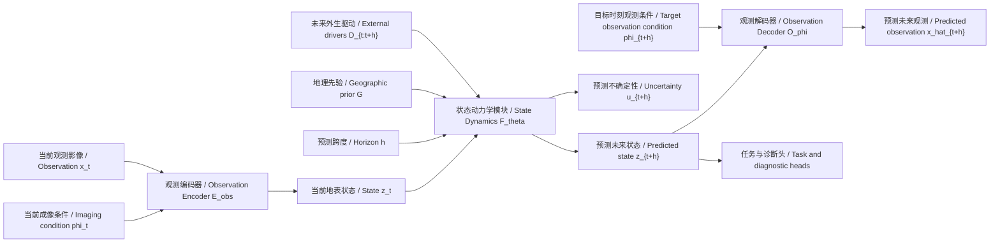

# 34 ObsWorld 主线定稿与实验方案（全量整合翻新版）

> 文件定位：这是 `output` 目录中 01-33 及辅助文档的整合版总纲。它不覆盖旧 07，而是把旧 07/08、DGH 系列、Stage1.5 评估、Stage2 主实验讨论和 AAAI 叙事闭环统一成一份可继续执行的权威工作稿。

> 当前结论：本文主线应固定为 **ObsWorld: an Earth-observation world model for land-surface state dynamics**，即“面向遥感观测的陆表状态动力学世界模型”。它从带有成像条件的遥感观测中估计地表状态，并在外生驱动、地理背景和预测跨度条件下预测状态演化。EarthNet2021 标准预测是主实验观测协议，不是论文的全部目的；DGH 消融、weather-response 诊断、不确定性、地理一致性和下游迁移共同支撑世界模型叙事。

---

## 0. 读法与版本原则

本文件采用三层结构：

1. **最终采用**：后续写作、实验和代码实现应优先服从的方案。
2. **历史备选**：早期文档中出现过、但现在不作为主线的路线。
3. **已纠正风险**：旧文档里存在冲突、过强或不严谨表述的地方。

最重要的版本约束如下：

| 事项 | 最终采用 | 不再作为主线 |
| --- | --- | --- |
| 论文定位 | 显式区分观测条件与地表状态的陆表状态动力学世界模型 | EarthNet leaderboard 专用模型、纯像素预测模型 |
| Stage2 训练数据 | EarthNet2021-only 作为第一主线，即 `ObsWorld-E` | 默认 EarthNet+SSL4EO 联合训练作为第一张主表 |
| SSL4EO 的地位 | Stage1/1.5 预训练数据，属于标准 pretrain-finetune 范式 | 被解释成 Stage2 多数据集精度竞争负担 |
| D | `day_of_year, precipitation, temperature, VPD, solar_radiation` | `ndvi_previous`、`sun_elevation`、离散 `season` 直接作为 D |
| G | 首版只用 `elevation` | 强行堆 slope/aspect/flow 等字段作为主线 |
| h | EarthNet lead-time，多跨度条件化 | 只固定一个 h，或把 `{10,20,30,60}` 当最终唯一方案 |
| ENS | `ENS↑`，越高越好 | `ENS↓` |
| 未来天气 | scenario/oracle forcing 协议下可以使用；deployment forecasting 才不能用未来真值 | 一概说未来 ERA5 都是泄露 |
| Stage1.5 结论 | 线性泄漏下降、跨模态一致性改善；不能声称完全解耦 | “完整非线性解耦已经成功” |

---

## 1. 英文术语速查

| 术语 | 中文解释 | 在本文中的作用 |
| --- | --- | --- |
| Observation | 观测影像 | 卫星看到的像素，是地表状态经过传感器、太阳角、云等成像条件后的结果 |
| State / latent state | 状态 / 潜在状态 | 模型内部表示的陆表状态 `z_t`，重点承载地表变化信息，并降低对观测外观捷径的依赖 |
| Imaging condition / phi | 成像条件 `phi` | 太阳高度角、季节、云、有效像素率、经纬度、模态等观测外观因素 |
| Dynamics | 动力学 | 状态如何随时间和外部驱动变化，不是指物理方程必须完全显式 |
| State transition | 状态转移 | 从 `z_t` 到 `z_{t+h}` 的变化过程 |
| External driver / D | 外生驱动 | 影响地表变化的外部条件，如天气、物候时间、辐射 |
| Geographic prior / G | 地理先验 | 相对稳定的地理背景，如海拔；帮助模型学习不同地区的响应差异 |
| Horizon / h | 预测跨度 | 从当前时刻到未来时刻的时间间隔，作为条件输入而不是隐含在数据索引里 |
| Weather-response | 天气响应诊断 | 固定状态和地理条件，改变天气驱动，看模型预测是否产生合理变化 |
| Uncertainty-error correlation | 不确定性-误差相关 | 模型觉得不确定的地方，真实误差是否更大；用于验证不确定性是否可信 |
| Scenario forcing | 情景条件预测 | 给定未来天气情景，预测对应地表响应；这是合法任务设定 |
| Deployment forecasting | 真实部署预测 | 在真实未来不可知时预测未来；此时未来天气必须来自天气预报或气候平均 |

使用原则：

- 文档内部优先使用中文主表达，英文作为括注或表格列名保留。
- 已经比较清楚的旧表达尽量延续，不为了“更像论文”而频繁换词。
- `decoupling / 解耦` 只在 Stage1.5 技术讨论中使用；主线表述优先写成“显式处理观测条件”“降低成像捷径”“估计更稳定的地表状态”。
- `dynamics / 动力学` 不写成玄学概念，它就是“状态如何随时间、外生驱动、地理背景和预测跨度变化”。

---

## 2. 一句话主线

ObsWorld 学习的不是“未来像素长什么样”本身，而是：

```text
给定当前陆表状态表示 z_t、未来外生驱动 D_{t:t+h}、地理先验 G 和预测跨度 h，
学习陆表状态转移 z_t -> z_{t+h}，
再通过观测解码器还原到可评估的未来遥感观测。
```

论文的一句话可以写成：

> We propose ObsWorld, an Earth-observation world model that estimates latent land-surface states from imaging-conditioned observations and predicts their future transitions under external drivers, geographic priors, and prediction horizons.

对应中文表达：

> ObsWorld 从带有成像条件的遥感影像中估计相对稳定的陆表状态，并在外生驱动、地理背景和预测跨度条件下预测状态演化，再将未来状态解码为可验证的遥感观测。

完整工作定义可以延续旧稿的表达骨架：

> ObsWorld 是一个面向遥感观测的地表状态动力学世界模型：它从多源、有偏、带成像条件的遥感像素观测中估计相对稳定的地表状态，在外生驱动、地理先验和预测跨度条件下预测未来地表状态，再利用目标时刻的观测条件把未来状态解码为可验证的未来像素观测。

这三个版本的区别是：

| 版本 | 用途 | 特点 |
| --- | --- | --- |
| 英文一句话 | 以后写 paper abstract / intro 时参考 | 更紧凑，但对中文读者不够直观 |
| 中文简洁版 | 当前文档主线 | 读起来快，适合反复确认方向 |
| 完整工作定义 | 方法设计和流程图解释 | 保留旧稿中“观测 -> 状态 -> 未来状态 -> 未来观测”的完整链条 |

---

## 3. 我们真正想要什么

最终目标不是证明一个 20M-30M 级别模型在所有像素指标上压过 300M+ 大模型，而是证明：

1. 遥感世界模型不应只停留在“重建未来图像”，还应建模地表状态如何响应外部驱动。
2. 观测条件和地表状态需要显式区分，否则模型可能学到的是太阳角、季节外观、云和传感器捷径。
3. `D/G/h` 不是装饰变量，而是决定状态转移的机制条件。
4. 标准预测任务是检验动力学的观测协议；它必要，但不足以单独支撑世界模型叙事。
5. 如果状态表示真的有意义，应在下游或迁移任务中体现出一定可复用性。

因此，本文不是“EarthNet2021 专用预测器”，而是“借 EarthNet2021 的标准预测协议来观测一个状态动力学世界模型是否成立”。

---

## 4. 全部文档来源与吸收方式

本文件不是只整合 07/08 和 31-33，而是吸收了 `output` 中所有当前可见材料。各文档在最终方案中的地位如下。

| 文档 | 主要信息 | 在本版中的处理 |
| --- | --- | --- |
| 01_叙事审查 | 早期判断：世界模型叙事要避免概念包装 | 保留“必须有状态、驱动、转移、预测检验”的审稿风险意识 |
| 02_推荐论文主线 | 推荐从遥感基础模型盲区切入 | 保留 introduction 逻辑：现有模型强表征但弱动态 |
| 03_叙事确定后的细节审查 | 输入输出、状态与像素关系、消融意识 | 吸收为“像素是观测接口，状态是核心对象” |
| 04_最终判断与下一步建议 | 建议固定问题定义、先做最小可证伪任务 | 吸收为 P0 实验优先级 |
| 05_ObsWorld新主线总结与可行性审查 | ObsWorld 三支柱雏形：state/dynamics/observation | 保留主线，但削弱过宽数据集铺开 |
| 06_最新主线方案与实验设计 | 早期完整实验蓝图 | 保留结构，更新数据策略和指标方向 |
| 07_旧主线定稿 | 旧总纲，信息丰富但有过时字段 | 作为结构模板，统一纠错 |
| 08_旧问答路线 | 用户疑问与实现路线 | 另见新 08，全量重答 |
| 09_远程服务器SSL4EO_FSDP训练提示词 | SSL4EO 训练执行提示 | 保留为 Stage1 工程记录 |
| 10_完整实验流程与字段设计 | 字段 schema 与多阶段流程 | 保留 schema 意识，更新 D/G/h 最终字段 |
| 11_SSL4EO第一步数据处理 | SSL4EO 字段构建和预处理 | 保留 Stage1 数据处理逻辑 |
| 12_SSL4EO phi构造详情 | phi 字段来源与构造 | 保留为 Stage1.5 成像条件基础 |
| 13_phi字段数据集结构 | phi v2.0、FiLM 设计约束、season/sun 处理 | 保留为 Stage1.5 的关键工程依据 |
| 14_Stage1.5与Stage2代码实现报告 | 代码进度、Stage2 仍是骨架 | 保留为实现风险清单 |
| 15_Stage1/1.5训练指南 | 训练步数、配置、输入结构 | 保留为复现实验记录 |
| 16_训练步数调研 | stage 训练预算和 epoch/step 讨论 | 保留为训练资源安排参考 |
| 18_现状评估与后续路线 | 诚实评估：Stage1/1.5 有证据，动力学仍待证明 | 保留为风险边界 |
| 19_S1 incidence字段 | S1 几何字段可行性 | 不作为当前主线，作为未来 S1 完善 |
| 20_S1几何字段审查 | S1 缺产品引用、几何字段难度 | 保留为不扩大 S1 负担的依据 |
| 21_phi v3与DEM说明 | DEM/geo 字段说明 | 吸收为 G=elevation 的来源 |
| 22_Stage2 DGH数据构建 | DGH 初版，倾向多数据集联合 | 保留 DGH 思路，纠正主实验数据策略 |
| 23_完整方法框架与Stage2算法 | 动力学模块设计 | 保留算法方向，更新评估闭环 |
| 24/25_DGH速查 | 字段获取速查 | 保留字段工程线索 |
| 24.2_当前问题梳理 | 指出字段归类混乱、ERA5 风险、Stage2 不清 | 吸收为纠错清单 |
| 26_DGH深度解析 | D/G/h 风险和 6 周路线 | 保留 DGH 原理，修正过硬文献/泄露表述 |
| 27_DGH字段终版 | D/G/h 字段最终化雏形 | 采用 D/G 字段，更新 h 为 EarthNet lead-time |
| 28/29_Stage1.5泄漏检测 | 30k vs 60k，60k alignment 更好但非线性泄漏未完全消失 | 采用 60k 做 Stage2 输入，但限制 claim |
| 30_ObsWorld总纲 | 架构、实验与训练总纲，但有冲突 | 作为旧总纲吸收；纠正 ENS、联合训练、h |
| 31_Stage2与AAAI主实验审查 | EarthNet-only 主实验、ENS↑、双协议天气、h 修正 | 作为最终决策锚点 |
| 32_研究定位与信心重建 | 创新点、EO-WM关系、小参数防守、下游任务 | 作为定位和问答依据 |
| 33_AAAI最终叙事与实验闭环 | 实验如何共同支撑叙事 | 作为实验矩阵和写作闭环的直接依据 |
| 简要改动/问题汇总/周报/精度对标/未命名 | 训练进度、EuroSAT 对标、阶段性问题 | 保留为进度归档和风险提示 |

---

## 5. 核心科学问题

本文可以围绕三个问题组织：

### Q1：遥感世界模型应建模什么？

不是单纯建模像素，而是建模“地表状态在外部驱动下如何变化”。像素预测仍然重要，因为最终必须回到可观测遥感影像上评估；但像素是观测接口，不是唯一科学对象。

### Q2：为什么需要处理成像条件？

遥感影像包含两类因素：

1. 地表本身：植被、水体、土壤湿度、积雪、城市地物等。
2. 成像条件：太阳高度角、传感器、云、阴影、季节外观、有效像素率等。

如果不显式处理这些因素，模型可能靠成像捷径做预测，而不是学习状态变化。ObsWorld 的 Stage1.5 通过 phi 条件和 leakage probe 尝试减少这类捷径。

### Q3：为什么 D/G/h 是世界模型的关键？

世界模型的核心不是“记住平均未来”，而是能够在不同条件下产生不同未来：

```text
same z_t + same G + different D -> different plausible z_{t+h}
same z_t + same D + different G -> geographically modulated response
same z_t + same D + same G + different h -> different lead-time evolution
```

因此，D/G/h 消融和 weather-response 诊断比单纯 ENS 更能证明本文特点。

---

## 6. 最终方法框架

### 6.1 模块定义

ObsWorld 由六个模块组成：

| 模块 | 记号 | 输入 | 输出 | 作用 |
| --- | --- | --- | --- | --- |
| Observation Encoder（观测编码器） | `E_obs` | 当前观测影像 `x_t` | 状态 `z_t` | 从像素观测中提取陆表状态表示 |
| Imaging Condition Encoder（成像条件编码器） | `E_phi` | 成像条件 `phi_t` | 成像条件嵌入 | 表示太阳角、云、季节、传感器等观测外观因素 |
| State Projector（状态投影器） | `P` | encoder token/features | compact state | 将 ViT 表征整理成适合动力学模块使用的状态 |
| State Dynamics Module（状态动力学模块） | `F_theta` | `z_t, D, G, h` | `z_{t+h}` 或分布参数 | 学习当前状态到未来状态的转移 |
| Observation Decoder（观测解码器） | `O_phi` | `z_{t+h}, phi_{t+h}` | 未来观测 `x_{t+h}` | 把未来状态还原为可评估影像 |
| Task / Diagnostic Heads（任务/诊断头） | `H` | `z` 或 `z_{t+h}` | NDVI、分类、风险、不确定性等 | 支撑诊断实验和下游任务 |

核心公式：

```text
z_t = E_obs(x_t, phi_t)
z_{t+h}, u_{t+h} = F_theta(z_t, D_{t:t+h}, G, h)
\hat{x}_{t+h} = O_phi(z_{t+h}, phi_{t+h})
```

其中 `u_{t+h}` 是可选不确定性输出。第一版可以先做 deterministic dynamics，再加 uncertainty head；但从论文完整性看，建议至少保留一个轻量不确定性估计。

### 6.2 Mermaid 总流程



这张图可以按四步读：

1. **从观测到状态**：`x_t` 是当前遥感影像，`phi_t` 是当前成像条件；二者一起进入观测编码器，得到当前地表状态 `z_t`。
2. **从状态到未来状态**：`z_t` 不直接变成未来像素，而是先和 `D/G/h` 一起进入状态动力学模块，预测未来状态 `z_{t+h}`。
3. **从未来状态回到未来观测**：未来状态还不能直接和 EarthNet 指标比较，所以要结合目标时刻观测条件 `phi_{t+h}`，由观测解码器生成 `x_hat_{t+h}`。
4. **诊断与下游**：`z_{t+h}` 还可以接任务头或诊断头，用于 NDVI、weather-response、不确定性、G consistency 和下游任务。

一句话理解这张图：

```text
当前观测 + 当前成像条件 -> 当前状态
当前状态 + 外生驱动 + 地理先验 + 预测跨度 -> 未来状态
未来状态 + 目标观测条件 -> 可验证的未来遥感观测
```

---

## 7. 训练阶段闭环

### 7.1 Stage1：SSL4EO 表征预训练

目标：让 ViT-S/16 规模 encoder 具备基本遥感表征能力。

采用：

- SSL4EO-S12/S2/S1 作为遥感预训练来源。
- 当前路线不把 Stage1 本身包装成创新点。
- Stage1 是必要地基，创新不在“用了 pretrain-finetune”，而在后续结构化动力学。

需要记录：

- 模型规模：当前主要是 `ObsWorld-S`，接近 ViT-S/16 量级，不是玩具模型。
- EuroSAT linear probing 结果只作为表征健康度参考，不作为论文主贡献。
- 如果 EuroSAT 精度弱于主流 SSL4EO 方法，不致命；但不能在论文里夸大 Stage1 表征领先。

### 7.2 Stage1.5：成像条件建模与状态表示约束

目标：通过 phi 条件、FiLM 或条件化训练，让状态表示减少成像因素泄漏。

关键输入：

- `sun_elevation`
- `season`
- `day_of_year`
- `cloud_cover`
- `cloud_shadow`
- `valid_ratio`
- `center_lat`
- `center_lon`
- `modality`
- time validity / missing indicator

注意：

- `season` 在 Stage1.5 可以作为 phi 的成像/物候协变量，但在 Stage2 的 D 中不再用离散 `season`，而用连续/周期化的 `day_of_year`。
- `sun_elevation` 属于成像条件，不属于外生驱动 D。
- 28/29 的结论必须诚实：60k 比 30k alignment 更好，适合进入 Stage2；但非线性探针仍可能识别部分成像因素，不能声称完全解耦。

推荐 claim：

> Stage1.5 reduces linear imaging-condition leakage and improves cross-modal consistency, providing a cleaner state representation for dynamics learning.

不推荐 claim：

> Stage1.5 completely removes all imaging information from the state.

### 7.3 Stage2：EarthNet2021 条件状态动力学

目标：训练 `F_theta(z_t, D, G, h)`，使状态能在不同驱动和跨度下演化。

最终首版策略：

- 主线模型：`ObsWorld-E`，Stage2 使用 EarthNet2021。
- Stage1/1.5 用 SSL4EO，Stage2 用 EarthNet2021，是标准 pretrain-finetune，不是问题。
- `ObsWorld-G`，即 EarthNet+SSL4EO 或更多数据联合训练，只作为泛化增强/附录，不作为第一主表默认模型。

这样安排的原因：

1. 与 EarthNet-only 方法比较更公平。
2. 避免主实验效果不好时无法解释是方法问题还是多数据集负迁移。
3. 论文主张是动力学机制，不需要把第一主实验变成多数据集训练竞赛。

### 7.4 Stage3：观测解码与预测评估

目标：把 `z_{t+h}` 解码成未来观测，用标准指标评估。

第一版可选择：

- Stage2 和 decoder 串行训练，便于消融。
- 后续可 joint fine-tune，提高像素指标。

需要避免：

- 只优化像素重建而牺牲 D/G/h 可解释性。
- 把 decoder 能力误写成世界模型核心。

### 7.5 Stage4：下游与迁移

目标：验证 `z` 不是 EarthNet2021 专用预测特征，而是具备一定迁移能力的状态表示。

推荐：

- P0：CropHarvest，作物/农业相关，与植被动态更贴近。
- P1：Sen1Floods11，灾害/洪水方向，作为跨任务泛化。
- 可选：如果资源允许，再加入一个 foundation model 对照表，比较 SkySense/Prithvi/Galileo 等模型的 frozen/linear protocol。

---

## 8. 数据与字段最终定义

### 8.1 数据集分工

| 数据 | 阶段 | 作用 | 是否主实验 |
| --- | --- | --- | --- |
| SSL4EO | Stage1/1.5 | 表征预训练与成像条件建模 | 不是 Stage2 主实验 |
| EarthNet2021 | Stage2/3 | 标准预测、DGH、诊断实验 | 是主实验核心 |
| CropHarvest | Stage4 | 农业/作物下游迁移 | 推荐 P0 |
| Sen1Floods11 | Stage4 | 灾害/洪水迁移 | 推荐 P1 |
| EarthNet+SSL4EO 联合 | 附录/扩展 | 泛化增强或跨域诊断 | 不作为首版主表默认 |
| GreenEarthNet / OOD split | 可选扩展 | 跨区域或气候泛化 | 资源允许时加入 |

### 8.2 D：外生驱动

最终 D 字段：

| 字段 | 含义 | 角色 |
| --- | --- | --- |
| `day_of_year` | 年内日，建议 sin/cos 周期编码 | 季节/物候时间驱动 |
| `precipitation` | 降水 | 水分输入 |
| `temperature` | 温度 | 热量条件 |
| `VPD` | vapor pressure deficit，蒸汽压亏缺 | 水分胁迫 |
| `solar_radiation` | 太阳辐射 | 能量输入 |

可选增强：

- `temperature_max/min`
- soil moisture proxy
- snow-related driver

但第一版不建议扩太多，否则消融和解释会变复杂。

明确排除：

- `ndvi_previous`：这是状态反馈或目标派生量，不是外生驱动。
- `sun_elevation`：主要影响观测外观，应归 phi。
- 离散 `season`：容易和 phi 混淆，Stage2 用 `day_of_year` 替代。

### 8.3 G：地理先验

最终首版 G：

| 字段 | 含义 | 为什么够用 |
| --- | --- | --- |
| `elevation` | 海拔 | 稳定、可获取、与气候/植被响应相关，且不引入过多工程复杂度 |

为什么 G 只有一个也可以做实验：

- G 的目的不是制造复杂物理定律，而是提供地理背景。
- 如果 elevation 分层后，模型误差、响应曲线或 D 敏感性出现合理差异，就可以证明 G 在调节响应。
- AAAI 审稿更关心变量是否有清晰作用和验证，而不是字段数量越多越好。

暂不主线加入：

- slope/aspect/flow accumulation：可能对水文有用，但容易增加边界效应、DEM 处理难度和解释负担。
- land cover：有用但可能与目标状态/标签缠绕，首版需谨慎。

### 8.4 h：预测跨度

最终原则：

- h 必须作为条件输入，不能隐含在训练样本顺序中。
- h 不建议只设一个值。
- 如果使用 EarthNet2021，应尊重其时间协议，采用多 lead-time。

推荐两档：

| 方案 | h 取值 | 适用情况 |
| --- | --- | --- |
| 完整协议 | `{5,10,15,...,100}` 天 | 资源允许，最贴近 EarthNet 多帧预测 |
| 轻量协议 | `{5,10,20,30,60,100}` 天 | 资源紧张，仍覆盖短中长跨度 |

旧 `{10,20,30,60}` 的地位：

- 可以作为历史备选或 ablation。
- 不应写成最终唯一设置。
- 如果 EarthNet 输出天然是 5-day intervals，忽略 5/15/25 等 lead-time 会丢失评估颗粒度。

### 8.5 phi 与 D 的边界

| 字段 | 最终归类 | 原因 |
| --- | --- | --- |
| `sun_elevation` | phi | 影响光照、阴影、辐射外观 |
| `season` | phi 可保留，D 不用离散 season | 成像外观和半球相关，D 用 day_of_year 更干净 |
| `day_of_year` | D | 连续物候时间驱动 |
| `cloud_cover` | phi / mask | 观测质量，不是地表状态驱动 |
| `ndvi_previous` | state feedback / auxiliary target | 状态量，不是外生条件 |
| `elevation` | G | 稳定地理背景 |

---

## 9. 天气字段与泄露协议

旧文档中“未来 ERA5 一定是泄露”的说法需要改成双协议。

### 9.1 Scenario / oracle forcing 协议

任务定义：

```text
给定一个未来天气情景，预测地表在该情景下的响应。
```

在这个协议下：

- 使用目标期真实天气或 reanalysis 作为外生 forcing 是合法的。
- 因为任务不是“闭眼预测真实未来”，而是“条件响应建模”。
- 这非常适合 ObsWorld 的叙事，因为我们关心模型是否响应 D。

### 9.2 Deployment forecasting 协议

任务定义：

```text
在真实未来不可知时，预测未来观测。
```

在这个协议下：

- 不能使用未来真实天气。
- 必须使用天气预报、气候平均、历史统计或无未来 forcing 的 baseline。

### 9.3 论文写法

主文建议这样写：

> We primarily evaluate ObsWorld under a scenario-conditioned forecasting protocol, where future meteorological drivers are provided as exogenous forcing to assess land-surface response. For deployment-style forecasting, these drivers should be replaced by operational forecasts or climatological estimates.

这比“一概泄露”更准确，也比“完全无视泄露风险”更稳。

---

## 10. 主实验总逻辑

实验不是散的。它们共同回答一个递进问题：

```text
标准预测：模型是否在公认协议上能预测？
        ↓
DGH 消融：预测能力是否来自 D/G/h 条件状态转移？
        ↓
Weather-response：模型是否真的响应外部驱动，而不是记平均季节？
        ↓
Uncertainty/G consistency：模型是否知道哪里难、是否受地理背景调节？
        ↓
Downstream/transfer：状态表示是否有超出 EarthNet 的可复用价值？
```

因此，预测精度不是唯一支柱。即便 ENS 不压过 EO-WM，只要标准预测不弱、DGH 有增益、weather-response 清楚、下游可迁移，叙事仍然成立。

---

## 11. 实验一：EarthNet2021 标准预测

### 11.1 定位

这是第一张主表。它回答：

> ObsWorld 是否能在公认 Earth observation forecasting benchmark 上进入合理竞争区间？

它不是唯一贡献，但必须过关。否则后续机制实验缺乏可信基础。

### 11.2 推荐表格

| Method | Type | Params | External pretrain | ENS↑ | MAD/MAE↓ | OLS↑ | EMD↑ | SSIM↑ | NDVI-MAE↓ | DHR↑ |
| --- | --- | ---: | --- | ---: | ---: | ---: | ---: | ---: | ---: | ---: |
| Persistence / last frame | naive | - | no |  |  |  |  |  |  |  |
| Climatology / seasonal mean | naive | - | no |  |  |  |  |  |  |  |
| ConvLSTM / PredRNN-like | video forecast |  | no |  |  |  |  |  |  |  |
| Earthformer | spatiotemporal transformer |  | dataset-specific |  |  |  |  |  |  |  |
| Contextformer / EarthNet baseline | EO forecast |  | dataset-specific |  |  |  |  |  |  |  |
| EO-WM | EO world/forecast model | large | yes |  |  |  |  |  |  |  |
| ObsWorld-S | ours | ~ViT-S scale | SSL4EO |  |  |  |  |  |  |  |
| ObsWorld-M | ours optional | medium | SSL4EO |  |  |  |  |  |  |  |

说明：

- `ENS` 必须写 `ENS↑`。
- 参数量不公平时不要假装公平，应在表格中明确 Params。
- 如果 EO-WM 是 300M+ 级大模型，ObsWorld-S 只需证明在机制指标上更有特色。
- 如果资源允许，至少补一个 `ObsWorld-S` 完整版；若已有 ViT-S/16 量级，本文主模型就不应写成 tiny toy。

### 11.3 可接受结果

可接受：

- ObsWorld-S 明显强于 persistence/climatology 和常规轻量 video baseline。
- 与 Earthformer/Contextformer 接近，或在 NDVI/DHR/long-horizon 上有优势。
- ENS 略低于 EO-WM，但 DGH 和 response 指标更强。

危险：

- 输给 persistence 或 seasonal mean。
- 所有指标都明显弱于常规 transformer，且机制实验也无优势。
- 只报一个对自己有利指标，缺少标准指标。

---

## 12. 实验二：DGH 消融

### 12.1 定位

这是本文的机制核心实验。它回答：

> D、G、h 是否真的让模型学到条件状态转移？

### 12.2 推荐表格

| Config | D | G | h | Stage1.5 | ENS↑ | NDVI-MAE↓ | DHR↑ | Long-horizon Error↓ | Weather-response↑ |
| --- | --- | --- | --- | --- | ---: | ---: | ---: | ---: | ---: |
| z only | no | no | no | yes |  |  |  |  |  |
| z + h | no | no | yes | yes |  |  |  |  |  |
| z + D + h | yes | no | yes | yes |  |  |  |  |  |
| z + G + h | no | yes | yes | yes |  |  |  |  |  |
| z + D + G + h | yes | yes | yes | yes |  |  |  |  |  |
| full w/o Stage1.5 | yes | yes | yes | no |  |  |  |  |  |
| full single-h | yes | yes | single | yes |  |  |  |  |  |

### 12.3 解释逻辑

理想结果：

- 加 h 后，长短期预测区分更清楚。
- 加 D 后，NDVI-MAE、DHR、weather-response 明显改善。
- 加 G 后，整体指标可能小幅提升，但在 elevation strata 或地理分组上更稳定。
- 去掉 Stage1.5 后，像素指标可能不一定大降，但 response、泛化或成像条件泄漏指标应变差。

可接受：

- G 的总体增益很小，但在高海拔/低海拔分层中有差异。
- Stage1.5 的像素指标增益不大，但减少成像泄漏，增强跨条件一致性。

危险：

- D/G/h 都无增益。
- D 改了预测完全不动。
- h 改了模型输出几乎相同。

---

## 13. 实验三：Weather-response 诊断

### 13.1 定位

这是最能体现 ObsWorld 特点的实验。它回答：

> 模型是否真的学到“状态对天气驱动的响应”，而不是只学了平均未来？

### 13.2 三种设计

| 设计 | 做法 | 意义 |
| --- | --- | --- |
| Forcing sweep | 固定 `z_t, G, h`，逐步改变 precipitation / VPD / temperature / radiation | 检查预测是否随驱动连续变化 |
| Matched pairs | 找状态相近但天气不同的样本对 | 检查模型是否区分干湿、冷热情景 |
| Extreme subsets | drought / wet / heat 等极端子集 | 检查困难场景中的机制价值 |

### 13.3 指标建议

| 指标 | 含义 |
| --- | --- |
| D-sensitivity | 改变 D 后预测变化幅度是否显著 |
| Response sign accuracy | 降水增加、VPD 下降等情景下，NDVI/状态变化方向是否合理 |
| Response monotonicity | 驱动连续增强时响应是否大体单调 |
| Extreme subset gain | 在干旱、热浪等子集上，full model 相对 no-D 的提升 |
| DHR | Dynamic Horizon Response，衡量不同 h 下响应合理性 |

### 13.4 可接受结果

可接受：

- 标准 ENS 不是最高，但 weather-response 明显优于 baseline。
- response 方向在多数样本或关键子集上符合预期。
- 模型在 extreme weather 子集上比 no-D 更稳。

危险：

- 改变 D 后输出几乎不变。
- 响应方向经常反常，且无法用地理/季节解释。

---

## 14. 实验四：不确定性

### 14.1 定位

不确定性不是必须成为第一贡献，但可以增强“世界模型”的可信度。它回答：

> 模型是否知道哪些未来更难预测？

### 14.2 实现方式

首版可选轻量方案：

- dynamics module 输出 `mu` 和 `logvar`。
- 用 Gaussian NLL 或 heteroscedastic loss。
- 如果不稳定，可先用 ensemble/dropout 近似不确定性。

### 14.3 指标

| 指标 | 含义 |
| --- | --- |
| uncertainty-error correlation | 预测不确定性与真实误差的相关性 |
| calibration bins | 按不确定性分桶，误差是否随桶单调增加 |
| NLL / CRPS | 概率预测质量，可选 |
| high-uncertainty localization | 高不确定性是否出现在云、边界、极端天气、长期预测区域 |

### 14.4 可接受结果

可接受：

- 不确定性与误差有正相关。
- 长 horizon 和极端天气下不确定性升高。
- 高不确定性区域与可视化误差区域有重合。

危险：

- 不确定性几乎是常数。
- 不确定性与误差无关甚至负相关。

---

## 15. 实验五：G consistency / 地理先验分析

### 15.1 定位

G 的作用不是制造一套复杂地理物理定律，而是给状态转移提供稳定背景。首版只有 elevation 也可以设计实验。

### 15.2 推荐设计

| 设计 | 做法 | 意义 |
| --- | --- | --- |
| Elevation strata | 按海拔分桶评估 full vs no-G | 看 G 是否在不同地形下改善稳定性 |
| Response by elevation | 在不同海拔层做 weather-response sweep | 看同样天气驱动是否有不同响应曲线 |
| Error map over elevation | 可视化误差与海拔关系 | 证明 G 在地理背景中有解释价值 |
| G perturbation | 小幅扰动 elevation，观察输出变化 | 检查模型是否真的使用 G |

### 15.3 可接受结果

可接受：

- 总体 ENS 提升小，但高海拔/复杂区域提升明显。
- no-G 在某些地理分层中误差偏大，full model 更均衡。
- response 曲线在不同 elevation 分组中有可解释差异。

危险：

- G perturbation 完全不影响输出。
- G 只带来噪声，所有分层都变差。

---

## 16. 实验六：Downstream / Transfer

### 16.1 定位

下游任务不是为了证明 ObsWorld 是万能 foundation model，而是回答：

> 经过成像条件建模和动力学训练的状态表示，是否比普通预训练表征更适合地表状态相关任务？

### 16.2 推荐数据集

| 优先级 | 数据集 | 任务 | 为什么选 |
| --- | --- | --- | --- |
| P0 | CropHarvest | crop classification / agriculture | 与植被状态、物候和天气响应贴近 |
| P1 | Sen1Floods11 | flood mapping / disaster | 检查跨任务和状态变化敏感性 |
| P2 | EuroSAT / BigEarthNet | 常规分类 sanity check | 已有经验，但不应成为核心贡献 |

### 16.3 训练协议

建议至少两个协议：

| 协议 | 做法 | 意义 |
| --- | --- | --- |
| Frozen linear probe | 冻结 encoder/state，只训练线性头 | 检查表示质量 |
| Light fine-tune | 少量层或 adapter 微调 | 检查迁移潜力 |

可选：

- 与 SkySense/Prithvi/Galileo 等遥感基础模型做 frozen/linear 对照。
- 如果无法运行所有大模型，至少把它们放在 related work 或补充表中，不要硬凑不公平主表。

### 16.4 可接受结果

可接受：

- ObsWorld 在 CropHarvest 或状态相关任务上优于 Stage1-only。
- 不一定全面超过大 foundation model，但在小样本、状态变化、跨域设置上有优势。

危险：

- Stage2 后表示全面变差。
- 下游任务与主线无关，无法支撑状态动力学叙事。

---

## 17. 可视化体系

AAAI 篇幅有限，可视化必须服务叙事，而不是堆图。

| 图 | 内容 | 支撑点 |
| --- | --- | --- |
| Fig. 1 | ObsWorld 方法总图：`x_t -> z_t -> F(D,G,h) -> z_{t+h} -> x_hat` | 解释世界模型结构 |
| Fig. 2 | EarthNet 标准预测：输入、GT、ObsWorld、baseline、error map | 证明预测能力 |
| Fig. 3 | Weather-response sweep：固定状态，改变降水/VPD/温度 | 证明 D 不是摆设 |
| Fig. 4 | Uncertainty map + error map | 证明不确定性可信 |
| Fig. 5 | Elevation/G 分层响应或误差 | 证明 G 的地理背景作用 |
| Fig. 6 optional | h 不同跨度下状态/NDVI 变化曲线 | 证明 h-conditioned dynamics |

可视化注意：

- 不要只展示好看的 RGB。
- 需要展示 NDVI/状态变量/error map/response curve。
- 每张图都要能回答一个审稿问题。

---

## 18. 主文表格安排

AAAI 篇幅有限，建议主文保留 4-5 张核心表，其余入附录。

| 表 | 主文/附录 | 内容 | 作用 |
| --- | --- | --- | --- |
| Table 1 | 主文 | EarthNet 标准预测对比 | 证明 benchmark 竞争力 |
| Table 2 | 主文 | D/G/h/Stage1.5 消融 | 证明机制变量有效 |
| Table 3 | 主文 | Weather-response 诊断 | 证明模型响应外部驱动 |
| Table 4 | 主文或紧凑合并 | Uncertainty + G consistency | 证明可信度和地理调节 |
| Table 5 | 主文或附录 | Downstream / Transfer | 证明状态表示可复用 |
| Appendix tables | 附录 | 更多 h、更多 D、更多数据集、ObsWorld-G | 补充泛化与稳健性 |

如果篇幅非常紧：

- Table 4 可以把 uncertainty 和 G 分成两个小子表。
- Downstream 可以只保留 CropHarvest 主文，Sen1Floods11 放附录。
- ObsWorld-G 不进主文第一表，避免叙事混乱。

---

## 19. 对比对象放置原则

### 19.1 EO-WM

EO-WM 是重要强基线，但不是本文唯一中心。

放置方式：

- Table 1：如果有可比 EarthNet 结果，放入标准预测表。
- Discussion：承认其大参数和生成/预测能力。
- 我们的重点：小得多的结构化动力学模型，在 D/G/h response 和解释性上给出不同价值。

不要这样写：

> 我们全面超过 EO-WM。

除非结果真的支持。

建议写法：

> While large EO world models may excel at high-fidelity visual forecasting, ObsWorld focuses on structured state transitions under explicit exogenous drivers and geographic priors.

### 19.2 SkySense / Prithvi / Galileo

这些更适合放在：

- related work：遥感 foundation models。
- downstream/transfer 表：frozen/linear 或 light fine-tune。
- 不建议放在 EarthNet 标准预测主表，除非它们有明确同协议预测实现。

### 19.3 数据集专用预测模型

Earthformer、Contextformer、ConvLSTM/PredRNN-like、EarthNet baseline 等应放在 Table 1。

它们回答的是：

> 在标准预测赛道上，ObsWorld 是否够强？

而不是：

> 谁更像世界模型？

---

## 20. 结果如何支撑叙事

### 20.1 最理想情况

如果结果如下，叙事非常稳：

- Table 1：ObsWorld-S 接近或超过主流 EarthNet baseline，至少强于 naive 和轻量视频模型。
- Table 2：full `D+G+h+Stage1.5` 明显优于去掉 D/h 的版本。
- Table 3：weather-response 显著，D 改变会带来合理状态变化。
- Table 4：不确定性与误差正相关，G 在海拔分层上有作用。
- Table 5：下游迁移优于 Stage1-only 或至少在 CropHarvest 上有优势。

论文结论：

> ObsWorld is not merely a forecasting architecture; it learns driver-conditioned land-surface state transitions that remain observable through standard EO forecasting and transferable to state-related downstream tasks.

### 20.2 可容错情况

仍可投稿的情况：

- ENS 低于 EO-WM，但 DHR/weather-response/NDVI dynamics 更好。
- G 总体增益小，但分层分析有效。
- Stage1.5 未完全去除非线性泄漏，但比无 phi 条件建模更稳。
- 小模型参数少，绝对精度不是第一，但效率和机制分析清晰。

### 20.3 必须复盘的情况

需要停下来调整的情况：

- 标准预测输给 persistence/climatology。
- D/G/h 消融没有任何可见差异。
- weather-response 完全不随 D 变化。
- uncertainty 与误差无关。
- Stage2 训练后下游表示明显崩坏。

---

## 21. 论文贡献点

建议写成三点：

1. **Problem / perspective**：提出遥感世界模型应关注观测条件下的陆表状态动力学，而不仅是未来像素重建。
2. **Method**：设计 ObsWorld，将 observation encoder、imaging-condition disentanglement、D/G/h-conditioned state dynamics 和 observation decoder 统一起来。
3. **Evaluation**：构建标准预测 + DGH 消融 + weather-response + uncertainty/geographic consistency + downstream transfer 的评估闭环，用于验证模型是否真的学习条件状态转移。

不要把贡献写成：

- 我们用了 SSL4EO 预训练。
- 我们用了 ViT。
- 我们用了 EarthNet。

这些是实现条件，不是核心创新。

---

## 22. 当前代码与实现风险记录

根据 14、28、29 及后续讨论，当前状态应按以下方式理解：

| 部分 | 当前状态 | 风险 |
| --- | --- | --- |
| Stage1 | 已有 SSL4EO 训练/评估线索 | EuroSAT linear probing 不一定领先，不能夸大 |
| Stage1.5 | phi 条件化和 30k/60k 评估已有记录 | 不能声称完全解耦 |
| ViT-S/16 规模 | 当前主线接近 `ObsWorld-S`，不是 toy | 若参数仍约 20M-30M，需要在表格中明确 |
| Stage2 dynamics | 旧记录显示仍偏骨架 | 必须实现真实 EarthNet loader、D/G/h 输入、h embedding |
| decoder | 有 phi-aware decoder 方向 | 需要与 EarthNet 输出和指标对齐 |
| uncertainty | 目前可能未实现 | 若写入主文，需要至少轻量实现 |

P0 实现任务：

1. EarthNet2021 数据读取与样本构造。
2. 从 EarthNet 或外接数据构造 `D_{t:t+h}`。
3. 构造 `G=elevation` 并与 patch 对齐。
4. h embedding 和多 lead-time 采样。
5. `F_theta(z_t,D,G,h)` 真实接入。
6. EarthNet 标准指标脚本，确保 `ENS↑`。
7. DGH 消融开关。
8. Weather-response 诊断脚本。

---

## 23. 写作口径

### 23.1 Introduction 逻辑

1. 遥感 foundation models 在静态表征、分类、分割上很强。
2. 但遥感场景的核心挑战之一是地表状态随天气、地理和时间跨度变化。
3. 普通视频预测多关注像素连续性，容易混淆观测外观和地表状态。
4. 因此我们提出面向遥感观测的陆表状态动力学世界模型。
5. 我们在 EarthNet 标准预测上验证可观测能力，并用 DGH/response/uncertainty/downstream 验证机制。

### 23.2 方法章节口径

应突出：

- observation vs state 的区别。
- phi 的作用是成像条件，不是强物理驱动。
- D/G/h 是状态转移条件。
- decoder 是观测接口。

避免：

- 把所有变量都说成“物理定律”。
- 把像素预测说成全部目标。
- 把 pretrain-finetune 说成创新本身。

### 23.3 实验章节开头

建议写：

> Our experiments are designed to answer three questions: whether ObsWorld remains competitive under a standard EO forecasting protocol, whether its gains come from driver-, geography-, and horizon-conditioned state dynamics, and whether the learned state is useful beyond the forecasting benchmark.

---

## 24. 历史备选与不再主线

| 历史方案 | 为什么出现 | 现在如何处理 |
| --- | --- | --- |
| Active acquisition / 主动观测选择 | 早期世界模型想象更大 | 暂不主线，AAAI 篇幅和实现成本过高 |
| 多数据集 Stage2 联合训练作为主表 | 想突出泛化 | 改为附录/扩展，主表 EarthNet-only 更公平 |
| D 中加入 `ndvi_previous` | 想利用历史植被信息 | 改为状态反馈或辅助目标，不归 D |
| D 中加入 `sun_elevation` | 早期字段归类混乱 | 改归 phi |
| 离散 `season` 同时放 phi 和 D | 想表达物候 | 拆分：phi 可有 season，D 用 day_of_year |
| G 扩展很多 DEM 派生量 | 想增强地理先验 | 首版只用 elevation，降低复杂度 |
| `h={10,20,30,60}` 固定 | DGH 文档中的通用多跨度方案 | EarthNet 主线改为 5-day lead-time 协议 |
| `ENS↓` | 旧表格方向写错 | 全部改为 `ENS↑` |
| “未来 ERA5 一定泄露” | 机器学习严谨性担忧 | 改为 scenario vs deployment 双协议 |

---

## 25. 最小可执行版本

如果时间紧，最小 AAAI 可执行版本应是：

1. `ObsWorld-S`，Stage1/1.5 权重固定或轻微微调。
2. Stage2 使用 EarthNet2021-only。
3. h 使用 `{5,10,20,30,60,100}` 轻量多跨度。
4. D 使用五个核心字段。
5. G 使用 elevation。
6. 表 1：EarthNet 标准预测。
7. 表 2：D/G/h/Stage1.5 消融。
8. 表 3：weather-response 诊断。
9. 图 1-3：方法图、预测图、response 图。
10. 附录或主文短表：uncertainty 或 CropHarvest 至少一个。

这套最小版已经能支撑“观测条件建模 + 条件状态动力学”的主张。

---

## 26. 完整顶会版本

如果资源允许，完整版本增加：

1. `ObsWorld-M` 中等规模版本，缓解参数量质疑。
2. 完整 `{5,10,15,...,100}` lead-time。
3. uncertainty head + calibration。
4. elevation strata + G perturbation。
5. CropHarvest + Sen1Floods11。
6. ObsWorld-G 附录：EarthNet+SSL4EO 或其他数据的泛化增强。
7. 与 SkySense/Prithvi/Galileo 的 downstream frozen/linear 对比。

---

## 27. 最终判断

当前内容能够支撑 AAAI 叙事标准，前提是实验不要只押注像素 SOTA，而要形成闭环：

```text
EarthNet 标准预测证明模型能预测；
DGH 消融证明预测依赖结构化条件；
Weather-response 证明模型响应外部驱动；
Uncertainty/G consistency 证明模型有可信度与地理背景意识；
Downstream/transfer 证明状态表示不只是 EarthNet 过拟合。
```

如果后续结果只是“像素指标中等”，但机制实验明确，仍有投稿价值。如果机制实验也不成立，则应及时复盘为“遥感条件预测模型”或“观测条件感知表征学习”方向，而不要硬撑 world model 叙事。
