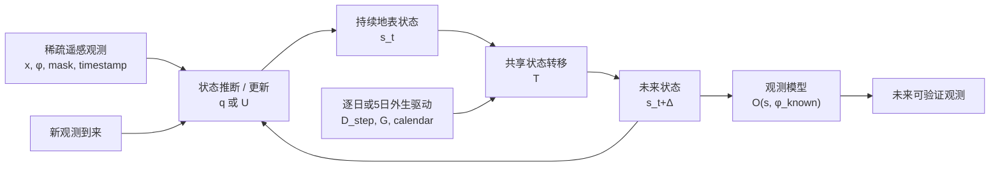

```mermaid
flowchart LR
    X["稀疏遥感观测<br/>x, φ, mask, timestamp"] --> E["状态推断 / 更新<br/>q 或 U"]
    E --> S["持续地表状态<br/>s_t"]
    S --> T["共享状态转移<br/>T"]
    D["逐日或5日外生驱动<br/>D_step, G, calendar"] --> T
    T --> SF["未来状态<br/>s_t+Δ"]
    SF --> O["观测模型<br/>O(s, φ_known)"]
    O --> Y["未来可验证观测"]
    XN["新观测到来"] --> E
    SF --> E
```