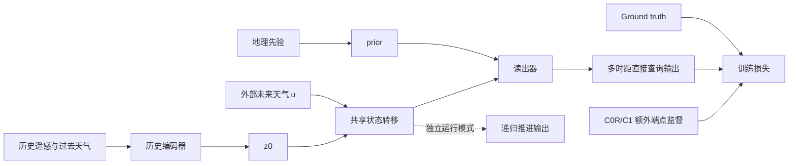

# 图2：方法与监督框架（文字版）

```mermaid
flowchart LR
  H[历史遥感与过去天气] --> E[历史编码器]
  E --> Z0[z0]
  G[地理先验] --> P[prior]
  W[外部未来天气 u] --> T[共享状态转移]
  Z0 --> T
  P --> R[读出器]
  T --> R
  R --> Y[多时距直接查询输出]
  T -.独立运行模式.-> RR[递归推进输出]
  GT[Ground truth] --> L[训练损失]
  Y --> L
  EP[C0R/C1 额外端点监督] --> L
```

- `prior`、`z0`、外部天气、共享转移与读出是已实现路径；GT 只连接训练损失。
- 全时距直接监督作用于各查询时距；C0R/C1 的额外端点监督进入损失路径，不新增推理模块。
- 默认直接多时距查询与递归运行是两个不同运行模式，不在图中混为同一条链。
- 不展示未实现模块。
