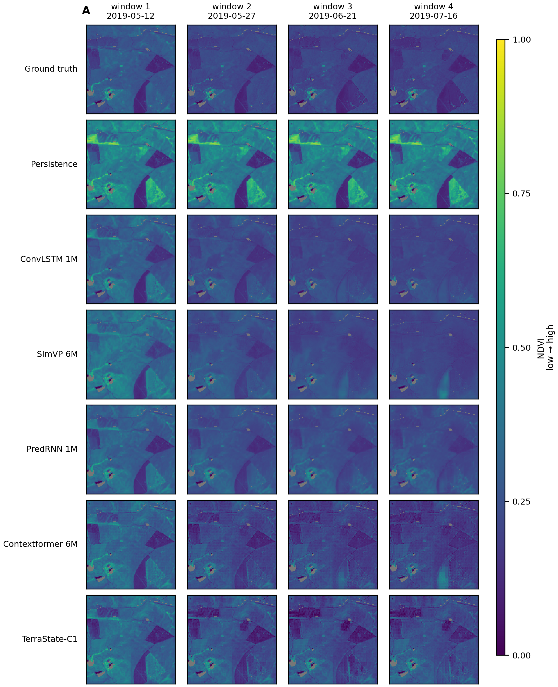
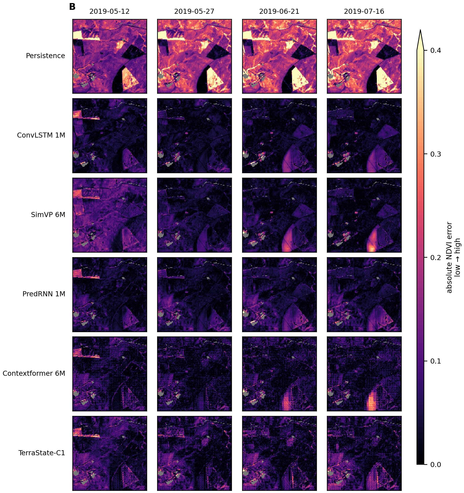
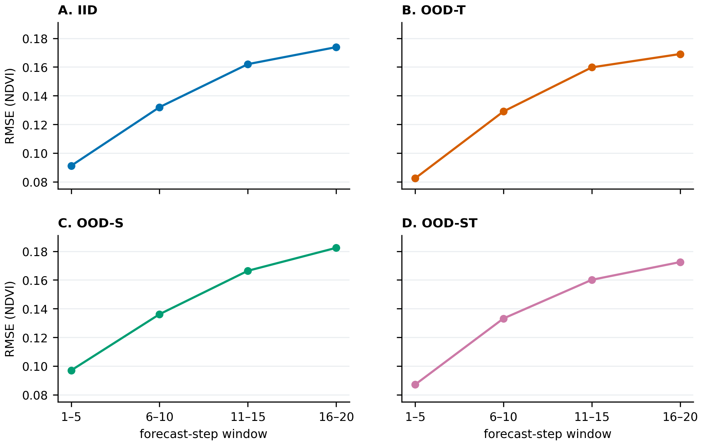
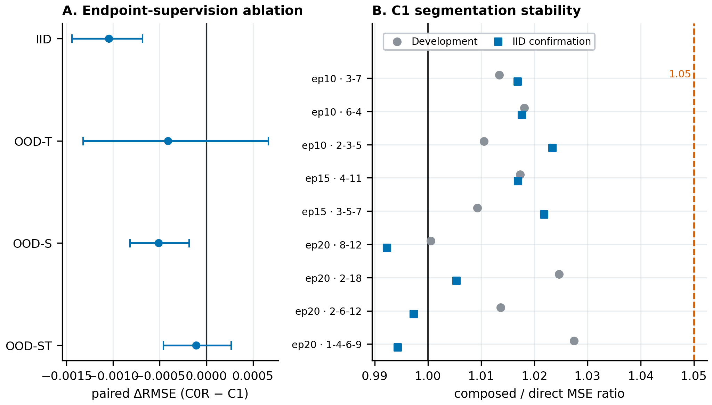
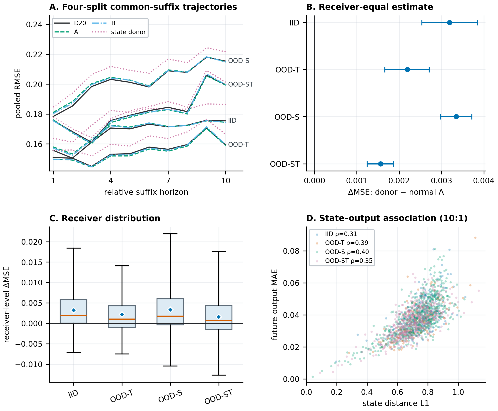
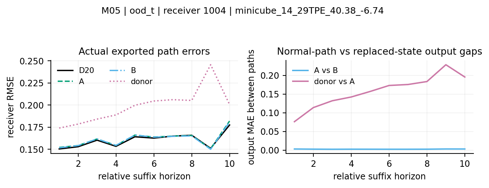
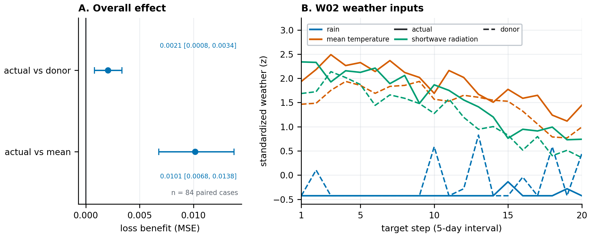
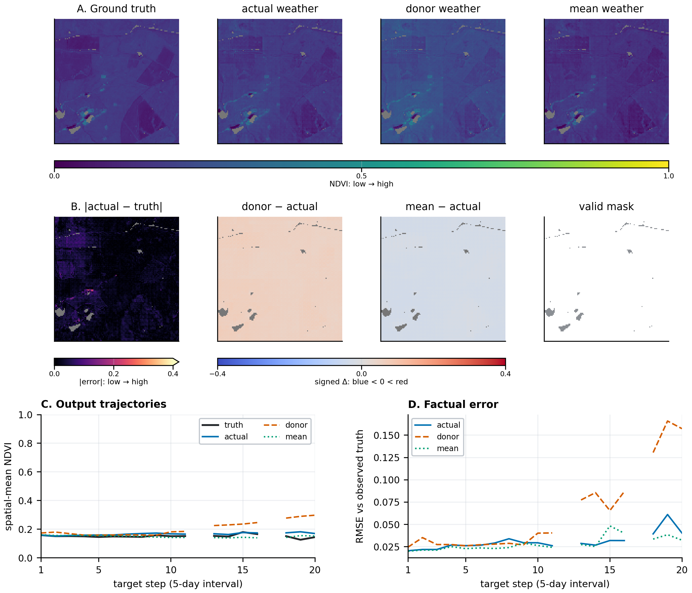
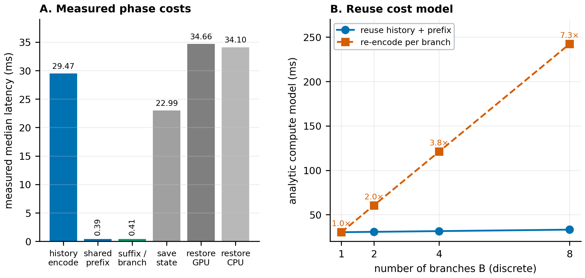

# TerraState：面向天气条件植被预测的可复用空间预测状态

**TerraState: Learning Reusable Spatial Predictive States for Weather-Conditioned Vegetation Forecasting**

## 摘要

高分辨率植被预测不仅要回答“未来的图像是什么样”，还要面对一个更贴近长期使用的问题：当预测过程被拆成不同的时间段、在中途接入更新后的天气，或从同一历史状态分支出多个未来时，模型内部保存的状态还能不能继续工作？一次性预测准确并不能自动给出肯定答案。两个隐藏状态可以生成相近的当前图像，却在共同的后续天气下走向不同的未来；同样，一个模型可以在固定终点表现良好，却在改变计算分段后产生明显退化。

我们提出 TerraState，将由历史遥感观测形成的上下文先验，与受未来天气驱动的密集空间状态结合起来。模型使用共享的变跨度转移，在保留全时距直接预测监督的同时，让不同分段路径也直接接受真实观测监督。由此，训练目标不只要求模型在既定时距输出合理图像，也要求其中间状态能够适应不同推进方式，并继续承担后续预测。

我们在 GreenEarthNet 的四个标准划分上建立了一条由“预测基础—分段稳定—共同后缀—状态干预—天气响应—状态复用成本”组成的证据链。TerraState 在四个划分上稳定完成 20 个五日步、约 100 天的密集 NDVI 预测，三个训练种子的离散度很小。更关键的是，在九个训练时未采用的分段方案上，递归分段监督模型的 composed/direct MSE 比值保持在 0.9923–1.0275，全部位于 1.05 门限内；直接端点监督对照在开发诊断范围内为 1.0709–1.3246。到达同一中间时刻后，两条合法前缀路径在共同后缀上的 RMSE 相对直达参考只变化 −0.62% 至 +0.59%，而替换为匹配 donor 的中间状态会带来 +1.45% 至 +6.42% 的完整后缀代价。四个划分上，receiver 等权的状态替换效应均为正且 95% 区间下界大于零；移除动态状态支路也会在全部划分上一致降低预测质量。天气替换进一步表明，模型确实利用了与样本匹配的实际天气，而不是把天气输入当作装饰。状态复用实验则明确展示了可共享的历史编码与前缀计算，以及这种复用随分支数增长所形成的计算空间。

这些结果共同说明，TerraState 学到的不只是一次性图像生成所需的表示，而是在已测试的有限窗口、时间分段和共同后缀条件下，能够支持后续预测的空间状态。本文把状态能力作为标准预测精度之外的独立评价维度，为可更新、多时距和多情景的遥感预测提供了一条清晰、可测量的实现路径。

**关键词：** 遥感图像序列；植被预测；空间预测状态；天气条件建模；变跨度转移；状态复用

## 1. 引言

### 1.1 从“预测一段未来”到“维护一个可继续使用的未来”

卫星影像为大范围地表变化提供了连续观测，但这些观测并不真正连续：云层会遮挡地表，不同区域的有效历史长度不同，观测间隔与天气变化也并不整齐。植被未来又同时受季节节律、空间背景和气象条件影响。因此，一个实用的预测模型需要从不完整历史中提取稳定信息，并把未来天气转化为具有空间分辨率的植被变化。

现有图像序列预测通常把问题写成从历史到未来的端到端映射。这个目标很重要，却只覆盖了模型使用方式的一部分。在实际分析中，我们经常需要查询多个时距；天气预报更新后，希望从已经计算到的中间时刻重新开始；比较多种天气路径时，希望共享相同历史，而不是为每种情景重复编码全部观测。此时，模型内部状态必须具备两个能力：一是改变时间分段后仍能到达质量相近的未来，二是到达中间时刻后仍保留继续预测所需的信息。

这两个能力不能由一次性终点误差替代。当前输出相似，不代表隐藏状态相同；隐藏状态不同，也不一定意味着未来预测不同。在 TerraState 的实现中，每个空间位置的状态为 256 维，而当前 NDVI 读出只有 16 维。线性读出矩阵的秩至多为 16，因此当前输出无法唯一确定全部隐藏状态。这只是一个线性代数上的非唯一性观察：它说明为什么需要进一步实验，并不预设其余维度一定存储了有用记忆。真正有说服力的问题是：当两个状态接上同一段天气后，它们能否继续准确预测？如果把状态换成另一个样本的状态，后续质量是否会稳定下降？

### 1.2 核心科学问题

本文聚焦如下问题：

> 在部分可观测的遥感影像序列中，如何学习一种密集空间预测状态，使天气条件预测在改变推进跨度或时间分段后仍保持稳定，并在到达中间时刻后继续承载未来预测？

围绕这一问题，我们不把“世界模型”当作需要反复证明的身份标签，而把它具体化为一组可检验的能力：历史信息能否形成空间状态，天气能否推动该状态，分段改变是否会破坏预测，共同后缀能否继续工作，中间状态是否真的被后续输出使用，以及保存和复用状态能节省哪些计算。

**图 1｜科学问题框架。** 相同历史观测和天气路径可以按不同时间分段形成中间状态；随后给这些状态接入同一后续天气，分别考察当前预测相容性与后续预测能力。[打开图 1 框架](../figures/图1_科学问题框架/framework.md)

### 1.3 本文的主要贡献与亮点

本文的价值不依赖单一指标，而来自一条逐层收紧的证据链：

1. **提出面向变跨度查询的空间预测状态框架。** TerraState 将历史形成的上下文先验与天气驱动的动态状态分开建模，使用同一共享转移处理不同整数跨度，使模型能够在 20 个五日步的有限窗口内直接查询或分段推进。
2. **把真实观测监督同时作用于直接与分段路径。** 模型保留所有时距的直接监督，同时让递归分段端点也拟合真实影像。监督目标直接面向“分段后仍能预测”，而不是只要求潜向量彼此接近。
3. **建立超越终点误差的状态能力评估。** 九个留出分段检验未见分段；共同后缀比较合法前缀路径；状态 donor 替换和状态支路移除检验状态是否携带样本相关信息；天气替换检验外部驱动是否被模型使用。
4. **给出覆盖四种分布条件的完整结果。** IID、时间外推 OOD-T、空间外推 OOD-S 和时空联合外推 OOD-ST 全部纳入标准预测、共同后缀与状态干预，避免只在最容易的划分上展示机制。
5. **将可复用状态连接到可核实的计算结构。** 我们分开报告历史编码、共享前缀、每分支后缀、状态保存恢复和身份校验开销，明确哪些成本可以共享，哪些开销会限制端到端收益。
6. **提供可复核、可重绘的图表资产。** 每张图的采用版本、备选、候选、数据、图注、阅读说明和重绘入口均按图号独立归档，使视觉结果与数值来源保持一一对应。

## 2. 问题设定与相关研究位置

### 2.1 任务设定

给定 130 个历史观测步及其掩膜和历史条件，模型预测未来 20 个五日步的 NDVI 图像序列，总窗口约 100 天。未来天气作为外部驱动进入动态支路，模型在四个 GreenEarthNet chopped 划分上评估：IID、OOD-T、OOD-S 和 OOD-ST。标准任务回答预测质量；机制任务进一步改变时间分段、状态或天气，以判断模型内部表示能否继续承担未来预测。

### 2.2 与普通多时距预测的区别

普通多时距预测可以从同一历史直接输出多个未来时刻，但通常不要求某个中间状态能够再次作为预测起点。TerraState 关注的是“状态的后续可用性”：如果先走 10 步，再从第 10 步继续；或者先走 5 步、再走 5 步、再继续，后续质量是否与从初态直达相近。这个问题把模型从一次性映射推进到可更新的预测过程。

### 2.3 与固定步长递归的关系

固定步长递归模型天然可以暂停和继续，因此“能够保存状态”本身不是 TerraState 的独有贡献。本文更关心共享变跨度转移带来的行为：模型能否用不同跨度组合到达相同时间，并在不逐个执行所有细步的情况下保持预测质量。当前结果验证了已测试跨度和分段下的稳定性与后续能力；与严格固定步长基线的同预算对照仍是后续增强项。

### 2.4 与潜状态一致性约束的关系

直接让两个潜向量接近是一种常见思路，但潜空间距离与预测价值并不等价。不同潜状态可能产生同样准确的未来；相近潜状态也可能在后续演化中放大差异。因此 TerraState 的核心监督和评价都回到可观测空间：分段路径拟合真实图像，共同后缀用真实未来评分，状态替换看真实损失如何变化。潜状态距离只作解释性伴随量，不承担主结论。

## 3. TerraState 方法

### 3.1 历史上下文与空间动态状态

历史影像、有效掩膜和历史条件首先进入 Contextformer/PVT-v2 编码器。编码结果形成两类互补信息：

- 时距相关上下文先验 `P[1:H]`：为每个未来时距提供由历史决定的读出基准；
- 初始空间状态 `z0`：表示将在天气和时间跨度作用下发生演化的动态成分。

未来天气只进入动态转移支路。地理条件与绝对时间偏移共同参与状态推进。对任意允许的目标时距 `h`，预测由对应先验与动态读出相加得到：

```text
历史影像、掩膜、历史条件
          │
      历史编码器
     ┌────┴────┐
 P[1:H]       z0
     │          │ 未来天气、地理条件、跨度
     │          ▼
     │      共享转移 T
     │          │
     └──── P[h] + O(z_h) ────> NDVI 预测
```

一次转移是逐空间块共享的残差 MLP，密集空间上下文主要由历史编码器提供。因此我们将 `z` 称为密集空间预测状态，但不把转移解释为显式物理扩散或邻域传播。

### 3.2 变跨度转移与两种运行路径

令 `T_[a,b]` 表示使用同一连续天气路径中 `[a,b]` 片段的状态转移：

```text
z_b^direct = T_[0,b](z0)
z_b^split  = T_[a,b](T_[0,a](z0))
y_b        = P[b] + O(z_b)
```

默认完整窗口预测从同一初态对各时距进行独立查询；递归分段是额外的训练与运行路径。两种路径共享同一个转移与读出模块。本文的“变跨度”限定为五日整数倍和既定 20 步窗口，不延伸到任意连续时间或无界长期模拟。

### 3.3 直接—分段联合观测监督

训练时，两条路径都面对真实观测：

```text
直接路径：z0 ──T[0,b]────────> z_b^direct ──> y_b^direct ──> GT_b
分段路径：z0 ──T[0,a]──> z_a ──T[a,b]──> z_b^split ──> y_b^split ──> GT_b
```

两种训练臂均保留全时距直接监督。C1 的额外端点监督经过递归分段路径，C0R 的额外端点监督走直接路径。两臂继承同一个父权重，使用同一 seed 42、同一训练步数 14880、相同参数量 7.1809M 和相同四卡设置。这个设计让我们能够把后续行为差异主要归因于训练路径干预的整体效果，而不是模型规模或训练时长。

需要强调的是，C0R 是直接端点监督对照，而不是输出一致性正则模型。当前阶段显式一致性损失权重为零；父模型早期训练使用过锚定与蒸馏。因此，准确说法是“当前阶段使用真实遥感标签进行直接和分段观测监督”。

### 3.4 完整运行状态与复用

中间运行状态可写为 `S_b=(P[1:H], z_b, g, b, metadata)`。其中，`P` 保存有限预测窗口内由历史生成的时距先验，`z_b` 是推进到当前时刻的动态状态，`g` 为地理条件，`b` 为绝对偏移。保存 `S_b` 后，新的后缀天气可以从该时刻继续输入；多个后缀查询能够共享历史编码和前缀推进。

**图 2｜方法与监督框架。** 图中应从输入依次读取历史先验、动态状态、天气条件、共享转移和读出；真实观测只连接训练损失，直接查询与递归运行分开表示。[打开图 2 框架](../figures/图2_方法与监督框架/framework.md)

## 4. 实验设计

### 4.1 数据与评价协议

标准预测采用 GreenEarthNet 官方 chopped、LC-balanced 评分协议。四个划分分别测试同分布、时间分布偏移、空间分布偏移与时空联合偏移。官方 `R²_LC` 和 `RMSE_LC` 用于标准结果；共同后缀和状态干预采用同一接收样本集合上的 pooled 误差与配对 MSE 差。两类口径回答不同问题，不进行换算。

### 4.2 对照与基线

标准预测比较 Persistence、ConvLSTM 1M、PredRNN 1M、SimVP 6M、Contextformer 6M 与 TerraState-C1。四个学习基线使用匹配协议的官方 checkpoints 重评；图 3 也使用官方 seed-42 checkpoints 生成同一 P42 样例上的空间预测。训练机制对照使用同父权重、同 seed、同步数和同参数量的 C0R/C1 配对。

### 4.3 统计约定

标准表中的 `均值 ± 标准差` 来自三个训练种子 27、42、97，标准差为样本标准差，不是置信区间。机制比较中的 95% 区间采用配对空间组 bootstrap，同一次重采样同时作用于比较两侧。状态替换预先以 receiver 等权作为主口径，地理组等权和有效像素 pooled 作为敏感性口径。我们不会因某个辅助口径更显著而替换主口径。

### 4.4 证据链

实验按六层展开：

1. 标准预测确认模型能够完成基础任务；
2. 留出分段确认改变推进方式不会轻易破坏输出；
3. 共同后缀确认中间状态可以继续预测；
4. donor 替换和状态移除确认状态携带样本相关信息；
5. 天气替换确认外部驱动被真实使用；
6. 成本分解确认状态复用在计算上对应什么。

## 5. 结果

### 5.1 稳定的标准空间预测基础

TerraState 在四个划分上都完成了密集 NDVI 预测，R²_LC 为 0.4949–0.5726，RMSE_LC 为 0.1510–0.1621。三个训练种子的 R²_LC 样本标准差仅约 `6.5×10⁻⁵` 至 `2.2×10⁻⁴`，说明在当前共享初始化和训练设置下，结果对 seed 变化高度稳定。模型在时间偏移划分 OOD-T 上取得最高的自身 R²_LC 0.5726，在更困难的空间偏移划分 OOD-S 上仍保持 0.4949。

**表 1｜GreenEarthNet 四划分标准预测。** R²_LC 越高越好，RMSE_LC 越低越好；表内学习模型为三个官方或训练种子的均值。为突出总体位置，本表先显示均值，逐模型样本标准差与逐 seed 数值保留在[十二章继承更新版](01_TerraState_第一数据集成果总览_十二章继承更新版.md)及图 3 数据目录中。

| 模型 | 参数量 | IID R² / RMSE | OOD-T R² / RMSE | OOD-S R² / RMSE | OOD-ST R² / RMSE |
|---|---:|---:|---:|---:|---:|
| Persistence | 0 | 0.0000 / 0.2213 | 0.0000 / 0.2157 | 0.0000 / 0.2258 | 0.0000 / 0.2183 |
| ConvLSTM | 1.04M | 0.5107 / 0.1557 | 0.5483 / 0.1615 | 0.4761 / 0.1622 | 0.5234 / 0.1610 |
| SimVP | 6.59M | 0.4988 / 0.1461 | 0.5616 / 0.1492 | 0.4649 / 0.1529 | 0.5275 / 0.1553 |
| Contextformer | 6.06M | 0.5333 / 0.1484 | 0.5877 / 0.1431 | 0.5021 / 0.1549 | 0.5567 / 0.1473 |
| PredRNN | 1.43M | 0.5414 / 0.1423 | 0.5924 / 0.1474 | 0.5087 / 0.1494 | 0.5635 / 0.1478 |
| **TerraState-C1** | **7.18M** | **0.5221 / 0.1555** | **0.5726 / 0.1510** | **0.4949 / 0.1621** | **0.5407 / 0.1542** |

表 1 的意义是建立一个可信的预测底座：TerraState 不是靠牺牲基础任务到不可用程度来获得状态行为，它在四种分布条件下都处于已发布预测模型的有效性能区间。与此同时，本文并不把标准榜单当作唯一目标；TerraState 的主要增量将在后续分段、接续和状态干预实验中体现。





**图 3｜P42 标准空间预测与绝对误差。** A 的横向是四个冻结代表日期，纵向依次为 Ground truth、Persistence、TerraState-C1、ConvLSTM、PredRNN、SimVP 和 Contextformer；所有预测使用 0–1 NDVI 共用色标。B 展示同一方法与日期相对 Ground truth 的逐像素绝对误差，共用 0–0.4 色标；暗色代表误差低，亮色代表误差高，灰色只表示无效像素。该图让读者直接检查空间纹理、地块边界和变化位置；总体模型排序仍由表 1 决定。



**图 5｜时距增长与分布偏移。** 四个子图分别对应 IID、OOD-T、OOD-S 与 OOD-ST；横轴是四个真实的五步窗口，纵轴是 RMSE。所有划分的误差都随时距增长而上升，表明远期预测更具挑战；OOD-S 在长时距上的上升最明显。误差棒是三个训练种子的样本标准差，其长度很短，再次展示当前训练过程的稳定性。折线只连接四个真实统计点，不代表插值得到的逐步观测。

### 5.2 递归分段监督显著改善未见分段的稳定性

C1 与 C0R 的标准预测非常接近。C0R 的 RMSE 在四个划分上仅比 C1 低 0.00027–0.00083，说明两者处在相近的基础预测水平。这个小差距使分段实验更有解释力：如果 C1 在分段下更稳定，不能简单归结为“它整体训练得更好”。

在九个留出分段上，C1 的 composed/direct pooled MSE 比值在独立 IID2856 确认集上为 0.9923–1.0234，在 dev476 开发诊断集上为 1.0005–1.0275，两个集合均为 9/9 位于 1.05 门限内。按端点看，IID2856 在 50、75、100 天的最坏相对增加分别为 +2.34%、+2.19% 和 +0.54%。尤其在 100 天端点，若干分段的误差甚至略低于一次直达。

直接端点监督对照 C0R 在开发诊断范围内为 1.0709–1.3246，九个组合全部超过门限。C0R 并不是一个失败的预测器，它的标准预测还略高于 C1；它的分段退化说明，标准终点精度不会自然带来分段稳健性，而 C1 的训练目标确实改变了模型在不同推进路径下的行为。



**图 6｜一次性精度与分段能力的清晰取舍。** A 展示同一标准评分记录上 C0R−C1 的配对 ΔRMSE，负值表示 C0R 的一次性预测略低；B 展示九种 C1 分段在开发和独立确认范围上的 MSE 比值，全部位于 1.05 门限内。两个面板把“付出了多少一次性精度”与“换来了多少分段稳定性”并排呈现，不把不同来源的分段方案强行逐点配对。

### 5.3 共同后缀：合法前缀路径不再主导未来

分段终点稳定仍不足以说明状态可以继续使用。为此，我们让路径 A `[10]` 与路径 B `[5,5]` 到达同一中间时刻 `b=10`，再接入完全相同的后缀天气 `u[10:20]`。D20 是从初态到终点的直达参考；donor 条件则把中间状态换为匹配的另一个样本状态。

在完整后缀 1–10 上，A 和 B 相对 D20 的 pooled RMSE 变化全部位于 −0.62% 至 +0.59%：

| 划分 | D20 RMSE | A 相对 D20 | B 相对 D20 | donor 相对 D20 |
|---|---:|---:|---:|---:|
| IID | 0.167407 | +0.56% | +0.39% | **+6.42%** |
| OOD-T | 0.155730 | −0.62% | −0.25% | **+4.18%** |
| OOD-S | 0.200986 | +0.59% | +0.39% | **+3.76%** |
| OOD-ST | 0.181850 | −0.48% | −0.22% | **+1.45%** |

这个结果形成了一个非常清楚的对照。合法前缀路径如何切分，几乎不再影响后续质量；一旦换入与 receiver 不匹配的状态，四个划分的误差都系统性上升。换言之，TerraState 对“怎样到达这里”具有较强稳健性，但对“此刻是谁的状态”保持敏感。这正是可复用预测状态希望具备的性质。

### 5.4 状态替换：中间状态携带样本相关的后续信息

receiver 等权主口径下，donor−A 的完整后缀 ΔMSE 在四个划分均为正，且空间组 bootstrap 95% 区间下界全部大于零：

| 划分 | 完整后缀 ΔMSE | 95% 区间 | 单终点 h10 ΔMSE | 95% 区间 |
|---|---:|---:|---:|---:|
| IID | 0.003192 | [0.002537, 0.003848] | 0.004109 | [0.002808, 0.005303] |
| OOD-T | 0.002192 | [0.001660, 0.002708] | 0.003140 | [0.002143, 0.004180] |
| OOD-S | 0.003345 | [0.002975, 0.003719] | 0.003431 | [0.002734, 0.004111] |
| OOD-ST | 0.001558 | [0.001247, 0.001867] | 0.001004 | [0.000364, 0.001668] |

主口径 8/8 个“划分×范围”组合的区间下界均大于零；两种敏感性口径共 16 行中有 15 行同样如此。唯一例外是 OOD-ST 单终点 h10 的地理组等权口径，点估计仍为正，但区间跨零。完整后缀比单一末帧更贴近“继续预测”的目标，也呈现出更一致的状态依赖。

状态支路移除提供了另一条互补证据。关闭转移贡献 `alpha0` 后，四个划分的官方 R²_LC 分别从 0.5220、0.5726、0.4949、0.5408 降到 0.4883、0.5555、0.4614、0.5237；配对 ΔR² 的 95% 区间在四个划分全部高于零。将转移替换为恒等映射会造成更大退化。由此可见，动态状态支路不是未被使用的附属结构，而是标准预测与后续接续都实际依赖的组成部分。



**图 7｜如何阅读共同后缀与状态作用。** 整图按 A/B 第一行、C/D 第二行排列。A 只保留一个坐标系，在其中汇总四个划分的 16 条轨迹；颜色与线型区分 D20、A、B、state donor，曲线右端文字区分 IID、OOD-T、OOD-S、OOD-ST。前三条靠近代表合法路径稳定，donor 更高代表不匹配状态带来代价。B 是四个划分的平均替换效应与区间；C 展示不同 receiver 的效应分布，说明总体规律中仍存在样本异质性；D 检验状态距离与输出差距的关联。为避免成千上万个散点互相遮挡，D 先按状态距离排序，再把相邻 10 个 receiver 汇总为一个中位数点；图中 Spearman ρ 仍基于未压缩的原始 receiver，约为 0.31–0.40。该关联支持“更不同的状态往往带来更不同的输出”，但不被解释为因果关系。



**图 7 机制案例 M05。** 该例把总体统计落到一个具体样本上：合法路径的后续轨迹与空间输出保持接近，而 donor 状态引入可见差异。它帮助理解机制，但总体结论仍由全部 receiver 的配对统计给出。

### 5.5 天气输入被模型真实使用

TerraState 的状态演化由天气驱动。为了判断天气是否真正参与预测，我们在冻结热旱子集上，把同一 receiver 的实际天气替换为匹配 donor 天气或样本窗口均值天气。实际天气有对应真实观测；donor 与 mean 是情景输入，不存在被观测到的真反事实标签。

在 84 个热旱样本、31 个地理组上，actual 的 R² 为 0.6345，高于 donor 的 0.5884 和 mean 的 0.5578；RMSE 分别为 0.1473、0.1561 和 0.1924。以 `control−actual` 定义完整 20 步窗口的 ΔLoss，actual 相对 donor 的收益为 0.002053，地理组 95% 区间 [0.000761, 0.003452]；actual 相对 mean 的收益为 0.010140，区间 [0.004839, 0.015558]。两个区间都不含零，说明使用与样本匹配的实际天气能够稳定降低误差。

这项实验同时区分“响应幅度”和“预测收益”。天气替换后输出变化大，只说明模型被推动得更远，并不保证更接近真实观测。热旱相对正常对照在 donor 替换上的损失收益差区间跨零，因此本文不把结果包装成“只在热旱下才增强”；更稳健也更重要的结论是：天气输入确实参与状态演化，并为冻结子集上的准确预测提供了有效信息。





**图 8｜总体效应与 W02 过程展示。** 总体图 A 汇总 84 对天气替换的效应与区间，B 把 rain、mean temperature、shortwave radiation 的 actual/donor 轨迹放在同一面板；颜色区分天气变量，线型区分 actual 与 donor。W02 详图展示 Ground truth、事实预测、绝对误差、天气输入以及 actual/donor/mean 输出轨迹。NDVI 与绝对误差均由暗到亮表示低到高；带符号差值以零为中心，蓝色为负、红色为正。三个水平色带分别与对应图组对齐，避免把不同物理量混在一个色标中。

### 5.6 状态复用把多分支预测转化为共享前缀加轻量后缀

完整预测的历史测量约为 48 ms，保存的 `z + prior + geo` 状态约 2.50 MiB。进一步的阶段分解显示：历史编码中位 29.47 ms，共享前缀推进 0.39 ms，每个后缀分支约 0.41 ms。由此，多分支查询可以把昂贵的历史编码和前缀只计算一次，每新增一个情景主要增加后缀成本。

解析成本模型为：

```text
reuse(B)    = history_encoding + shared_prefix + B × suffix_per_branch
reencode(B) = B × (history_encoding + shared_prefix + suffix_per_branch)
```

在 B=1、2、4、8 时，重编码成本与复用成本之比分别为 1.00×、1.97×、3.84× 和 7.30×。这不是笼统的端到端加速承诺，而是清楚说明可共享计算随分支数增加如何累积。当前适配器还会执行较重的全量模型哈希校验，单次中位 33.35 ms；状态保存和恢复中位分别为 22.99 ms 和 34.10 ms。它们提示了工程优化空间：核心算子已经很轻，但身份校验与存储路径仍需针对真实部署重新设计。



**图 9｜实测阶段与解析成本分开阅读。** A 比较历史编码、共享前缀、后缀、保存恢复和校验等阶段，指出真实瓶颈在哪里；B 只在 B=1、2、4、8 四个离散分支数上展示从零重算与状态复用的解析成本。折线用于引导阅读，不代表连续测量。图中最重要的信息不是某一个最大倍率，而是收益来源清楚、可复算，也能看见尚未优化的系统开销。

### 5.7 第二数据集位置

**表 2 与图 4｜第二数据集验证：预留。** 当前文档不使用第一数据集的其他划分冒充独立数据集，也不预填结果。未来第二数据集应至少复验三类能力：标准空间预测、留出分段稳定性、共同后缀与状态干预；如果只增加普通预测表，将不足以验证本文最核心的状态主张。[查看图 4 边界说明](../figures/图4_第二数据集_延期/ANALYSIS_ZH.md)

## 6. 综合分析

### 6.1 为什么这不是若干互不相关的消融

每项实验都补上上一项留下的逻辑空缺。标准预测说明模型能工作，却不能说明状态可继续用；分段稳定说明改变路径不会明显破坏端点，却不能说明状态真的携带后续信息；共同后缀证明合法路径能继续预测，但仍可能由强先验掩盖动态状态；donor 替换和状态移除进一步确认后续输出依赖样本相关状态；天气替换确认外部驱动不是形式输入；成本分解则把这种状态能力连接到多查询、多情景和天气更新的实际用途。

把这些结果放在一起，TerraState 呈现出三个同时成立的性质：

- **对合法分段不敏感：** 九个留出分段的比值集中在 1 附近，A/B/D20 的共同后缀误差差异在 ±0.62% 内；
- **对状态身份敏感：** donor 替换造成 +1.45%–+6.42% 完整后缀代价，主口径四划分区间均高于零；
- **对外部天气敏感且受益：** actual 天气相对 donor 与 mean 都带来正的事实损失收益。

这三个性质共同构成“可复用空间预测状态”的核心证据：一个好的状态不应因为计算分段的无关变化而轻易漂移，但又必须保留样本身份和天气驱动所需的信息。

### 6.2 TerraState 最突出的展示价值

第一，本文把隐藏状态是否有用转化为读者可以直接看懂的图像和误差问题。图 7 不只画潜向量距离，而是同时展示真实 RMSE 轨迹、donor 替换效应、样本分布和状态—输出关联。这样，状态能力不再依赖抽象命名。

第二，结果覆盖四种分布条件，而不是只在 IID 上成立。空间外推和时空联合外推中的绝对误差更高，但合法路径依旧接近，donor 替换仍保持同方向。这说明当前观察到的状态行为并非单一划分的偶然现象。

第三，方法与使用方式紧密对应。变跨度状态不是额外添加的解释模块，而是直接服务多时距查询、中途更新和多情景分支；状态复用图进一步指出共享发生在哪里。

第四，图表资产已经形成完整的可读链。图 3 让读者看空间预测，图 5 看时距与分布偏移，图 6 看训练带来的分段改变，图 7 看后续状态功能，图 8 看天气条件响应，图 9 看复用成本。每张图都回答不同问题，避免依靠单张复杂大图承担全部结论。

### 6.3 可直接落到使用流程中的能力

TerraState 的状态设计对应四类很自然的使用流程。

**多时距查询。** 同一段历史经一次编码后，可以在不同目标时距上查询未来。留出分段实验说明，查询边界如何组合不会轻易成为预测质量的主导因素。对于需要同时观察短期、中期和约百日趋势的分析，这比只输出一个固定终点更灵活。

**天气更新后的续算。** 当新的天气预报到来时，可以保留已经形成的历史先验和中间状态，从当前时间接入新的后缀天气。共同后缀实验验证了“从中间状态继续”在现有窗口内具有可靠的事实预测基础；它不是简单地缓存一组已经生成的未来图像。

**多情景分支。** 多条给定天气路径可以共享同一历史编码和前缀，只为每个情景支付后缀转移与读出。图 9 的成本分解显示，历史编码约 29.47 ms，而每个后缀分支约 0.41 ms，分支数增加时共享价值迅速放大。天气 donor/mean 实验又证明，改变天气确实会推动预测发生有结构的变化。

**空间分布偏移下的状态分析。** OOD-S 与 OOD-ST 的基础预测更困难，但分段稳定、合法前缀接近和 donor 替换代价仍保持一致方向。因而，状态能力可以作为传统平均误差之外的诊断维度：模型不仅要回答“预测得多准”，也要回答“换一种计算路径后是否仍可信”。

这些用途目前是由第一数据集上的受控实验支撑的能力映射，不等同于已经完成生产部署。但它们让方法优势具有清楚的落点：每一项实验都对应一个未来系统真正会执行的动作，而不是为了增加消融数量而设置。

### 6.4 精度—能力取舍

递归分段监督带来小幅、方向一致的一次性精度代价。与同父权重的 C0R 相比，C1 的官方 RMSE 高 0.00027–0.00083；相对各划分当前最强同协议基线，seed-42 C1 的 RMSE 差距为 4.66%–9.30%。这个差距值得继续优化，但它也让本文的能力结论更可信：C1 的分段优势不是由更高的一次性预测精度附带产生，而是训练目标真正把能力从固定路径转向了不同分段下的可用状态。

更合适的理解不是“用一个指标换另一个指标”，而是标准预测系统需要同时考虑多个维度：当前图像质量、时间推进稳健性、中间状态信息、天气条件响应和多分支计算。TerraState 已经证明其中后四项可以被明确训练和测量；下一阶段的目标是在保留这些能力的同时，继续缩小标准预测差距。

### 6.5 适用范围

当前结论限定于 GreenEarthNet 第一数据集、20 个五日步的有限窗口、已测试九个留出分段、独立多时距共同后缀查询以及现有单架构。主要机制结果来自 seed 42 的严格配对，标准预测包含三个种子。donor 状态和天气替换是功能诊断，不是观测到的真实因果反事实；潜状态也不被解释为完整物理地表状态。

这些边界不削弱已经得到的结论，而是明确下一步可以怎样扩展：在第二数据集复验完整证据链；加入固定步长与简单输出一致性强对照；测试逐步 rollout 形态的共同后缀；研究只允许传递当前预测图的跨段瓶颈；在更多初始化和编码器上确认机制；把运行状态恢复和多天气分支放到真实端到端系统中测量。

## 7. 结论

TerraState 试图解决的不是“再预测一张未来图像”，而是如何在天气驱动的遥感预测中维护一个可以继续使用的空间未来。通过历史先验、密集动态状态、共享变跨度转移以及直接—分段联合观测监督，模型把不同推进路径连接到同一个可评价的未来。

第一数据集上的结果已经形成完整而一致的证据：模型能够稳定完成四个划分上的标准预测；递归分段监督使九个留出分段全部保持在预设门限内；不同合法前缀在共同后缀上与直达参考几乎持平；替换或移除中间状态会系统性损害后续预测；实际天气比替代天气提供更好的事实预测；保存状态后，多分支查询能够共享主要历史计算。

因此，TerraState 的核心亮点可以概括为一句话：**它把遥感图像预测从固定的一次性输出，推进为一种在已测试时间分段下稳定、对状态身份与天气条件保持敏感、并可被后续查询复用的空间预测过程。**

第二数据集与更强对照将决定这一结论能够扩展多远；但在当前第一数据集上，方法、实验、统计和可视化已经共同说明：中间状态不是不可解释的副产品，而是未来预测真正依赖、可以被检验，也具有实际复用价值的计算对象。

---

## 图表阅读入口

- [图 1：科学问题框架](../figures/图1_科学问题框架/README.md)
- [图 2：方法与监督框架](../figures/图2_方法与监督框架/README.md)
- [图 3：标准空间预测](../figures/图3_标准空间预测/README.md)
- [图 4：第二数据集预留](../figures/图4_第二数据集_延期/README.md)
- [图 5：时距与分布偏移](../figures/图5_时距与分布偏移/README.md)
- [图 6：分段稳定性](../figures/图6_分段稳定性/README.md)
- [图 7：共同后缀与状态作用](../figures/图7_共同后缀与状态作用/README.md)
- [图 8：天气条件响应](../figures/图8_天气条件响应/README.md)
- [图 9：状态复用成本](../figures/图9_状态复用成本/README.md)

> 本稿面向第一数据集的完整中文叙事。第二数据集相关位置仅保留结构，不预填结果；所有定量结论均来自当前冻结证据，并可通过对应图号目录中的数据与说明复核。
