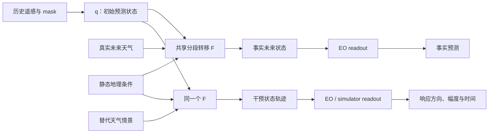

# TerraState：AAAI 后续研究与实验总纲

> [!abstract] 文档定位
> 本文是 TerraState 后续研究的详细依据。核心目标不是继续堆叠普通下游任务，而是把 AAAI 阶段的“可检验预测状态”升级为“递归、可组合、干预响应经过校准的地表世界模型”。阶段编号表示学术依赖关系，不表示时间、人员或算力安排。

简明版本见 [TerraState 后续研究计划](./A02_TerraState_后续研究计划.md)。本文汇总并校准 [85 号实验设计](./85_TerraState_下游任务谱系与TIP_ICLR双目标实验设计_20260814.md)、[90 号任务谱系](./90_遥感世界模型任务谱系与TerraState下游任务完整规划_TIP_ICLR分叉策略_20260814.md)、[91 号代表作分析](./91_遥感世界模型代表作实验设计逻辑汇总_含TIP_ICLR近邻_20260814.md)、[92 号扩展方案](./92_后续思路与实验扩展方案大纲_按稿件接受度排序_20260814.md) 和 [93 号快速问答](./93_核心问题快速问答_下游任务与两个venue实验清单_20260814.md)。若旧文档与本文冲突，以本文的当前冻结判断为准。

---

## 1. 最终研究定位

### 1.1 一句话主线

> TerraState 从云遮挡、部分可见的遥感历史中推断一个服务预测的地表状态；后续工作将把当前 fixed-window、direct-horizon 接口升级为共享的分段递归转移，使状态能够组合不同时间段、在中途替换天气，并用真实 EO 与受控过程模拟共同检验事实预测、状态承载、组合一致性和干预响应。

### 1.2 两个核心主张

后续论文只保留两个主要主张，避免把所有扩展都写成并列贡献。

| 编号 | 主张 | 最低可信证据 |
|---|---|---|
| **C1：可组合预测状态** | 在保持事实预测能力的同时，共享状态转移能在未见时间分段下得到准确、非坍塌且路径一致的预测状态 | 同协议事实预测；Q2 状态承载；held-out composition；broken control；状态方差与有效秩保护 |
| **C2：干预响应校准** | 对同一初始状态替换未来天气时，模型响应的方向、幅度和时间与受控情景参考一致，并能外推到未见 forcing | paired simulator trajectories；effect sign、amplitude、timing；held-out forcing；事实预测不显著退化 |

支持性证据包括完整 OOD、部分观测鲁棒性、训练级消融、效率和空间失败分析，但这些不应稀释 C1/C2。

### 1.3 反主张

后续实验必须排除以下替代解释：

1. 组合结果只是固定递归代码的恒等式，而不是学习到的时间段一致性；
2. composition loss 通过常数状态或低方差状态获得低路径误差；
3. 天气干预只让输出“发生变化”，但方向、幅度和时间并不正确；
4. 新方法的收益只来自更多参数、更多监督或模拟器数据；
5. 状态路径存在于结构图中，却不服务最终预测；
6. 模拟器拟合提高了受控情景指标，却损害真实 EO 的事实预测能力。

---

## 2. AAAI 阶段的可信起点

### 2.1 当前模型合同

AAAI 阶段 TerraState 的结构为：

$$
z_t=q(\mathcal H_t,u_{\leq t}^{past},g),
\qquad
z_{t+h}=T(z_t,u_{t+1:t+h}^{future},g,h),
\qquad
\widehat y_{t+h}=b_h(\mathcal H_t,u_{\leq t}^{past},g)+O(z_{t+h}).
$$

其中：

- $q$ 读取历史遥感、过去天气和静态地理，但不读取未来天气；
- 未来天气只通过 $T$ 进入显式状态贡献；
- $b_h$ 是 weather-free 的历史先验；
- 每个 horizon 都从同一个 $z_t$ 直接查询；
- 当前接口不是 $z_t\rightarrow z_{t+1}\rightarrow z_{t+2}$ 的递归 rollout。

因此，当前模型可以称为 weather-driven、partially observed、fixed-horizon predictive-state model，不能称为已经具备组合性的递归世界模型。详细范围见 [AAAI 投稿稿件](../submission/main.tex) 和 [冻结证据台账](../TERRASTATE_V2_EVIDENCE.md)。

### 2.2 已有证据与边界

| 问题 | 当前结果 | 可以主张 | 不能主张 |
|---|---|---|---|
| **Q1：事实预测** | OOD-t $R^2=0.56935$，RMSE $=0.15059$ | 时间分布偏移下保持有用预测能力 | SOTA、所有分布均已验证 |
| **Q2：状态承载** | official $\Delta R^2=0.01997$；paired 95% CI $[0.01422,0.03018]$ | 显式状态路径显著服务最终预测，且在 OOD-t 仍成立 | 所有预测信息都只经过状态；OOD-t 的贡献显著强于 validation |
| **Q3：天气响应** | 84 对极端匹配样本中 actual $0.6254$ $>$ donor $0.5893$ $>$ mean $0.5430$ | 真实未来天气具有更好的完整窗口响应保真度 | 因果反事实、hot-dry 特异增强 |
| **旧 Q4** | real/shuffled composition ratio 约为 1 | 最多说明没有明显状态坍塌 | 组合律、递归动力学 |
| **future-state anchor** | 去掉后四项 OOD-t 指标略好 | 历史训练组件及简化线索 | 必要组件或性能来源 |
| **exclusive 路线** | $R^2=0.49027$，closure CI 跨 0 | 可作为历史 transition-dependence 诊断 | 与其他 checkpoint 拼接为一组完整证据 |

> [!warning] Q3 数值口径
> 极端子集的 $R^2=0.6254$ 不是完整 OOD-t 主表成绩。完整 OOD-t 为 $R^2=0.56935$、RMSE $=0.15059$。Q3 只支持 weather-response fidelity，不支持热旱特异增强。

### 2.3 checkpoint 血统

当前存在“投稿口径”和“可执行证据”之间的血统差异：

- 已有 Q1/Q2/Q3 可执行证据绑定 boundary80：epoch 31、step 11,904；
- 40 epoch、step 14,880 的最终权重已经重新找到并只读核验；
- 文件大小为 `44,300,969` bytes；
- SHA-256 为 `99f15a35fb9a356901c995bb0f48280a4da236f6970d0dd06343a28857fe2b8b`；
- [权重索引](../WEIGHTS_INDEX.md) 中“14,880 权重缺失”的表述属于待更新旧状态；
- 不能假设 11,904-step 的现有数字自动等于 14,880-step 的结果。

后续处理原则：

1. 已投 AAAI 数字保持冻结，不反向改写；
2. 后续研究先在 14,880 权重上统一重跑 Q1/Q2/Q3；
3. 14,880 固定为旧模型扩展研究的 canonical checkpoint；boundary80 只保留为 AAAI 历史证据和并排参照，不依据新评测结果在两者之间回选；
4. Candidate C 使用自己的唯一 checkpoint 和独立 provenance；
5. 旧模型协议与绘图代码可以复用，但旧模型结果不能代替新模型结果。

---

## 3. 当前缺口

### 3.1 缺少同协议多模型主表

当前结果以 TerraState 自身诊断为主，且部分 baseline 来自文献数字。后续第一张主表必须建立公平性能背景。

建议比较三类模型：

| 家族 | 模型 | 角色 |
|---|---|---|
| 简单基线 | Persistence、Climatology | 判断模型是否超越无学习或弱学习规则 |
| 强时空预测 | ConvLSTM、PredRNN 或 SimVP、Earthformer/Contextformer 中可稳定复现者 | 判断新机制是否以事实预测为代价 |
| 项目内核心 | Phase-I B4、AAAI TerraState、Candidate C | 隔离显式状态与递归组合的增量 |

必须至少保证 Contextformer、B4、AAAI TerraState 和 Candidate C 使用相同数据、manifest、mask、scorer 和输出时域。无法同协议复现的文献数字只能单列为 reference，不与自跑结果混成同一排名。

Q2 只适用于预定义显式状态接口的模型。没有该接口的模型应标 `N/A`；任意选择隐藏层后置零只能称附加表征诊断，不能冒充 Q2。

### 3.2 缺少完整分布偏移

已有正式证据主要覆盖 validation 与 OOD-t。需要统一覆盖：

- IID；
- OOD-t；
- OOD-s；
- OOD-st。

Q1 对所有模型报告；Q2 对具有显式状态接口的模型报告；Q3 对消费未来天气且允许合法替换天气的模型报告。

### 3.3 缺少五轴行为画像

旧文档称为“四维分层”，但实际有五个分析轴：

1. cloud ratio；
2. valid history frames；
3. longest missing gap；
4. lead time；
5. land cover。

前三项共同构成“观测质量”类别。每个 bin 必须同时报告 full prediction、state-removal effect、样本数和区间估计，不能只展示平均预测误差。

### 3.4 缺少训练级必要性证据

当前 Q2 是测试时切除状态路径。它证明训练完成的模型依赖状态，但不能单独回答“在训练层面是否需要这种结构”。需要四臂训练：

| Arm | 结构定义 | 研究问题 |
|---|---|---|
| A | $q\rightarrow b_h$，context-only | 纯历史预测能达到什么水平 |
| B | $q\rightarrow P(z_t)\rightarrow O_h$，无天气转移 | 显式状态瓶颈本身是否有用 |
| C | $q\rightarrow P\rightarrow T(u,g,h)\rightarrow O$，无 future-state anchor | 天气转移的增量；也是现有 no-anchor 线 |
| D | C + future-state anchor | 原完整模型；检验 anchor 是否确有价值 |

所有 arm 使用相同数据、更新合同、seed 集合和 checkpoint 选择规则，并报告参数差异。目标是刻画 accuracy/state-use trade-off，不预设 D 最优。

### 3.5 缺少读者可见的预测证据

现有图片主要是概念、架构和 aggregate statistics。仍缺：

- 真实预测序列；
- GT/Prediction/Error；
- 状态移除在空间上改变了哪里；
- actual/donor/mean weather 影响了哪些区域；
- direct 与 composed 路径如何不同；
- 代表性、强响应和失败案例。

这不是装饰性缺口。它决定读者能否把统计量与实际地表空间行为对应起来。

---

## 4. 后续叙事：从 direct-horizon 到 Candidate C

### 4.1 证据阶梯

Candidate C 的论文证据应按以下顺序建立：

1. **Factual**：真实天气下事实预测是否准确；
2. **Load-bearing**：显式预测状态是否服务最终输出；
3. **Responsive**：替换天气后状态和输出是否变化；
4. **Calibrated**：变化方向、幅度和出现时间是否对应受控参考；
5. **Extrapolative**：未见 forcing 强度和组合下是否仍合理；
6. **Compositional**：未见时间分段路径是否一致、准确且非坍塌。

AAAI 阶段覆盖 1、2，并部分覆盖 3。后续核心是补齐 4–6。

### 4.2 新模型接口

建议接口为：

$$
z_t=q_\psi(\mathcal H_t,u_{\leq t}^{past},g),
$$

$$
z_b=F_\theta\left(z_a,u_{a+1:b},g,\Delta t=b-a\right),
$$

$$
\widehat y_b=O_\omega(z_b)+b_b(\mathcal H_t,u_{\leq t}^{past},g).
$$

必须保持：

- $q$ 可以读取过去天气和静态地理，但不读取未来天气；
- 未来天气只通过 $F_\theta$ 进入显式状态贡献；
- $F_\theta$ 在不同时间段和跨度间共享参数；
- 支持从中间状态继续推进和替换后续天气；
- state removal 仍可定义且状态必须进入最终输出；
- 若保留 context prior，它必须 weather-free；
- future-state anchor 不默认作为必要组件。

### 4.3 为什么不能只用固定单步递归

如果模型只定义一个固定 5-day operator，那么“先走一步再走一步”与“连续调用两步”可能只是实现恒等式，不能形成有意义的新 Q4。

需要同时定义可变时间段 direct operator 与 composed operator：

$$
F_{\Delta_1+\Delta_2}(z,u_{1:\Delta_1+\Delta_2})
\quad\text{vs}\quad
F_{\Delta_2}\left(F_{\Delta_1}(z,u_{1:\Delta_1}),u_{\Delta_1+1:\Delta_1+\Delta_2}\right).
$$

两条路径使用共享参数但不同计算图，才能检验非平凡的 semigroup consistency。

### 4.4 训练目标

建议总目标：

$$
\mathcal L=
\mathcal L_{\mathrm{EO}}
+\lambda_z\mathcal L_{\mathrm{cmp}}^z
+\lambda_y\mathcal L_{\mathrm{cmp}}^y
+\lambda_{\mathrm{pair}}\mathcal L_{\mathrm{pair}}
+\lambda_{\mathrm{nc}}\mathcal L_{\mathrm{noncollapse}}.
$$

| 损失 | 作用 | 必须防止的问题 |
|---|---|---|
| $\mathcal L_{\mathrm{EO}}$ | 真实 EO 事实预测 | 模拟器监督替代真实任务 |
| $\mathcal L_{\mathrm{cmp}}^z$ | direct/composed latent consistency | 仅输出一致、状态任意漂移 |
| $\mathcal L_{\mathrm{cmp}}^y$ | direct/composed output consistency | latent 距离与任务无关 |
| $\mathcal L_{\mathrm{pair}}$ | paired scenario 的方向、幅度和时间校准 | 只证明“会变”而非“变得对” |
| $\mathcal L_{\mathrm{noncollapse}}$ | 保持状态方差、有效秩和运动 | 常数状态轻易满足 composition |

旧 future-state anchor 仅作为消融项，不默认进入 full Candidate C。

### 4.5 多保真训练角色

| 数据层 | 作用 | 不能替代什么 |
|---|---|---|
| GreenEarthNet / 真实 EO | 锚定 factual accuracy、OOD 和真实空间形态 | 无法提供同初态多未来的反事实真值 |
| WOFOST/PCSE + SCOPE | 在参数化适用的农田及植被类型内，提供同一模拟器初态、多天气的 paired trajectories | 不能被写成真实世界因果反事实，也不能直接外推到全部 GreenEarthNet 土地覆盖 |
| 可选真实干预资料 | 外部合理性检查 | 不作为主训练真值，除非协议和映射充分成立 |

模拟器主要负责 response calibration；真实 EO loss 必须持续存在。第一版 C2 证据限定在 WOFOST/PCSE 与 SCOPE 参数化有效的农田或植被类型，其他土地覆盖只报告 factual 结果或标记 `N/A`。这里的“同一初始状态”首先指共享同一套模拟器初始条件；在 EO latent 与模拟器状态之间的映射通过独立配准和 held-out 验证前，不能把它写成“同一个 EO latent 的真实反事实”。若两个域的状态维度不同，应使用 domain adapter 或分离 observation head，而不是强制假设二者观测完全同分布。

---

## 5. 总任务图

| 编号 | 目标 | 具体工作 | 必须产物 | 性质 |
|---|---|---|---|---|
| **T0** | 建立可信旧模型起点 | 14,880 权重重跑 Q1/Q2/Q3；冻结 SHA、commit、manifest、scorer | provenance 表、canonical JSON | 必做 |
| **T1** | 建立公平性能背景 | 同协议多模型、四 split、统一效率统计 | Table 1、效率表 | 必做 |
| **T2** | 补齐旧模型行为画像 | 五轴分层、Q2/Q3 深化、四臂训练消融 | 行为曲线、消融表、失败分层 | 期刊必做；顶会按证据缺口选择 |
| **T3** | 实现 Candidate C | 可变跨度递归转移、composition/non-collapse loss、paired 接口和合成小样本 smoke；不在情景库冻结前做正式 paired 训练 | 新模型接口、smoke 证据、唯一训练合同 | 必做 |
| **T4** | 建立新 Q4 | train/held-out partitions、broken controls、endpoint/non-collapse guards | Q4 JSON、Table 4、路径图 | 必做 |
| **T5** | 建立干预校准 | 先构建并冻结适用范围明确的 simulator 情景库，再开展 C4/C5 的正式 paired 训练与评测 | 情景 manifest、校准表、轨迹图、差分图 | 必做 |
| **T6** | 完整重评新模型 | Q1–Q4、四 split、五轴、消融、多 seed | Candidate C 最终结果集 | 必做 |
| **T7** | 建立可读视觉证据 | 预测、误差、状态贡献、天气干预、组合路径、失败案例 | Figure suite、sample manifest | 必做 |
| **T8** | 形成 venue 版本 | 顶会主版；TIP 条件改造；遥感期刊后备 | 对应图表组合与主张边界 | 分叉 |

> [!important] 复用边界
> T0–T2 的 manifest、evaluator、统计和绘图代码可以复用于 Candidate C，但旧模型结果不能成为新模型结果。模型结构改变后，T6 必须完整重跑。

---

## 6. 旧模型补证据合同

> [!note] 执行优先级
> E0/E1 是所有投稿路线的共同底座。E3–E5 的旧模型完整扩展对 TGRS/ISPRS JPRS 路线是必做项；对 ICLR/NeurIPS 主线只在解释 Candidate C 增量所需时执行，不能挤占 Candidate C 的 Q1–Q4、校准和消融。旧协议可复用，但 Candidate C 的对应结果仍须全部重跑。

### 6.1 E0：canonical checkpoint 对齐

**目的**：消除投稿描述、权重和机器证据之间的不一致。

**工作**：

1. 验证 14,880 权重 file SHA 与 weight SHA；
2. 固定代码 commit、数据 manifest 和 scorer；
3. 重跑 validation、OOD-t 的 Q1/Q2；
4. 重跑冻结 84 对的 Q3 actual/donor/mean；
5. 与 boundary80 并排，不按新结果回选 checkpoint；
6. 输出单一 provenance JSON 和简表。

**验收**：每个扩展研究数字都能追溯到固定的 14,880 checkpoint、同一 scorer 和明确的 split。若 14,880 弱于 boundary80，应如实报告差异并分析训练后段变化，但不按结果把旧模型扩展主线切回 boundary80。

### 6.2 E1：同协议性能主表

**数据与 split**：IID、OOD-t、OOD-s、OOD-st。

**指标**：$R^2$、RMSE、NSE、absolute bias、RMSE25；同时报告参数、FLOPs、显存和推理延迟。

**核心系统**：Persistence、Climatology、一个卷积时序基线、一个强 Transformer 基线、B4、AAAI TerraState、Candidate C。

**规则**：

- 自跑与文献数字分栏；
- 相同 mask、时域和 scorer；
- 随机训练系统使用一致 seed 集合；
- 不以 OOD test 选择 checkpoint；
- Candidate C 的事实预测必须与 direct-horizon TerraState 同预算比较。

**失败解释**：若 Candidate C 的组合能力提升但事实预测严重退化，只能说明正则或递归接口尚未平衡，不能以“机制更好”掩盖不可用预测。

### 6.3 E2：Q2 状态承载

**Arms**：

- full；
- state contribution removed；
- transition identity，仅作支持性诊断；
- 可选 state shuffle，需保持其他输入不变。

**指标**：dataset-level $\Delta R^2$、per-minicube paired $\Delta R^2$、以 minicube 为配对重采样单位的 primary bootstrap CI、逐 horizon contribution、空间 contribution map。地理 cluster bootstrap 只作为可选敏感性分析，不能替代冻结的 per-minicube primary 口径。

**规则**：

- state-removal 必须落在合法推理路径上；
- readout 不应接收训练外分布的任意状态；
- Q2 只对有显式状态接口的系统报告；
- OOD-t 与 validation 只说“均成立”或“仍成立”，没有跨 split 检验时不说“更强”。

### 6.4 E3：五轴行为分析

| 轴 | 推荐横轴 | 同时报告 |
|---|---|---|
| 云覆盖 | 预冻结 cloud-ratio bins | Q1、Q2、样本数、CI |
| 有效历史 | valid-frame count | Q1、Q2、样本数、CI |
| 连续缺测 | longest-gap bins | Q1、Q2、样本数、CI |
| 预测时域 | horizon 1–20 | 误差、state contribution、response magnitude |
| 土地覆盖 | forest/shrub/grass/crop 等 | Q1、Q2、Q3、样本数 |

分箱、最小样本量、稀疏 bin 合并规则和 cluster unit 在查看结果前冻结。若要声称“随着云量增加而变化”，需要趋势或交互检验，不能只依赖各 bin 独立 CI。

### 6.5 E4：Q3 深化

在原 84 对协议基础上增加：

- forcing severity；
- land cover；
- lead time；
- response onset；
- response magnitude；
- donor 优于 actual 的失败样本。

统一保持 history、state、geography、horizon 和 checkpoint 不变，只替换未来天气。actual/donor/mean 的像素预测必须保存，避免再次出现只有 aggregate JSON、没有可视化 raster 的情况。

### 6.6 E5：旧模型训练级四臂消融

四臂采用相同 manifest、更新合同、seed 和 validation 选择规则。主表同时报告：

- factual Q1；
- Q2 load-bearing；
- Q3 forcing fidelity；
- 参数量和效率。

若 C（无 anchor）继续优于 D（有 anchor），结论应是“anchor 不是必要组件，简化模型更合理”，而不是修改选择规则挽救 full arm。

### 6.7 可选状态复用实验

未来胁迫 probe 可保留为 appendix 或应用补充，但不是主线硬门。若执行，至少比较：

1. advanced state $z_{t+h}$；
2. context state $z_t$；
3. history feature；
4. history feature 与未来天气拼接；
5. 随机初始化；
6. 完整预测输出特征。

由未来 NDVI 阈值生成的标签只能称“派生事件评估”；若与 SPEI/EDO 对齐，可称独立气象指数交叉验证，仍不能写成真实灾害因果真值。

---

## 7. Candidate C 训练与消融合同

### 7.1 代码贯通检查

正式训练前，先用少量 step 验证：

- direct 与 composed 路径均可 forward/backward；
- $q$ 不读取未来天气；
- 中途 weather switch 只影响 switch 后路径；
- 每个 loss 都能产生预期梯度；
- checkpoint 保存/恢复后 direct/composed 输出一致；
- held-out partitions 不进入训练；
- broken control 不参与参数更新；
- state variance、effective rank 和 movement 可导出；
- evaluator 能输出 per-cube JSON 和定性预测数组。

少量 step 只证明代码合同成立，不作为方法结果。

### 7.2 Candidate C 方法消融

| Arm | 模型 | 要回答的问题 |
|---|---|---|
| C0 | AAAI direct-horizon TerraState | 旧起点 |
| C0S | direct-horizon TerraState + 与 C4/C5 相同的 paired simulator 样本、监督量和更新次数 | 收益是否只来自新增模拟器数据与 paired 监督，而非递归组合结构 |
| C1 | recursive/segment transition，无 composition loss | 递归接口本身是否有用 |
| C2 | C1 + latent composition | latent 一致性是否足够 |
| C3 | C2 + output composition | 输出路径一致是否带来增量 |
| C4 | C3 + paired scenario calibration | 干预校准是否改善且不伤 factual skill |
| C5 | full Candidate C + non-collapse control | 完整方法 |
| C6 | C5 去除 non-collapse control | 排除常数状态解释 |
| C7 | C5 加/去 future-state anchor | 验证旧组件是否仍无必要 |

模型选择不能只看 Q1，也不能只看 Q4。预先冻结主选择规则，例如以 validation factual skill 为前提，再在满足前提的候选中依据 composition 与 calibration 选择唯一 checkpoint。

### 7.3 简洁性检查

需要回答“复杂度是否真的必要”：

- 可变跨度 operator vs 固定单步递归；
- latent-only composition vs latent+output composition；
- paired calibration vs 单纯天气敏感性正则；
- Candidate C vs C0S 与参数量匹配的更宽 direct-horizon 模型。

如果更宽 direct 模型只提高精度但没有 Q4/校准能力，可以支持机制新意；如果它同时达到相同能力，则 Candidate C 的复杂结构需要进一步简化。

---

## 8. 新 Q4：组合一致性合同

### 8.1 旧 Q4 的最终处理

旧 Q4 只作为方法动机：

- 旧模型从相同 $z_t$ 对每个 horizon 直接查询；
- composition 未作为有效递归结构进入训练；
- real/shuffled ratio 约为 1；
- 结果只支持 non-collapse，不支持 composition；
- 不再对旧接口追加指标以制造正面结论。

### 8.2 新研究问题

> Candidate C 能否在未见时间分段路径上得到一致、准确、非坍塌的状态与预测，并在中途替换天气后沿新路径继续演化？

### 8.3 partition 设计

令 $\pi=(\delta_1,\ldots,\delta_K)$ 且 $\sum_k\delta_k=h$。冻结：

- direct $h$；
- two-segment partitions；
- multi-segment partitions；
- train-seen partitions；
- held-out partitions；
- weather-order shuffled control；
- segment-weather mismatched control；
- identity-state 与 constant-state collapse controls。

正式运行前必须把下列设计写入独立 manifest；当前均属于“待冻结”，不能在查看 test 结果后补选：

| 冻结字段 | 需要明确的内容 | 作用 |
|---|---|---|
| 基础时间单位 | 一个 transition step 对应的天数、允许的 segment length 集合 | 保证 direct/composed 的时间语义一致 |
| 端点集合 | 训练与评测的总 horizon，以及 step-to-day 映射 | 防止只展示有利 horizon |
| train partitions | 每个端点允许参与训练的分段序列及采样权重 | 定义模型实际见过的组合 |
| held-out partitions | 与 train 不重合的两段/多段序列 | 定义真正的组合外推 |
| control 生成器 | shuffle、mismatch、identity、constant 的规则与随机种子 | 保证负对照可复现 |
| 统计单位 | minicube、地理 cluster、seed 的层级和聚合规则 | 避免伪重复与事后换口径 |

旧协议中已经参与训练的 partition 不能再称 held-out。新的 train/validation/test partition 集合必须在正式结果前单独保存 manifest 和 SHA。

### 8.4 指标

| 类别 | 指标 |
|---|---|
| 路径一致 | latent path distance、output path gap |
| 端点准确 | direct/composed 各自相对 C0 的 factual non-inferiority，以及 composed 相对 direct 的退化 |
| 分段稳定 | error vs number of segments |
| 负对照 | `gap_real/gap_broken`、$A_{comp}=gap_{broken}-gap_{real}$ 及 cluster CI |
| 非坍塌 | state movement、std retention、effective-rank retention |
| 任务作用 | Q2 load-bearing、mid-course weather-switch response |

### 8.5 建议预注册验收线

以下阈值是运行前的建议起点，正式执行前需冻结，结果出现后不得调整：

先定义独立于路径间相似度的事实端点守门条件。对路径 $p\in\{direct,composed\}$，要求其相对同协议 C0 同时满足预冻结的 $R^2$ 与 RMSE 非劣界：

$$
G_{abs}(p)=
\left[\operatorname{LCB}(\Delta R^2_{p-C0})\geq-\epsilon_{R^2}\right]
\land
\left[\operatorname{UCB}\left(\frac{\mathrm{RMSE}_p}{\mathrm{RMSE}_{C0}}\right)\leq1+\epsilon_{RMSE}\right].
$$

$\epsilon_{R^2}$、$\epsilon_{RMSE}$、CI 层级和 primary split 必须在运行前按可接受的事实预测退化冻结，不能由 test 结果决定。只有 $G_{abs}(direct)$ 与 $G_{abs}(composed)$ 均通过，才能继续解释相对路径差异。

| 档位 | 事实端点守门 | Composed 相对 direct | Broken control | 状态保持 |
|---|---|---|---|---|
| 最低成立 | direct、composed 均通过 $G_{abs}$ | held-out composed MSE 不超过 direct 的 5% | pooled $A_{comp}$ CI 下界 $>0$，至少一半 partition ratio $<1$ | std/effective-rank retention $\geq0.5$，且 Q2 成立 |
| 较强 | direct、composed 均通过 $G_{abs}$ | 不超过 3% | 大多数 partition ratio $<1$ | retention $\geq0.7$ |
| 强结果 | direct、composed 均通过 $G_{abs}$ | 不超过 2% | 所有核心 partition 稳定优于 broken control | retention $\geq0.8$ 且 movement 非零 |

### 8.6 失败解释

| 结果 | 解释 |
|---|---|
| endpoint 好、composition 差 | 仍是预测器，不能称 compositional |
| composition 好、endpoint 差 | 可能正则过强或状态坍塌，主张不成立 |
| composition 好、Q2 不成立 | 状态路径一致但不服务预测，主张不成立 |
| Q4 成立、校准弱 | 可称 compositional predictive-state model，不能称 intervention-calibrated |
| Q4 与校准均成立 | 支持 Candidate C 完整叙事 |

---

## 9. 干预校准与外推

### 9.1 情景构造

先在参数化适用的农田或植被类型内，以同一套 **模拟器初始条件** 构造：

- 温度单因素变化；
- 降水单因素变化；
- 热与旱复合变化；
- 热与湿等 held-out 组合；
- 不同 onset 与持续时间；
- 训练范围内 forcing 强度；
- held-out forcing 强度。

在 T5 正式训练前冻结 forcing grid：

| 字段 | 需要冻结的内容 | 泛化角色 |
|---|---|---|
| 温度与降水强度 | 物理单位、基准值、训练范围和 held-out 档位 | 强度外推 |
| 复合类型 | train-seen 与 held-out 的热/旱/湿组合 | 组合外推 |
| onset 与持续时间 | 允许的起点、持续步数及 held-out 组合 | 时间外推 |
| 初始条件 | 作物/植被类型、土壤、物候和 simulator state ID | 保证 paired trajectories 真正同初态 |
| EO–simulator 映射 | 可用地类、配准规则、adapter 版本和 held-out 检查 | 限定证据适用范围 |
| 情景划分 | train/validation/test scenario IDs 与 SHA | 防止情景泄漏 |

每个情景保留 factual、simulator-grounded 和 external-check 三种证据身份，禁止混写。除非 EO–simulator state mapping 已通过独立验证，“同初态”只指 simulator 内部配对，不等于同一个 EO latent 的真实反事实。

### 9.2 对比

- actual weather；
- donor weather；
- climatology mean；
- simulator paired forcing；
- time-shifted weather；
- shuffled weather；
- direct-horizon TerraState；
- recursive Candidate C；
- 可选 simulator-only surrogate。

### 9.3 指标

- trajectory RMSE；
- response-vector cosine；
- effect-sign accuracy；
- amplitude error；
- onset/peak timing error；
- severity ranking；
- held-out forcing degradation；
- prediction difference maps；
- factual skill preservation。

### 9.4 成功与失败

完整 C2“干预响应校准”必须同时满足：

1. C4/C5 的 factual path 通过预冻结的事实端点守门条件 $G_{abs}$；
2. paired scenarios 的响应方向达到预冻结标准并显著优于无校准模型；
3. 响应幅度误差达到预冻结标准并形成稳定增量；
4. onset/peak timing 误差达到预冻结标准并形成稳定增量；
5. held-out forcing 不只是输出幅度任意放大；
6. response maps 与适用植被区域、有效 mask 和时序逻辑一致。

若方向成立、但幅度和 timing 中仅一项成立，只能标记为 `PARTIAL_CALIBRATION` 并收缩 C2，不能写成方向、幅度、时间均已校准。如果模型只在模拟器域表现良好，必须报告 domain gap；不能用 simulator score 替代真实 EO 主表，也不能外推到未验证土地覆盖。

---

## 10. 图表合同

### 10.1 正文主图

#### Figure 1：从 AAAI TerraState 到 Candidate C

左侧画旧 direct-horizon：同一个 $z_t$ 分别查询不同 horizon。右侧画新 segment-wise transition：状态可继续推进、中途换天气，并具有 direct/composed 两条路径。图中标出 Q1、Q2、Q3 和新 Q4 的干预位置，以及真实 EO 与 paired simulator 的不同作用。

#### Figure 2：事实预测与误差图谱

每个案例包含：

- 历史观测与 cloud mask；
- future weather 摘要；
- GT；
- Persistence；
- 最强同协议 baseline；
- AAAI TerraState；
- Candidate C；
- $h\in\{1,5,10,20\}$ 的预测和 absolute error。

固定选择普通中位、重云、长缺测、强天气和失败案例。所有模型使用相同 crop、mask、horizon 和色标。

#### Figure 3：完整行为画像

用 small multiples 同时展示 cloud ratio、valid frames、longest gap、lead time 和 land cover。每个面板同时给出事实预测与 state-removal effect，避免只画精度曲线。

#### Figure 4：状态移除的空间后果

展示 GT、full、state removed、signed state contribution 和 `error_removed-error_full`。固定选择 Q2 中位收益、上四分位收益、近零或负收益样本。

#### Figure 5：legacy Q3 天气响应深化

主面板画 actual、donor、mean 的分层结果，并以 `actual-donor` paired gap 展示 forcing severity × land cover 的样本数和 CI；附图画 gap 随 lead time 的曲线并标出 response onset。至少加入一个 donor 优于 actual 的冻结失败样本，展示三种天气输入下的预测、误差和响应区域。

#### Figure 6：新 Q4 组合路径

展示 direct、two-segment、multi-segment、held-out partition 和 broken weather/order control，并配 latent gap、output gap、endpoint error 和状态有效秩。

#### Figure 7：天气干预校准

同一模拟器初始条件下展示 factual、donor、mean 和多个 simulator forcing；并列模型与模拟器轨迹、响应差分图、方向/幅度/timing 指标。至少包含 strong、median 和 failure 三类案例。

### 10.2 主表

| 表 | 内容 | 核心作用 |
|---|---|---|
| **Table 1** | 同协议多模型 × IID/OOD-t/OOD-s/OOD-st | 建立事实预测背景 |
| **Table 2** | Q2 与 legacy Q3 能力矩阵；Q3 另列 actual/donor/mean 或 paired gap × severity/land cover、样本数与 paired CI | 证明状态承载和天气使用；无显式状态模型 Q2 为 N/A |
| **Table 3** | 旧模型与 Candidate C 方法消融 | 隔离递归、composition、paired calibration |
| **Table 4** | 新 Q4 train/held-out composition | 支撑 C1 |
| **Table 5** | intervention calibration 与 held-out forcing | 支撑 C2 |
| **Table 6** | 五轴鲁棒性 | 说明能力边界 |
| **Table 7** | 参数、FLOPs、显存、延迟 | 排除复杂度解释 |
| **TIP Table** | RGB+NIR 图像指标与第二数据 | 仅用于 TIP 条件路线 |

### 10.3 定性样本 manifest

每个最终样本保存：

- cube ID；
- split；
- land cover；
- cloud ratio；
- valid frames；
- longest gap；
- weather severity；
- checkpoint SHA；
- 选择规则和失败标签。

代表性样本按元数据选择，不先看误差；机制样本按全量 Q2/Q3/Q4 effect 的中位、分位和失败区间机械选择。最终图必须出现失败案例。

### 10.4 视觉规范

- GT、模型和 horizon 共用固定 NDVI 色标；
- signed response 使用零中心发散色标；
- absolute error 使用单调色标；
- 无效像素和云区域明确遮罩，不以 0 冒充预测；
- 同一行保持相同 crop、mask 和色条；
- 不使用红绿作为唯一差异编码；
- 图中数字只作解释，最终证据来自 aggregate statistics 与 CI。

---

## 11. Venue 路线

### 11.1 ICLR / NeurIPS 主线

这是默认自然适配。硬条件为：

- Candidate C 是真实的新方法，而不是旧模型改名；
- composition 进入训练；
- held-out Q4 同时通过 endpoint、broken control 和 non-collapse；
- paired scenario calibration 形成稳定增量；
- forcing extrapolation 有明确结果；
- direct 与 composed 均通过预冻结的事实端点守门条件 $G_{abs}$；
- 贡献能够抽象为部分观测、外生驱动世界模型的一般问题。

### 11.2 TIP 条件路线

TIP 不是对 ICLR 版本换标题，而需要额外完成：

- 输出扩展到 S2 RGB+NIR 或更完整多光谱；
- 增加 PSNR、SSIM、SAM、ERGAS 等图像与光谱指标；LPIPS 仅用于固定 RGB composite，不直接用于四通道或多光谱张量；
- 提供 GT/Prediction/Error 多光谱序列；
- 增加第二个独立数据设置；
- 形成 image formation 或 multidimensional signal prediction 上的实质方法贡献；
- 完整报告感知质量、光谱一致性、时序一致性和效率。

### 11.3 TGRS / ISPRS JPRS 后备

若 Candidate C 未达到顶会方法强度，但旧模型证据扩展完整，可收缩为遥感行为研究：

- 四 split；
- 五轴行为分析；
- 训练级消融；
- Q3 深化；
- 同协议主表；
- 空间定性与失败图谱；
- 完整 provenance。

该路线不要求把多光谱输出作为硬门，但 venue 优先级低于顶会主线和 TIP 条件路线。

---

## 12. 最终决策边界

| 结果 | 论文定位 |
|---|---|
| Q4 + 校准 + 外推成立 | ICLR/NeurIPS 完整主线 |
| Q4 成立、校准较弱 | compositional predictive-state 方法；收缩 C2 |
| 新方法不足，但多光谱预测与第二数据很强 | TIP 条件路线 |
| 新方法不足，旧模型行为画像完整 | TGRS/ISPRS JPRS 后备路线 |
| Q4 只通过路径距离、不通过 endpoint/Q2/non-collapse | 不成立，继续作为诊断 |
| 模拟器结果强、真实 EO 退化明显 | 不成立，报告 domain gap |

### 12.1 禁止主张

- SOTA；
- causal counterfactual；
- hot-dry-specific enhancement；
- 旧 Q4 已成立；
- future-state anchor 必要；
- 跨 checkpoint 拼接；
- simulator trajectory 是真实反事实；
- arbitrary hidden-layer intervention 等于 Q2；
- 少量 step 的代码贯通等于方法有效；
- Candidate C 可以直接继承旧模型 OOD、分层或消融数字。

---

## 13. 最终完成清单

### 13.1 必须完成

- [ ] 14,880 checkpoint 的 Q1/Q2/Q3 与 provenance 对齐
- [ ] 同协议多模型四 split 主表
- [ ] Candidate C 五轴行为分析
- [ ] Candidate C direct/composed 代码合同
- [ ] 新 Q4 train/held-out partition manifest
- [ ] Q4 endpoint、broken control、non-collapse、Q2 联合判据
- [ ] paired scenario calibration
- [ ] held-out forcing 外推
- [ ] Candidate C 完整重评
- [ ] 事实预测、状态移除、天气干预、组合路径和失败图
- [ ] 参数与效率对照

### 13.2 条件项

- [ ] 旧模型五轴画像与训练级四臂消融（TGRS/ISPRS JPRS 必做；顶会按证据缺口）
- [ ] 未来胁迫派生事件评估
- [ ] SPEI/EDO 外部交叉验证
- [ ] 真实干预资料外部检查
- [ ] RGB+NIR 多光谱输出
- [ ] 第二数据设置
- [ ] TIP 图像与光谱质量指标

---

## 14. 关联资料

- [85：TIP/ICLR 双目标实验设计](./85_TerraState_下游任务谱系与TIP_ICLR双目标实验设计_20260814.md)
- [86：旧 Q2–Q4 诊断](./86_TerraState_PhaseI_Q2-Q4诊断与PhaseII决策执行总纲_20260724.md)
- [87：冻结主张与负结果](./87_TerraState_冻结主张_极端热旱状态审计_本地Manifest与方案B决策树_20260726.md)
- [88：Q1–Q4 冻结合同](./88_TerraState_full24唯一条件合同_Q1-Q4冻结与唯一训练执行说明_20260726.md)
- [90：任务谱系与 venue 分叉](./90_遥感世界模型任务谱系与TerraState下游任务完整规划_TIP_ICLR分叉策略_20260814.md)
- [91：代表作实验设计逻辑](./91_遥感世界模型代表作实验设计逻辑汇总_含TIP_ICLR近邻_20260814.md)
- [92：后续实验扩展方案](./92_后续思路与实验扩展方案大纲_按稿件接受度排序_20260814.md)
- [93：核心问题快速问答](./93_核心问题快速问答_下游任务与两个venue实验清单_20260814.md)
- [TerraState-V2 冻结证据](../TERRASTATE_V2_EVIDENCE.md)
- [TerraState 权重索引](../WEIGHTS_INDEX.md)
- [AAAI 投稿稿件](../submission/main.tex)
- [现有图表工作区说明](../writing/figure_workspace/sources/README.md)
