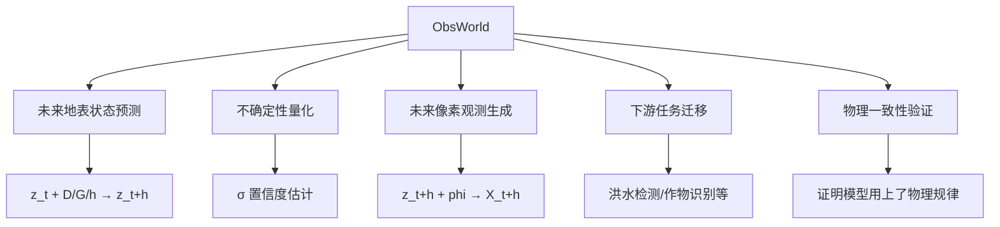

# 23 ObsWorld完整方法框架与Stage2动力学算法设计

> [!abstract] 本文定位
> 本文从源头梳理 ObsWorld 的完整方法链条：从"最终想要什么"倒推回来，明确 5+1 阶段的训练目标、输入输出、loss 设计、数据流，**重点详述 Stage 2 状态动力学的算法细节**（dgh 如何注入、不确定性如何建模、物理一致性如何验证）。
> 
> 与 [[22_dgh数据构建完整方案]] 的关系：22 准备数据，23 设计算法用这些数据。

---

## 0. 文档导读

> [!info] 本文回答的核心问题
> 1. **ObsWorld 到底要做什么？** 最终产出是什么能力？(见 §1)
> 2. **5+1 阶段的完整链条是什么？** 每阶段的输入输出、loss、数据集？(见 §2)
> 3. **Stage 2 的算法细节是什么？** dgh 如何注入？不确定性如何建模？(见 §3，核心)
> 4. **如何验证模型学到了物理规律？** Stage 5 能力实验设计？(见 §4)
> 5. **推理时如何使用？** 四种典型应用场景？(见 §5)

### 与其他文档的关系

| 文档 | 角色 | 与本文关系 |
|------|------|-----------|
| [[10ObsWorld 完整实验流程与字段设计]] | 总纲 | 本文是其方法细化版本 |
| [[22_dgh数据构建完整方案]] | 数据准备 | 22 准备 dgh 数据，23 设计算法使用 |
| [[21_phi_v3与geo字段说明文档]] | phi 字段 | phi 作用于编码器/解码器，dgh 作用于动力学 |
| **23(本文)** | **方法框架与算法** | 完整方法链条 + Stage 2 算法设计 |

---

## 1. ObsWorld 核心目标与最终产出

### 1.1 项目全称解读

**ObsWorld — Imaging-Decoupled Land-Surface State Dynamics**

关键词拆解：
- **Land-Surface State**：地表状态（不是遥感图像本身）
- **Imaging-Decoupled**：与成像条件解耦（z 表征地表本身，不受云、太阳角影响）
- **Dynamics**：状态如何随时间演化（核心）
- **World**：世界模型，支持预测、反事实推理、不确定性量化

### 1.2 最终产出的五大能力



**能力1：未来地表状态预测**
- 输入：当前观测 X_t、外生驱动 D、地理先验 G、预测跨度 h
- 输出：未来状态 z_{t+h}（潜空间表征）
- 用途：环境监测、灾害预警、资源管理

**能力2：不确定性量化**
- 输出：σ（对预测的置信度）
- 用途：决策支持（高不确定性→需要更多观测）

**能力3：未来像素观测生成**
- 输入：z_{t+h} + 目标成像条件 phi_{t+h}
- 输出：未来观测图像 X_{t+h}
- 用途：可视化、云去除、传感器域迁移

**能力4：下游任务迁移**
- 输入：z_t 或 z_{t+h}
- 输出：任务特定预测（洪水 mask、作物类别等）
- 用途：实际应用出口

**能力5：物理一致性与可解释性**
- 验证：预测是否遵循物理规律（水往低处流、降雨推动洪水）
- 用途：模型可信度、科学研究价值

### 1.3 核心架构概览

```text
┌─────────────────────────────────────────────────────────┐
│  输入层                                                   │
│  • 历史观测 X_t（S2光学/S1雷达）                          │
│  • 成像条件 phi_t（太阳角、云、季节）                     │
│  • 外生驱动 D（降雨、温度、太阳辐射）                     │
│  • 地理先验 G（高程、坡度、水流方向）                     │
│  • 预测跨度 h（7天、30天、365天）                        │
└──────────────────┬──────────────────────────────────────┘
                   ↓
┌──────────────────┴──────────────────────────────────────┐
│  Stage 1: 观测编码（成像解耦）                            │
│  Enc_phi: (X_t, phi_t) → z_t                            │
│  z_t = 地表状态表征（256维 × H × W）                     │
└──────────────────┬──────────────────────────────────────┘
                   ↓
┌──────────────────┴──────────────────────────────────────┐
│  Stage 2: 状态动力学（核心，dgh 作用阶段）                │
│  Dynamics: (z_t, D, G, h) → p(z_{t+h})                 │
│  输出：μ_{z_{t+h}}（均值）+ σ_{z_{t+h}}（不确定性）     │
└──────────────────┬──────────────────────────────────────┘
                   ↓
┌──────────────────┴──────────────────────────────────────┐
│  Stage 3: 观测解码                                        │
│  Dec: (z_{t+h}, phi_{t+h}) → X_{t+h}                   │
│  可控生成：同一 z 在不同 phi 下生成不同外观观测           │
└──────────────────┬──────────────────────────────────────┘
                   ↓
┌──────────────────┴──────────────────────────────────────┐
│  Stage 4: 下游任务（验证 z 的有用性）                     │
│  TaskHead: z → 洪水mask/作物类别/建筑提取                │
└──────────────────┬──────────────────────────────────────┘
                   ↓
┌──────────────────┴──────────────────────────────────────┐
│  Stage 5: 世界模型能力实验                                │
│  D/G 消融、反事实推理、物理一致性检查                     │
└──────────────────────────────────────────────────────────┘
```

---

## 2. 5+1阶段完整方法链条

### Stage 1: 观测编码预训练

**目标**：学习从遥感观测 X 提取地表状态表征 z 的编码器

| 维度 | 内容 |
|------|------|
| **输入** | 遥感影像 X（S2 光学 12 波段、S1 雷达 2 通道） |
| **输出** | 编码器 Enc: X → z，z ∈ R^{D_z × H × W}，D_z=256 |
| **架构** | ViT-based MAE（Masked Autoencoder） |
| **训练方法** | 自监督：mask 75% patches，预测它们 |
| **loss** | L_recon = ||X_reconstructed - X||² |
| **数据集** | SSL4EO-S12（24.4万地点，S2/S1，无标注） |
| **训练策略** | 多卡 FSDP，batch_size=4096，epochs=100 |
| **产出** | encoder.ckpt（通用遥感编码器） |

**关键能力**：Enc(X) → z，z 编码地表状态信息（植被、水体、建筑等）

---

### Stage 1.5: 成像解耦

**目标**：让 z 不受成像条件（云、太阳角、季节、传感器）影响

| 维度 | 内容 |
|------|------|
| **输入** | X + phi（成像条件：太阳高度角、云掩码、季节、传感器类型） |
| **输出** | 成像解耦编码器 Enc_phi: (X, phi) → z |
| **方法** | phi 通过 FiLM 层调制编码器各层 |
| **loss** | L_recon + L_contrast（同地点不同成像条件的 z 应接近） |
| **数据集** | SSL4EO-S12（有 4 季节、多云量变化） |
| **训练策略** | 加载 Stage 1 权重，新增 FiLM 层，联合训练 |
| **产出** | encoder_v1.5.ckpt（成像解耦的编码器） |

**关键能力**：z 表征"地表本身"而非"图像外观"（如"3月的森林"而非"3月晴天拍的森林"）

**FiLM 机制**：
```python
for layer in Encoder:
    γ, β = FiLM(phi)  # phi → 仿射参数
    z = layer(z) * γ + β  # 调制特征
```

---


### Stage 2: 状态动力学（dgh 作用核心阶段）

**目标**：学习地表状态如何随时间演化，加入外生驱动和地理约束

| 维度 | 内容 |
|------|------|
| **输入** | • z_t（当前状态，从 X_t 编码）<br>• D（外生驱动：precipitation, temperature, solar_radiation 等）<br>• G（地理先验：elevation, slope, flow_direction 等）<br>• h（预测跨度：标量，单位天） |
| **输出** | • 未来状态分布参数：μ_{z_{t+h}} ∈ R^{D_z × H × W}<br>• 不确定性：σ_{z_{t+h}} ∈ R^{D_z × H × W} 或 log_σ |
| **架构** | 动力学模块 Dynamics（详见 §3） |
| **loss** | L_total = α·L_state + β·L_obs + γ·L_proxy + δ·L_kl（详见 §3.3） |
| **数据集** | • DynamicEarthNet（月度 LULC 时序）<br>• EarthNet2021（5日密集 + 天气）<br>• SSL4EO-S12（季节对，90天）<br>• ERA5-Land（提供 D 输入） |
| **训练策略** | • Stage 2a：单数据集跑通架构<br>• Stage 2b：多数据集联合训练<br>• Stage 2c：解冻编码器联合微调 |
| **产出** | dynamics.ckpt，能力：Dynamics(z_t, D, G, h) → p(z_{t+h}) |

**关键能力**：
1. 根据当前状态 + 条件预测未来状态
2. 量化预测的不确定性
3. 支持多时间尺度预测（h=7天 vs h=365天）
4. 可解释的物理机制（D/G 的作用可验证）

**监督信号（关键）**：
```python
# 方案A：状态空间 loss（主 loss）
z_real = Enc(X_future, phi_future)  # 从真实未来观测编码
mu, log_sigma = Dynamics(z_t, D, G, h)
L_state = ||mu - z_real||²

# 方案B：观测重建 loss（如果联合训解码器）
z_pred = sample_from_distribution(mu, sigma)
X_pred = Dec(z_pred, phi_future)
L_obs = ||X_pred - X_future||²

# 方案C：代理任务 loss（辅助监督）
NDVI_pred = NDVIHead(mu)
L_proxy = ||NDVI_pred - NDVI_real||²

# 方案D：KL 正则（VAE 式）
L_kl = -0.5 * sum(1 + log_sigma - mu² - sigma²)

# 总 loss
L_total = alpha*L_state + beta*L_obs + gamma*L_proxy + delta*L_kl
```

**关键纠正（重要）**：
- ❌ Stage 2 不训练洪水检测、作物识别等应用任务
- ✅ Stage 2 训练的是「状态如何演化」，监督信号是 **未来观测本身**
- ✅ ERA5 提供的是 **D 输入**，不是监督标注
- ✅ 洪水标注在 Stage 4 才使用

---

### Stage 3-5 简述

**Stage 3: 观测解码**
- 目标：Dec: (z, phi) → X，可控生成未来观测
- 数据集：SSL4EO / EarthNet2021
- 产出：decoder.ckpt

**Stage 4: 下游任务微调**
- 目标：验证 z 的有用性
- 数据集：Sen1Floods11（洪水）、作物数据、建筑数据
- 产出：证明 z 迁移能力

**Stage 5: 世界模型能力实验**
- 目标：验证物理一致性
- 方法：D/G 消融、反事实推理、不确定性校准
- 产出：论文核心卖点

---

## 3. Stage 2 动力学算法设计（核心）

### 3.1 dgh 的物理意义与作用机制

**D（外生驱动）的作用**：

| 维度 | 说明 |
|------|------|
| **物理意义** | 提供"为什么会变"的信息，推动状态演化 |
| **例子** | precipitation 推动洪水，temperature 推动植被返青 |
| **无 D 情况** | 模型只能基于惯性外推（"昨天是森林，明天还是"） |
| **有 D 情况** | 模型知道"降雨 300mm → 可能洪水" |
| **核心字段** | precipitation, temperature, solar_radiation, ndvi_previous, day_of_year |

**G（地理先验）的作用**：

| 维度 | 说明 |
|------|------|
| **物理意义** | 约束"怎么变才合理"，提供空间背景 |
| **例子** | 水往低处流，陡坡不积水，城市扩张倾向平地 |
| **无 G 情况** | 模型可能预测水往山顶流 |
| **有 G 情况** | 模型知道地形约束，水沿 flow_direction 扩散 |
| **核心字段** | elevation, slope, flow_direction, flow_accumulation, lulc_static |

**h（预测跨度）的作用**：

| 维度 | 说明 |
|------|------|
| **物理意义** | 告诉模型"要预测多远"，支持多尺度预测 |
| **例子** | h=7 天（短期洪水）vs h=365 天（年度土地覆盖变化） |
| **无 h 情况** | 单模型只能预测固定跨度 |
| **有 h 情况** | 单模型支持 1-365 天任意跨度 |
| **编码方式** | log(h) → MLP → 与 D 拼接 |

**三者协同**：
```
z_{t+h} = f(z_t, D, G, h)
其中：
- z_t 提供初始条件（当前什么状态）
- D 提供演化驱动（什么力量推动变化）
- G 提供演化约束（什么变化是合理的）
- h 提供演化尺度（变化要持续多久）
```

### 3.2 动力学模块架构设计

**核心问题**：dgh 如何注入到动力学模块中？

**选项A：FiLM 调制（推荐，类似 phi）**

```python
class Dynamics(nn.Module):
    def __init__(self, z_dim=256, D_dim=64, G_dim=128, h_dim=16):
        self.backbone = TransformerEncoder(layers=6)
        self.film_D = FiLMGenerator(D_dim + h_dim)
        self.film_G = FiLMGenerator(G_dim)
        self.D_encoder = MLPEncoder(D_fields → D_dim)
        self.G_encoder = CNNEncoder(G_fields → G_dim spatial)
        self.h_encoder = MLPEncoder(log(h) → h_dim)
        
    def forward(self, z_t, D, G, h):
        # 编码条件
        D_emb = self.D_encoder(D)  # [B, D_dim]
        G_emb = self.G_encoder(G)  # [B, G_dim, H, W]
        h_emb = self.h_encoder(log(h))  # [B, h_dim]
        
        # FiLM 调制
        x = z_t  # [B, z_dim, H, W]
        for layer in self.backbone:
            # D+h 调制（全局，时间相关）
            gamma_D, beta_D = self.film_D(torch.cat([D_emb, h_emb], dim=1))
            x = layer(x) * gamma_D.unsqueeze(-1).unsqueeze(-1) + beta_D.unsqueeze(-1).unsqueeze(-1)
            
            # G 调制（空间局部，地理约束）
            gamma_G, beta_G = self.film_G(G_emb)
            x = x * gamma_G + beta_G
        
        # 输出分布参数
        mu = self.mu_head(x)  # [B, z_dim, H, W]
        log_sigma = self.sigma_head(x)  # [B, z_dim, H, W]
        return mu, log_sigma
```

**优点**：
- 可控性强：D 和 G 的作用解耦清晰
- 物理可解释：D 调制全局趋势，G 约束空间模式
- 实现简单：复用 Stage 1.5 的 FiLM 经验

**选项B：交叉注意力**

```python
class Dynamics(nn.Module):
    def forward(self, z_t, D, G, h):
        D_emb = self.encode_D(D)  # [B, N_D, D_d]
        G_emb = self.encode_G(G)  # [B, H*W, D_g]
        h_emb = self.encode_h(h)  # [B, 1, D_h]
        
        # z_t 作为 query，D/G/h 作为 key/value
        condition = torch.cat([D_emb, G_emb, h_emb], dim=1)
        z_out = CrossAttention(query=z_t, key=condition, value=condition)
        
        return mu, log_sigma
```

**选项C：分层条件（推荐用于理解物理机制）**

```python
class Dynamics(nn.Module):
    def forward(self, z_t, D, G, h):
        # 第 1 步：D 驱动全局演化
        z_global = self.global_dynamics(z_t, D, h)
        
        # 第 2 步：G 约束局部空间模式
        z_local = self.local_dynamics(z_global, G)
        
        return mu, log_sigma
```

**推荐组合**：FiLM 调制（选项 A）+ 必要时加交叉注意力增强

### 3.3 Loss 函数设计

**混合 loss 策略（推荐）**：

```python
def compute_loss(z_t, X_future, phi_future, D, G, h):
    # 1. 动力学预测
    mu, log_sigma = Dynamics(z_t, D, G, h)
    
    # 2. 编码真实未来状态（作为监督）
    z_real = Enc(X_future, phi_future)  # detach?需实验
    
    # 3. 状态空间 loss（主 loss）
    L_state = F.mse_loss(mu, z_real)
    
    # 4. KL 正则（鼓励合理不确定性）
    L_kl = -0.5 * torch.sum(1 + log_sigma - mu.pow(2) - log_sigma.exp())
    L_kl = L_kl / (B * H * W * D_z)  # 归一化
    
    # 5. 观测重建 loss（如果联合训解码器）
    z_sample = mu + torch.randn_like(mu) * torch.exp(0.5 * log_sigma)
    X_pred = Dec(z_sample, phi_future)
    L_obs = F.mse_loss(X_pred, X_future)
    
    # 6. 代理任务 loss（辅助，可选）
    NDVI_pred = NDVIHead(mu)
    NDVI_real = compute_ndvi(X_future)
    L_proxy = F.mse_loss(NDVI_pred, NDVI_real)
    
    # 总 loss
    L_total = alpha * L_state + delta * L_kl + beta * L_obs + gamma * L_proxy
    return L_total
```

**超参数推荐**（需调优）：
- alpha（状态 loss 权重）：1.0（主 loss）
- beta（观测 loss 权重）：0.1-0.5（如果联合训）
- gamma（代理 loss 权重）：0.05-0.1（辅助）
- delta（KL 权重）：0.0001-0.001（正则）

**阶段性策略**：
- Stage 2a（跑通架构）：只用 L_state + L_kl
- Stage 2b（加解码器）：加入 L_obs
- Stage 2c（精调）：加入 L_proxy

### 3.4 不确定性建模

**方案A：VAE 式参数化分布（推荐）**

```python
# 输出分布参数
mu, log_sigma = Dynamics(z_t, D, G, h)

# 训练时采样
epsilon = torch.randn_like(mu)
z_pred = mu + epsilon * torch.exp(0.5 * log_sigma)

# 推理时
# 确定性预测：z_pred = mu
# 不确定性估计：sigma = torch.exp(0.5 * log_sigma)
# 多样性采样：z_samples = [mu + randn()*sigma for _ in range(N)]
```

**方案B：Dropout 集成**

```python
# 推理时多次前向（不同 dropout mask）
z_samples = []
for _ in range(100):
    mu, _ = Dynamics(z_t, D, G, h, training=True)  # keep dropout
    z_samples.append(mu)
    
z_mean = torch.stack(z_samples).mean(dim=0)
z_std = torch.stack(z_samples).std(dim=0)  # 不确定性估计
```

**推荐**：VAE 式（方案 A），因为：
- 显式建模不确定性
- 训练高效（一次前向）
- 可控性强（可调节 sigma）

### 3.5 训练时数据流

```python
# ========== 单个训练 step ==========
# 1. 采样 batch
batch = dataloader.sample()
X_t = batch['image_t']          # [B, C, H, W]
X_future = batch['image_future']
phi_t = batch['phi_t']
phi_future = batch['phi_future']
D = batch['D']                  # 从 dgh parquet 加载
G = batch['G']                  # 从 dgh parquet 加载
h = batch['h']                  # 时间间隔（天）

# 2. 编码当前状态
z_t = Enc(X_t, phi_t)  # [B, 256, H, W]

# 3. 动力学预测
mu, log_sigma = Dynamics(z_t, D, G, h)

# 4. 计算 loss
loss = compute_loss(z_t, X_future, phi_future, D, G, h)

# 5. 反向传播
loss.backward()
optimizer.step()
```

**多数据集混合采样**：

```python
# 每个 step 从一个数据集取 batch，step 间轮换
datasets = [DynamicEarthNet, EarthNet2021, SSL4EO]
weights = [0.4, 0.4, 0.2]  # 采样权重
dataset = np.random.choice(datasets, p=weights)
batch = dataset.sample()
```

---

## 4. 物理一致性验证实验设计

### 4.1 D 消融实验

**目标**：验证降雨是否真的影响洪水预测

```python
# 实验设置
z_t = Enc(X_t, phi_t)
D_with_rain = create_weather(precipitation=300mm)
D_no_rain = create_weather(precipitation=0mm)
G_real = load_geo_prior()

# 预测
z_with_rain = Dynamics(z_t, D_with_rain, G_real, h=3days).mean()
z_no_rain = Dynamics(z_t, D_no_rain, G_real, h=3days).mean()

# 评估
flood_prob_with = FloodHead(z_with_rain).mean()
flood_prob_no = FloodHead(z_no_rain).mean()

# 期望
assert flood_prob_with > flood_prob_no * 1.5
# 论文中报告：相关系数 R²、p-value
```

### 4.2 G 消融实验

**目标**：验证地形是否真的约束洪水扩散

```python
# 实验设置
G_real = load_geo_prior()  # 真实 DEM
G_flat = create_flat_dem()  # 假设平坦

# 预测
z_with_G = Dynamics(z_t, D_heavy_rain, G_real, h=3days).mean()
z_no_G = Dynamics(z_t, D_heavy_rain, G_flat, h=3days).mean()

# 评估：检查水体是否在低洼处
water_mask_with_G = segment_water(z_with_G)
elevation_of_water = G_real['elevation'][water_mask_with_G]

# 期望：有 G 时水体高程 < 全局平均高程
assert elevation_of_water.mean() < G_real['elevation'].mean()

# 论文中报告：Pearson 相关系数（水体概率 vs 高程）
```

### 4.3 反事实推理实验

**目标**："如果降雨是正常的 2 倍会怎样？"

```python
# 对比实验
D_normal = get_historical_avg()
D_extreme = D_normal * 2  # 极端情景

z_normal = Dynamics(z_t, D_normal, G, h=7days).mean()
z_extreme = Dynamics(z_t, D_extreme, G, h=7days).mean()

# 分析差异
delta_z = z_extreme - z_normal
impact_map = torch.norm(delta_z, dim=1)  # [B, H, W]

# 可视化：哪些地方受影响最大？
# 期望：低洼、高 TWI 的地方 impact 大
```

### 4.4 不确定性校准实验

**目标**：σ 是否真的反映预测误差

```python
# 测试集评估
uncertainties = []
errors = []

for sample in test_set:
    z_t = Enc(sample['X_t'], sample['phi_t'])
    mu, sigma = Dynamics(z_t, sample['D'], sample['G'], sample['h'])
    
    z_real = Enc(sample['X_future'], sample['phi_future'])
    error = torch.norm(mu - z_real, dim=1)  # [H, W]
    
    uncertainties.append(sigma.mean(dim=1))  # [H, W]
    errors.append(error)

# 计算相关系数
corr = pearsonr(uncertainties.flatten(), errors.flatten())
# 期望：corr > 0.7，高不确定性 = 高误差
```

---

## 5. 推理时应用场景

### 5.1 场景1：未来观测预测

**用例**：预测 7 天后的遥感影像

```python
# 输入
X_t = load_image("current.tif")
phi_t = compute_phi(X_t)
D_forecast = load_weather_forecast(days=7)
G = load_geo_prior(location)
h = 7

# 流程
z_t = Enc(X_t, phi_t)
mu, sigma = Dynamics(z_t, D_forecast, G, h)

# 输出1：确定性预测
X_7d = Dec(mu, phi_target)

# 输出2：不确定性估计
z_samples = [mu + randn()*sigma for _ in range(100)]
X_samples = [Dec(z, phi_target) for z in z_samples]
X_mean = mean(X_samples)
X_std = std(X_samples)  # 像素级不确定性
```

### 5.2 场景2：洪水预警

**用例**：根据天气预报预测洪水风险

```python
# 输入
X_t = current_sentinel_image
D_heavy_rain = create_weather(precipitation=300mm, duration=3days)
G = load_geo_prior()

# 预测
z_t = Enc(X_t, phi_t)
z_3d = Dynamics(z_t, D_heavy_rain, G, h=3).mean()

# 洪水风险评估
flood_risk_map = FloodHead(z_3d)  # [H, W]，每像素概率

# 输出预警
alert_regions = flood_risk_map > 0.7
alert_polygons = vectorize(alert_regions)
# 发送预警到灾害管理部门
```

### 5.3 场景3：政策评估

**用例**：评估退耕还林的长期影响

```python
# 基线场景（维持现状）
G_current = load_geo_prior()
z_baseline = Dynamics(z_t, D_normal, G_current, h=3650).mean()  # 10年

# 政策场景（退耕还林）
G_policy = modify_lulc(G_current, policy="reforestation")
z_policy = Dynamics(z_t, D_normal, G_policy, h=3650).mean()

# 对比
NDVI_gain = compute_ndvi(z_policy) - compute_ndvi(z_baseline)
carbon_sequestration = estimate_carbon(NDVI_gain)
# 输出政策建议报告
```

### 5.4 场景4：云去除

**用例**：预测云下的地表状态

```python
# 输入：部分被云遮挡的影像
X_cloudy = load_cloudy_image()
cloud_mask = detect_cloud(X_cloudy)

# 策略1：用历史状态 + 动力学填补
z_hist = Enc(X_history, phi_history)
z_current = Dynamics(z_hist, D_recent, G, h=time_gap).mean()
X_cloudless = Dec(z_current, phi_clear)
X_result = X_cloudy * (1 - cloud_mask) + X_cloudless * cloud_mask

# 策略2：预测未来云下状态
z_future = Dynamics(z_current, D_forecast, G, h=5days).mean()
X_future_clear = Dec(z_future, phi_clear_sky)
```

---

## 6. 关键设计选择与待定问题

### 6.1 已确定的设计


| 设计点 | 选择 | 理由 |
|--------|------|------|
| **dgh 注入方式** | FiLM 调制 | 可控性强、物理可解释、实现简单 |
| **不确定性建模** | VAE 式参数化分布 | 显式建模、训练高效、可控 |
| **主 loss** | 状态空间 loss | 直接监督 z 演化，比像素 loss 稳定 |
| **Stage 2-3 关系** | 先分开训，后联合（阶段性） | 降低初期复杂度，稳定收敛 |
| **多数据集策略** | 同质 batch + 轮换采样 | 避免分辨率冲突，简单有效 |

### 6.2 待实验确定的问题

| 问题 | 选项A | 选项B | 推荐策略 |
|------|-------|-------|---------|
| **z_real 是否 detach** | detach（固定编码器） | 不 detach（联合优化） | 先 A 后 B |
| **loss 权重** | α=1.0, β=0.1, γ=0.05, δ=0.001 | 需网格搜索 | 从推荐值开始调优 |
| **动力学 backbone** | Transformer | CNN+RNN | 两者都试，Transformer 优先 |
| **h 最大值** | 365 天 | 730 天 | 根据任务需求定 |
| **批大小** | 16（多数据集混合） | 32（单数据集） | 根据显存调整 |

### 6.3 风险与缓解

| 风险 | 后果 | 缓解措施 |
|------|------|---------|
| **模式崩溃** | 所有预测趋向均值 | 增大 KL 权重、加判别器 |
| **不确定性估计崩溃** | σ → 0 或 σ → ∞ | Clamp log_σ 范围、监控 σ 统计量 |
| **物理不一致** | 水往山顶流 | 加 G 约束 loss、人工检查失败样本 |
| **过拟合单数据集** | 在其他数据集泛化差 | 增大数据集轮换频率、域自适应 |
| **长期预测累积误差** | h=365 时预测崩溃 | Curriculum learning（从短到长）、Autoreg rollout |

---

## 7. 总结与路线图

### 7.1 完整方法链条总结

```
历史观测 X_t + 成像条件 phi_t
         ↓ Enc_phi (Stage 1/1.5)
当前地表状态 z_t（成像解耦）
         ↓ + D(降雨/温度) + G(地形/水流) + h(跨度)
         ↓ Dynamics (Stage 2，核心)
未来状态分布 p(z_{t+h}) = N(μ, σ²)
         ↓
    ┌────┴────┐
    ↓         ↓
确定性预测  不确定性
z_{t+h}=μ    σ
    ↓         ↓
    ↓    Dec(Stage 3)
    ↓         ↓
  Task    未来观测
  Head    X_{t+h}
(Stage4)
    ↓
下游应用
(洪水/作物)
```

### 7.2 与 22 号文档的配合

| 文档 | 职责 | 产出 |
|------|------|------|
| [[22_dgh数据构建完整方案]] | 数据准备 | dgh_v1/v2/v3 parquet |
| **23(本文)** | 算法设计 | Dynamics 架构、loss、训练策略 |
| 下一步 | 代码实现 | `models/dynamics/state_dynamics.py` |

### 7.3 实施路线

**Week 1-2**：
- 构建 dgh_v1_minimal（22 文档）
- 实现 Dynamics 模块骨架（FiLM 版本）
- 单数据集（SSL4EO 季节对）smoke test

**Week 3-4**：
- ERA5 下载 + dgh_v2 构建（22 文档）
- 多数据集联合训练（DynamicEarthNet + EarthNet）
- 调优 loss 权重

**Week 5-6**：
- Stage 2-3 联合训练（加解码器）
- 下游任务评估（Sen1Floods11）
- D/G 消融实验

**Week 7+**：
- 物理一致性全面验证
- 不确定性校准
- 论文实验补全

---

**最后更新**：2026-07-01 · **维护者**：Zhijian Liu · **项目**：ObsWorld — Imaging-Decoupled Land-Surface State Dynamics

