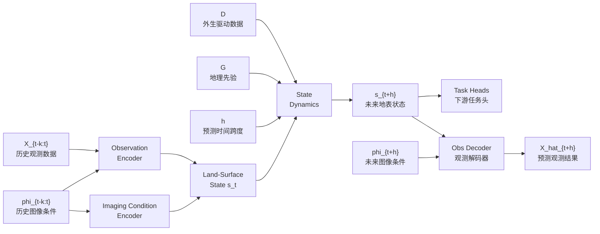

# 18 ObsWorld 现状评估与后续训练路线决策文档

> **数据协议更新（2026-07-16）：**本文保留历史推理；其中数据身份、测试划分和指标建议不再作为执行依据。当前只使用服务器已有的 EarthNet2021x NetCDF 数据，并采用 EarthNet2021 `train/iid/ood/extreme/seasonal` 协议；请以 [48：统一数据协议](48_ObsWorld_EarthNet2021x统一数据协议与主实验规范_20260716.md) 和 47 为准。

> 本文目的:在动手做 Stage 2 之前,把"我们现在到底是什么样子、问题在哪、flowchart 里每个元素怎么落地、phi 该补什么、1.5 怎么训"一次性讲清楚,供决策。**结论先行:基础扎实、方向成立,但目前训练出来、能拿出手的东西恰恰是最不 novel 的一柱(又一个 S1/S2 MAE encoder),三个差异化支柱都还是脚手架。下一步的核心不是急着冲动力学,而是用已有的 SSL4EO 数据把"可证伪的成像解耦 + phi 可控观测"这两块差异化证据做扎实——这是被严重低估的廉价高回报区。**

本文与 07(主线定稿)、10(完整实验流程)、11(SSL4EO 数据处理)是延续关系:07/10/11 说"应该怎么做",本文说"现在做到哪了、哪里糊了、下一步具体怎么定"。第 6 节给出如何回填 10 和 11。

## 给不熟悉英文和模型术语的速查版

如果你暂时不懂深度学习和英文缩写,先记住下面这组中文含义即可。本文后面所有判断基本都围绕这些词展开。

| 术语                           | 可以先理解成                  | 在本文里为什么重要                         |
| ---------------------------- | ----------------------- | --------------------------------- |
| `X` / image / observation    | 真实遥感图像,也就是卫星拍到的画面       | 图像不只包含地表,还包含光照、云、传感器等拍摄因素         |
| `phi`                        | 成像条件卡片,即"这张图是怎么拍出来的"    | 例如太阳高度角、季节、云量、经纬度、传感器类型。它不是图像内容本身 |
| encoder / 编码器                | 读图器,把图像压缩成模型内部特征        | 我们希望它读出"地表是什么",而不是只记住颜色、云、季节      |
| decoder / 解码器                | 画图器或重建器,把内部特征再变回图像      | 如果给它不同 `phi`,它应该能画出不同拍摄条件下的同一地表   |
| latent / `z_t` / `s_t`       | 模型脑子里的压缩表示,本文想把它叫"地表状态" | 审稿人会问:这到底是状态,还是普通图像特征? 所以必须有证据    |
| state / 状态                   | 地表本身较稳定的东西              | 例如水体、森林、农田、建筑等,不应因为太阳角不同就完全变掉     |
| FiLM                         | 用 `phi` 去调模型每一层的旋钮      | 它会让模型在读图时参考成像条件                   |
| cross-attention              | 让图像特征主动去查看 `phi` 信息     | 比 FiLM 更强的一种条件交互方式                |
| loss / 损失                    | 训练时告诉模型"这样对/这样错"的规则     | 不同 loss 会把模型推向不同目标                |
| counterfactual / shuffle phi | 故意把图像和错误的 `phi` 配在一起做测试 | 用来检查模型的状态表示是否真的不依赖成像条件            |
| consistency                  | 一致性约束                   | 同一地点/同一地表的不同观测,内部状态应该接近           |
| decoupling / 解耦              | 把"地表本身"和"拍摄条件"分开        | 这是本文的核心卖点                         |

一句话类比:我们想让模型先看图读出"这块地是什么状态",再根据"今天怎么拍"这张条件卡片把它画出来。争议点在于:这张条件卡片到底应该在"读图时"就给模型,还是只在"画图时"给模型。

---

## 0. 前沿格局修正(先纠一个误判)

调研 ~20 篇 CVPR/AAAI/arXiv 后,有一个关键修正必须写在最前面:

- **EO-WM(arXiv 2606.27277, 2026.06)不是威胁。** 二手摘要一度把它读成"latent state + 观测分离 + 太阳角条件 + DEM",经我直接核对 arXiv 摘要,它实际是**一个 video-diffusion 的植被(NDVI)预测器,条件是气象 forcing**,既没有成像条件(phi)解耦,也没有显式成像无关 state latent,也没有 DEM。它属于 EarthNet2021 / EarthNet2021x / VegeDiff 这一脉。**这对我们是好消息。**

真正占据我们部分地盘的是这两类:

| 竞品                                              | 它做了什么                                                                       | 它*没*做 = 我们的缝隙                                               |
| ----------------------------------------------- | --------------------------------------------------------------------------- | ----------------------------------------------------------- |
| **RS-WorldModel**(2026, 2B VLM)                 | 显式把成像元数据(太阳角/off-nadir/GSD/云)喂进模型,**明确动机就是"分离物理变化 vs 传感器变化"**,且做文本引导的未来场景预测 | 没有结构化 latent state,解耦是**语言 token 隐式**完成;无外生驱动 latent 动力学    |
| **EarthNet2021 / EarthNet2021x / VegeDiff / EO-WM** | "气象条件下预测未来 S2 像素",EarthNet2021x 有 learned cloud mask(隐式承认观测被污染)             | 直接预测像素,**无成像无关 state,无可控 phi_{t+h} 解码**——用 mask 处理云,而不是建模成像 |
| **DOFA**                                        | wavelength-conditioned 动态 embedding(条件化*编码器*)                               | 条件在编码端,不是*解码端按未来成像条件渲染*                                     |
| **SkySense / CROMA / Prithvi / Galileo**        | S1+S2 多模态表征 backbone                                                        | 判别式,无 state/observation 分离,无动力学                             |

> **唯一真正可防守的 novelty = 显式、可度量、可证伪的成像无关 land-surface state + phi 可控的观测解码 + 驱动/先验的反事实实验。** 这正是 RS-WorldModel 用 token 隐式糊过去、EarthNet 系完全没做的部分。我们的工程重心应该压在这里。

---

## 1. 现状全景(代码级核对)

### 1.1 三柱现状表

| 支柱                 | 设计要求(07/10)                                  | 代码实际状态(已核对)                                                                                                                                                                         | 差距                                                                      |
| ------------------ | -------------------------------------------- | ----------------------------------------------------------------------------------------------------------------------------------------------------------------------------------- | ----------------------------------------------------------------------- |
| **柱1 状态估计 + 成像解耦** | 编码器 + phi 注入 + 解耦损失,输出 `{z_t, S_t, U_t}`     | ✅ Stage1 双模 MAE(ViT-S/16, 22.77M)训练中,约 43%;✅ Stage1.5 `MultiModalViTEncoderFiLM`(FiLM 逐层 + cross-attn)+ `ImagingConditionEncoder` + 三个解耦 loss 代码完成,tiny smoke 通过、FiLM identity 验证通过 | **未规模训练、未评估解耦是否真发生;只有 `z_t`(MAE patch tokens),无显式语义 `S_t`,无不确定性 `U_t`** |
| **柱2 状态动力学(论文心脏)** | `z_t + D + G + h → z_{t+h}`,多步 rollout,驱动敏感性 | ⚠️ 仅 `state_dynamics_module.py` 残差 GRU/Transformer/MLP 骨架,`driver_dim=0 / geo_dim=0`,D/G 是接口占位,无时序 dataloader,核心逻辑标了 `TODO[Stage2]`                                                 | **几乎全空——world model 的核心证据为零**                                           |
| **柱3 条件观测模型**      | `s_{t+h} + phi_{t+h} → X_{t+h}`,phi 可控       | ⚠️ `dual_head_decoder.py` 是普通双头 MAE 重建器,**解码端完全不吃 phi**                                                                                                                             | **解码器不接 phi → "未来成像条件可控"这一卖点尚未实例化**                                     |

### 1.2 三档分类:已训练 / 已实现未训 / 仅骨架

```text
已训练(有结果):
  - Stage1 双模 MAE encoder(tiny 5.72M, 50k → EuroSAT 69.57%;正规 ViT-S/16 训练中)

已实现、已 smoke、未规模训练:
  - MultiModalViTEncoderFiLM(FiLM + cross-attn,零初始化 identity 起点)
  - ImagingConditionEncoder(单时间片对齐版,sun/season/cloud/latlon/modality 子编码器)
  - ImagingDecouplingLoss(consistency / counterfactual / decorrelation)
  - DualHeadDecoder(S1/S2 重建,不吃 phi)
  - PhiCache(46 字段 parquet 内存索引,单时间片 batch 接口)

仅骨架 / 占位(TODO[Stage2]):
  - StateDynamicsModule(D/G 维度=0,无 rollout,无 teacher forcing)
  - join_external_data(ERA5/事件/DEM join 钩子,纯占位)
  - 无显式 state head、无 U head、无时序数据集 loader
```

### 1.3 phi 现状:46 字段是怎么被处理的

phi 离线抽取成 parquet(`phi_processed/{train,val}/{S2L2A,S1GRD}/*.parquet`),训练时 `PhiCache` 按 `sample_key`(= tar `__key__`)查表。**真正进入模型的不是 46 个全部**,`PhiCache` 精简到训练用列:`modality / center_lat / center_lon / time / time_valid / season / day_of_year / sun_elevation / cloud_cover / cloud_shadow / valid_ratio`(各 0~3 四时间片)。

进编码器的链路是:
```text
phi parquet(4 时间片)
  → batch_phi_single_timestep_to_tensors(按选中季节 t 取标量 [B])
  → ImagingConditionEncoder:
        sun_elevation → sin(elev) → MLP
        season        → 5 类 embedding(4季+missing)
        cloud          → [log(1+cover), log(1+shadow), valid_ratio, has_cloud] → MLP
        lat/lon        → 多频 sin/cos(NeRF 式)→ MLP
        modality       → 类别 embedding
      concat → fuse_proj → phi_embed [B, D] + phi_tokens [B,1,D]
  → FiLM(每层 γ/β)+ cross-attn(每层)注入 encoder
```
缺失处理是认真做了的:每个子编码器有 learnable missing embedding,S1 无云字段走 `time_valid AND isfinite(cover)` 判定 + `nan_to_num` 兜底,不污染前向。这部分工程质量没问题。

#### 白话解释:上面这条链路到底在说什么

可以把每个 SSL4EO 样本想成"同一地点的 4 张季节照片",每张照片旁边都有一张小卡片,记录它的拍摄条件:

- 这张图是什么传感器拍的:S1 雷达还是 S2 光学;
- 图像中心在哪里:经纬度;
- 什么时候拍的:时间、季节、年内第几天;
- 光照怎么样:太阳高度角;
- 云多不多:S2 的云量、云影、有效像素比例。

`phi parquet` 就是把这些小卡片提前整理成表格文件,类似一个很大的 Excel/CSV 缓存。训练时不再临时重新算,而是直接按 `sample_key` 查表。

`batch_phi_single_timestep_to_tensors` 的意思是:虽然一个样本有 4 个时间片,但训练时通常只选其中某一个季节 `t` 的图像,所以也只取同一个 `t` 的那张条件卡片。`[B]` 表示一个 batch 里有 B 个样本,每个样本取一个数,例如 B 个太阳高度角。

`ImagingConditionEncoder` 的作用是"把人能读懂的条件卡片翻译成模型能读懂的向量"。不同字段的翻译方式不同:

- `sun_elevation → sin(elev) → MLP`:太阳高度角是连续数字,先做三角变换,再用一个小网络变成向量。
- `season → embedding`:季节是类别,春夏秋冬不能直接当 0/1/2/3 的大小关系,所以用查表向量表示。
- `cloud → MLP`:云量很稀疏,所以先做 log 变换,再喂给小网络。
- `lat/lon → 多频 sin/cos`:经纬度有周期和空间位置含义,用类似 NeRF 的位置编码让模型更容易理解地理位置。
- `modality → embedding`:S1/S2 是类别,用查表向量表示。

最后 `concat → fuse_proj` 是把这些字段的向量拼起来,再压成统一大小的 `phi_embed`。`[B,D]` 可以理解成 B 个样本,每个样本一条 D 维条件向量。`phi_tokens [B,1,D]` 是把这条条件向量包装成一个 token,方便 Transformer 用。

原实现最后一步是 `FiLM + cross-attn 注入 encoder`:也就是在"读图器"读图的每一层,都把这张条件卡片给它看。工程上这可以跑通,也不代表代码坏了;真正的问题是叙事上要想清楚:如果我们的目标是让读图器输出"不受成像条件影响的地表状态",那读图时到底要不要把成像条件喂进去? 这就是后面 2.2 和第 4 节争论的核心。

缺失处理那句话的意思是:不是所有样本都有所有字段。比如 S1 雷达不受云影响,所以没有云量字段。如果直接把缺失值 NaN 喂给模型,训练会炸掉。现在代码会先判断字段是否真实有效,无效时走一个可学习的"缺失向量",所以这块属于工程上处理得比较稳。

---

## 2. 核心问题与不足(**重点,优先看这节**)

### 2.1 最严重:我们训出来的、最成熟的那一柱,恰恰最不 novel

Stage1 双模 MAE encoder 做得最扎实,但它本质就是"又一个 S1/S2 MAE"——CROMA/SatMAE/Prithvi 已经做过。**审稿人不会因为多一个 EO 自监督编码器买账。** 我们真正能切开竞品的三件事(可度量解耦、phi 可控渲染、驱动反事实)目前**一个都还没有实验证据**。周报里花在 EuroSAT OA 上的叙事权重,其实是在为最不重要的部分辩护。

> 判断:**当前更像"又一个 EO 编码器",还撑不起 world model 叙事。能不能撑起来,取决于下一阶段是否补上差异化支柱。**

### 2.2 ⭐ 最该先定的事:FiLM 注入编码器 vs. 解耦损失,存在内在矛盾

这是 1.5 规模训练前**必须先拍板**的设计冲突,否则训完无法解释:

- narrative 要 `s_t` 成像无关;
- 但 1.5 把 phi 经 **FiLM 注入编码器每一层**(`MultiModalViTEncoderFiLM`),
- 同时又用 `CounterfactualDecouplingLoss`(shuffle phi 后 latent 不应变)。

这两者直接打架:
- 如果 FiLM 真用了 phi → shuffle phi 必然改变 latent → counterfactual loss 被违反;
- 如果 counterfactual 被满足 → FiLM 退化成 no-op → 注入 phi 毫无意义。

现在的代码是两者的混合体,**概念上是糊的**。第 4 节给出 A/B/C 三个干净选项和我的建议。

#### 白话解释:为什么这两个东西会互相打架

这里的矛盾可以用"考试作弊纸条"来理解。

我们的论文想讲的是:模型读完图以后,脑子里留下的是"地表本身是什么",而不是"这张图是什么季节、太阳角是多少、云多不多"。这就是 `s_t` 成像无关。

但现在 Stage 1.5 的实现里,我们又把 `phi` 这张"拍摄条件纸条"通过 FiLM 和 cross-attention 塞进 encoder 的每一层。也就是说,读图器一边读图,一边一直看纸条。

接着我们又设计了一个 `CounterfactualDecouplingLoss`,大意是:我把纸条打乱,给你一张不匹配的 `phi`,但你的内部表示最好不要变。这个 loss 想证明"模型没有依赖纸条"。

问题就在这里:

- 如果 FiLM 真的有用,读图器当然会根据纸条改变自己的读法。那你把纸条打乱以后,输出表示就应该变。此时 counterfactual loss 会惩罚它。
- 如果 counterfactual loss 最后被满足,说明打乱纸条也不影响输出。那就等于模型学会了无视 FiLM,FiLM 变成摆设。

所以不是说 FiLM 一定错,也不是说 counterfactual 一定错;问题是这两个目标放在一起时,会把模型往相反方向拉。一个说"请利用 phi",另一个说"请不要受 phi 影响"。训练完以后,如果结果好,我们也很难解释到底是哪一个机制在起作用。

因此 18 文档才说必须先拍板:要么让 `phi` 主要帮助 encoder 读图,那就不要再用 shuffle phi 后 latent 不变这种 loss;要么坚持 `state` 必须和成像条件分离,那就把 `phi` 放到 decoder,让它只负责最后怎么把状态画成图。

### 2.3 "状态"现在和普通 SSL 特征不可区分

07 §8.3 / 10 §6.5 要双层 state:连续 `z_t` + 显式语义 `S_t`(水体/LULC/建筑/灾害)+ 不确定性 `U_t`。代码里只有 `z_t`(MAE patch tokens),没有语义 state head、没有 state 标签接入、没有 U。EuroSAT linear probing 是**场景分类代理,不是 state map**。对审稿人,"把 MAE 特征叫 land-surface state"是空洞的,除非有 (a) 可度量的解耦证据 + (b) state 级下游任务(分割/转移)。

### 2.4 S1 的成像解耦故事太薄

phi 46 字段的成像核心(sun_elevation / season / cloud / lat-lon)**对 S2 成立,对 S1 基本是空的**:
- S1 的云字段 → 整列 missing;
- S1 真正的成像变化——**入射角(incidence angle)、升/降轨(ascending/descending)、极化、speckle**——一个都没建模(目前只有 VV/VH 两个通道当输入)。

07 §8.2 明确列了 "SAR polarization / incidence angle"。**这意味着"双模态成像解耦"目前只有一半模态在真的解耦。**

### 2.5 GSD / 分辨率在单数据集内无法做解耦轴

`spatial_resolution` 在 SSL4EO 内全是 10m 常数。所以"跨分辨率/跨传感器成像不变"这条 claim **在 SSL4EO 单数据集上无法验证**,得等 EarthNet/Planet 等异分辨率源。先想清楚这条 claim 放哪验,别在 SSL4EO 上空谈。

### 2.6 公开数据集天然估计不到的东西(必须诚实标注)

我们只能用公开数据集,以下要么拿不到、要么只能弱代理。论文里**必须诚实区分,不能包装成强因果/强真值**:

| 想要的量 | 公开数据现实 | 处理原则 |
|---|---|---|
| S2 真实 view/incidence angle | SSL4EO 未提供(需 S2 官方 MTD_TL.xml,未随数据下载) | `field_mask=0`,S2 窄视场可暂忽略;EarthNet 等有则补 |
| 逐像素大气状态(气溶胶/水汽) | 拿不到(L2A 已做大气校正,但校正残差未知) | 不建模,作为观测噪声吸收进 decoder |
| 强因果外生驱动(精确降雨→洪水) | 只有 ERA5/GPM 格点气象,空间粗(~9–25km) | 标为**弱驱动**,做敏感性而非因果断言 |
| 地表状态真值(连续 z_t) | 没有真值,只有弱标签(LULC/NDVI) | `z_t` 永远是 latent,只能间接验证(下游任务/一致性) |
| 显式语义 state S_t 真值 | SSL4EO 的 LULC 是产品级弱标签,非人工标注 | 当 weak label,`field_mask` 标记,损失降权 |
| 事件标签(洪水/灾害发生) | SSL4EO 完全没有;需 Sen1Floods11/xBD | 留到 Stage 2/4,SSL4EO 阶段不碰 |

---

## 3. flowchart 各元素如何定义与构建(回应你贴的那张图)

你贴的 flowchart 里 D、G、h、phi 都已经有位置,问题是**它们现在哪些有、哪些空、公开数据怎么填**。逐个说清楚。


### 3.1 phi(成像条件)—— 现有处理 + 值得补充

**现有(已实现,见 1.3):** sun_elevation, season, day_of_year, cloud(cover/shadow/valid_ratio), lat/lon, modality。S2 用得上,S1 偏空。

**值得补充(按性价比排序):**

| 补充字段 | 属于谁 | 公开来源 | 性价比 | 怎么加 |
|---|---|---|---|---|
| **S1 升/降轨(asc/desc)** | S1 成像 | SSL4EO S1 元数据/时间戳推断,或 S1 GRD 命名 | ⭐⭐⭐ 高 | 类别 embedding,加进 `ImagingConditionEncoder` 一个子编码器 |
| **S1 入射角(incidence angle)** | S1 成像 | 若 SSL4EO S1 metadata 含;否则按轨道几何近似 | ⭐⭐⭐ 高 | 数值 → sin/cos → MLP(同 sun) |
| **S1 极化对标志(VV/VH 已是通道)** | S1 成像 | 已有 | ⭐ 低(已隐含在通道) | 不必单列 |
| **相对方位角 / 太阳方位角** | S2 成像 | NOAA 公式可算(已有 sun_elevation 的同套天文代码) | ⭐⭐ 中 | 复用现有 numpy 天文代码,加方位角 |
| **view/incidence angle(S2)** | S2 成像 | SSL4EO 无,需 MTD_TL.xml | ⭐ 低(窄视场) | 暂 `field_mask=0` |

**优先做 S1 的 asc/desc + incidence**,因为它直接补上 2.4 的短板,让"双模态解耦"名副其实,而且只需在 `ImagingConditionEncoder` 加一两个子编码器、`build_phi_cache.py` 加列、parquet 增列——不动主训练逻辑。**先确认 SSL4EO 的 S1 zarr/metadata 里到底有没有 orbit/incidence 字段**(这是个待核实的前置动作)。

### 3.2 D(外生驱动)—— 怎么从公开数据构建

**SSL4EO 阶段:D 基本不存在(无事件、无气象)。** 唯一可派生的是**弱驱动**:`season_driver`(季节)、`time_delta`(时间间隔)。这两个 07 §10.3 已明确说"只能当弱驱动,不做强因果声明"。

**Stage 2 起的真正 D,公开来源:**

| D 字段                 | 公开数据集                               | 访问方式                 | 空间/时间分辨率                    | 备注               |
| -------------------- | ----------------------------------- | -------------------- | --------------------------- | ---------------- |
| 降雨 precipitation     | ERA5(Copernicus CDS)/ GPM IMERG     | CDS API(免费需注册)/ NASA | ERA5 ~9km 逐小时;GPM ~10km 半小时 | 主力弱驱动            |
| 温度 temperature       | ERA5 t2m                            | CDS API              | 同上                          | 植被/物候驱动          |
| 累积热/旱 stress         | ERA5 派生(累加异常)                       | 自己算                  | —                           | EO-WM 用的就是这种;可借鉴 |
| 洪水事件 event_type/time | Sen1Floods11 / SEN12-FLOOD / C2S-MS | 数据集自带标签              | 事件级                         | Stage 2/4 洪水任务   |
| 人类活动 proxy           | 可选,OSM 增长率                          | 复杂,第一版不做             | —                           | 07 §27 备选,暂缓     |

**构建方式(沿用 phi 离线缓存范式):** 在 `build_phi_cache.py` 里按样本的 `(lat, lon, timestamp)` 去 ERA5 格点上**最近邻/双线性取值**,join 成 parquet 新列。`join_external_data` 钩子已经预留了位置(`phi_loader.py:158`)。**关键:ERA5 是格点 reanalysis,对 SSL4EO 的点位是"区域气象",不是逐像素——这是弱驱动的根因,论文要写明。**

### 3.3 G(地理先验)—— 好消息:SSL4EO 已经有 DEM

**最被低估的现成资源:SSL4EO-S12-v1.1 本身就含 `DEM / NDVI / LULC` 三个模态(11 文档 §3.1 列了),但我们一张都还没用。** 这是廉价的 G 和弱 state 来源:

| G 字段 | 来源 | 怎么得到 | 成本 |
|---|---|---|---|
| **DEM(高程)** | SSL4EO 自带 DEM 模态 | 直接读,与 S1/S2 同位置对齐 | ⭐ 极低 |
| **slope / aspect(坡度/坡向)** | DEM 派生 | numpy 梯度,一次性离线算 | ⭐ 极低 |
| **lulc_prior(土地覆盖先验)** | SSL4EO 自带 LULC 模态 | 直接读,当弱 state/先验 | ⭐ 低 |
| 永久水体 permanent_water | JRC Global Surface Water | 按 lat/lon 裁剪 | ⭐⭐ 中(需下外部图层) |
| 距河流距离 water_distance | HydroRIVERS | 矢量→栅格化→距离变换 | ⭐⭐⭐ 高(洪水任务才需要) |
| 距道路/建筑距离 | OSM | 同上 | 高(城市任务才需要) |

**建议:Stage 2 的 G 第一版就用 SSL4EO 自带的 DEM + 派生 slope。** 它和 S1/S2 天然同位置对齐,零额外下载,直接接进 `StateDynamicsModule` 的 `geo_dim`。JRC/HydroRIVERS/OSM 留到洪水/城市任务再补。

### 3.4 h(预测跨度)—— 现在是占位标量,真实 h 需要时序数据集

`StateDynamicsModule` 已经接受 `time_delta` 标量并 expand 进条件,接口在。但:
- **SSL4EO 的 4 个时间片是"季节快照",不是规整时序**,且默认按日期排序、季节顺序不保证(11 §3.6),所以 SSL4EO 内的 h 含义模糊。
- **真正规整的 h 来自 DynamicEarthNet(月度)和 EarthNet(带未来气象)**,Stage 2 接入它们时,h = 目标月 − 源月 / 天数差。

定义:`h ∈ {time_delta(天/月), horizon(预测第几步)}`,动力学阶段必须;SSL4EO 阶段不用。

#### 白话解释:`h` 到底是什么,为什么 SSL4EO 阶段不用

`h` 可以先理解成"往未来看多远"。

例如:

```text
今天的地表状态 s_t
  → 预测 1 个月后: h = 1 month
  → 预测 3 个月后: h = 3 months
  → 预测第 5 帧未来图像: horizon = 5
```

所以 `h` 不是图像内容,也不是成像条件,而是告诉动力学模块:"你要从现在推到未来多远"。

为什么本文说 SSL4EO 里的 `h` 含义模糊? 因为 SSL4EO 的 4 个时间片更像"给同一地点抽了几张季节照片",不是严格的连续视频。它可能是:

```text
冬天 → 夏天 → 秋天 → 冬天
```

中间不一定刚好每 3 个月一张,也不一定春夏秋冬完整覆盖。它适合用来训练"同一地点不同观测应该有某种一致性",但不适合严肃地说"我从 t 预测到 t+h"。

真正需要 `h` 的是 Stage 2 动力学。比如 DynamicEarthNet 是月度数据,那就可以明确说:

```text
2020年1月的状态 → 2020年2月的状态: h = 1个月
2020年1月的状态 → 2020年4月的状态: h = 3个月
```

EarthNet 也有明确的历史窗口和未来窗口,所以可以定义"预测第几步"。这时 `StateDynamicsModule` 才真正有用:它学的是"地表状态怎么随时间、气象、地理先验变化"。

最简单的判断:

- **SSL4EO 阶段:** 主要做表征、解耦、phi 可控观测,不要强行讲动力学预测。
- **Stage 2 时序数据阶段:** 才讲 `s_t + D + G + h → s_{t+h}`。

### 3.5 state(s_t / S_t / U_t)—— 怎么从"特征"升级成"状态"

这是把 2.3 落地。建议分三步,**前两步在 SSL4EO 上就能做**:

1. **`z_t`(连续潜状态):** = encoder patch tokens(已有)。不变。
2. **`S_t`(显式语义状态):** 加一个轻量 **state head**,在 SSL4EO 上用自带 **LULC 模态做弱监督分割**(weak label + `field_mask`)。这让 `z_t` 被推向"地表语义"而非纯纹理,呼应 10 §阶段1.5 的"状态感知辅助"。**这是把"特征"叫成"状态"的最低成本证据。**
3. **`U_t`(不确定性):** 第一版用 MC-dropout 或轻量 evidential 头,放到 Stage 2/4。SSL4EO 阶段不强求。

#### 白话解释:为什么不能直接把 `z_t` 叫 state

`z_t` 是 encoder 输出的一堆数字。它可能包含很多东西:

- 地表语义:水体、森林、农田、城市;
- 纹理颜色:绿色、灰色、边缘、道路纹理;
- 成像因素:太阳角、季节、云、传感器差异;
- 甚至一些模型自己学到但人看不懂的统计规律。

所以如果我们直接说"`z_t` 就是 land-surface state",审稿人很可能会问:你凭什么说这是"状态"? 它会不会只是普通 MAE 特征? 会不会只是记住颜色和纹理?

因此这里提出三层东西:

#### 1. `z_t`:模型内部连续特征

这是现在已经有的东西。它是模型读图后得到的内部向量或 patch tokens。可以理解为模型脑子里的压缩记忆。

问题是:它有用,但不够可解释。它像一串模型自己的暗号,我们不能只靠命名把它叫成"状态"。

#### 2. `S_t`:显式语义状态

`S_t` 是更容易给人看的状态图。例如每个位置大概是什么地表类别:

```text
水体 / 森林 / 农田 / 城市 / 裸地 / 草地 ...
```

这里说的 `state head` 可以理解成在 encoder 后面接一个很小的预测头,让它从 `z_t` 预测一张语义图或类别图。这个小头不是主模型,更像一个"检查器":它检查 `z_t` 里有没有地表语义信息。

`LULC` 是 land use / land cover,中文就是"土地利用/土地覆盖"。SSL4EO 自带 LULC 模态,虽然不是完美人工标注,但可以当弱标签使用。所谓弱监督就是:这个标签不一定百分百准,所以训练时要谨慎、降权、用 `field_mask` 标记有效性。

为什么这有帮助? 因为如果 `z_t` 能稳定预测 LULC,我们就能说它不只是颜色纹理,它确实包含地表语义。这是把"普通特征"升级成"状态"的最低成本证据。

#### 3. `U_t`:不确定性

`U_t` 表示模型对自己判断有多不确定。例如:

```text
这块区域很像水体,置信度 95% → 不确定性低
这块区域被云遮住,可能是农田也可能是草地 → 不确定性高
```

为什么世界模型需要不确定性? 因为遥感图像经常有云、阴影、噪声、季节变化,模型不应该假装所有地方都看得很清楚。能说"这里我不确定",反而更科学。

但 `U_t` 第一版不是最急的。它会增加实现和评估复杂度,所以文档建议放到 Stage 2/4,SSL4EO 阶段先不强求。

#### 这一节真正想让你拍板什么

这一节不是要求你现在立刻实现所有东西。它真正的意思是:

- 当前已有的 `z_t` 只能算"候选状态",还不能单独支撑论文 claim。
- 最低成本补强方式是:用 SSL4EO 自带 LULC 加一个轻量 `state head`,证明 `z_t` 里有地表语义。
- `U_t` 可以暂时不做,不要让第一版工程过重。

如果和第 4 节的 A 路线合起来看,一个更稳的 Stage 1.5 目标是:

```text
Encoder 不吃 phi,输出 z_t
  → z_t 通过解耦/对抗尽量不含成像条件
  → z_t 通过 state head 能预测 LULC 语义
Decoder 吃 z_t + phi,负责按条件重建/渲染观测
```

这样我们才更有底气说:这个 `z_t` 不是普通图像特征,而是更接近"地表状态"。

---


## 4. ⭐ Stage 1.5 的具体落实抉择(必须先拍板)

针对 2.2 的矛盾,三个干净选项:

#### 先用一句话区分 A/B/C

- **A:** 读图时不给 `phi`,画图时才给 `phi`。核心思想是"先读出地表状态,再按指定成像条件渲染"。
- **B:** 读图时就给 `phi`,让模型利用成像条件帮助自己读得更准。核心思想是"`phi` 是读图辅助信息"。
- **C:** 现在的混合版本。读图时给 `phi`,但又要求打乱 `phi` 后状态不变。核心问题是目标互相冲突。

如果你现在完全没有把握,最稳的理解是:A 更像世界模型/观测模型的叙事,B 更像条件化表征学习,C 不建议继续规模训练。

### 选项 A:phi 只进解码端(编码器不吃 phi)
```text
Encoder: X → z          (不注入 phi)
Decoder: (z, phi) → X̂   (phi 在渲染端控制成像)
解耦约束: 在 z 上加 phi-对抗 / 解相关(让 z 不含成像信息)
```
- **优点:** 概念最干净,完美契合"图像 = 状态的有偏观测"叙事;三柱对称(phi 编码端缺席、解码端控制);最好讲故事;直接为柱3(phi 可控渲染)铺路。
- **缺点:** 编码器学不到"主动除去成像因素"的能力,全靠解耦损失在 z 上压。
- **代价:** 要给 decoder 接 phi(目前没接),encoder 退回不吃 phi 版本(= Stage1 的 `MultiModalViTEncoder`)。

白话版:先让模型看图,但不给它看"拍摄条件卡片",逼它尽量只读出地表本身。等它读出 `z` 以后,再把 `z` 和 `phi` 一起交给 decoder,让 decoder 决定"在这个太阳角、这个季节、这个云量下应该画成什么样"。

这个方案最适合讲我们想要的故事:图像不是地表本身,而是地表在某种成像条件下的观测。地表状态相对稳定,成像条件控制外观。

你需要付出的工程代价是:旧的 `MultiModalViTEncoderFiLM` 不能直接作为主路线继续训,因为它把 `phi` 放进 encoder 了。需要改成 decoder 接 `phi`,也就是让"画图器"吃条件。

### 选项 B:phi 进编码端做条件归一化,但只在最终输出强制不变
```text
Encoder: (X, phi) → z   (FiLM 告诉编码器"怎么拍的",帮它除成像因素)
解耦约束: 不要用 shuffle-counterfactual;改用真实的不同成像视图做 consistency
          (同地点 S1 vs S2、或近邻日期两张图 → z 应接近)
```
- **优点:** 编码器能主动利用 phi 抵消成像差异;保留现有 `MultiModalViTEncoderFiLM`。
- **缺点:** "shuffle phi 后不变"这条不能要了(否则又回到矛盾);叙事上"编码器吃了 phi 又说 phi 无关"需要更小心地解释。
- **代价:** 删掉 `CounterfactualDecouplingLoss`,把 consistency 改成跨真实视图。

白话版:这条路线承认"读图器可以看拍摄条件卡片"。例如模型看到一张偏暗的图,同时知道太阳高度角低,它就可以判断"暗不一定是地表变了,可能只是光照问题"。所以 `phi` 在这里是帮助 encoder 去除成像干扰的辅助信息。

但如果选 B,就不能再用"把 `phi` 打乱后 latent 仍不变"作为主要约束。因为 B 的前提就是 encoder 会利用正确的 `phi`;你给错的 `phi`,输出当然可能变。B 更合理的验证方式是:同一地点、同一状态的真实不同观测,例如 S1/S2 或近邻日期图像,它们的 `z` 应该接近。

工程上 B 最省事,因为可以保留 `MultiModalViTEncoderFiLM`;但论文叙事更难写,需要解释清楚:"encoder 使用 `phi` 是为了校正观测偏差,最终输出的 state 仍希望是成像无关的"。

### 选项 C(现状):A+B 混合 —— ❌ 不要
编码器吃 phi(FiLM)+ 同时用 shuffle counterfactual。**概念矛盾,训出来无法解释。** 必须收敛到 A 或 B。

白话版:C 的问题不是代码跑不起来,而是结果难解释。它一边要求模型看 `phi`,一边要求模型看错 `phi` 也别变。就像一边告诉学生"请参考提示解题",一边又说"我把提示换错了,你的答案也不能变"。如果最后模型表现好,审稿人会追问:到底是 FiLM 起作用,还是模型学会无视 FiLM? 这个问题很难答。

### 我的建议:选 A
理由:(1) A 的叙事和 07/10 主线("图像是有偏观测")最一致;(2) A 让柱1 和柱3 共用同一个"phi 只在观测端"的原则,实验图对称漂亮;(3) **跨模态一致性(S1↔S2)这个最强解耦证据,在 A 下天然成立**(见 5.1);(4) A 下 encoder 就是干净的 `X→z`,Stage1 的权重可直接复用,不浪费正在训的 ViT-S。

> **如果选 A:** 现有 `MultiModalViTEncoderFiLM` 的 FiLM/cross-attn 模块挪到 decoder;`ImagingConditionEncoder` 保留(给 decoder 用);`CounterfactualDecouplingLoss` 改成"phi 对抗/解相关 on z";新增 consistency 用跨模态/跨真实视图正例。

#### 给你拍板前的最低判断标准

如果你的目标是先把论文故事讲得最稳、最像"世界模型",优先选 **A**。它的核心句子很清楚:encoder 负责估计地表状态,decoder 负责根据成像条件生成观测。

如果你的目标是尽量少改当前代码、尽快利用已经实现的 FiLM 训练框架,可以选 **B**。但选 B 后必须同步删改 counterfactual loss,不能再按 C 的逻辑继续训。

如果你还没决定,不要继续按 C 做大规模 Stage 1.5。C 最危险的地方是:它会消耗算力,但训练完以后很可能既不能证明"phi 帮助了解耦",也不能证明"state 真正成像无关"。

---

## 5. 后续分阶段训练路线(重排优先级)

**核心判断:别急着冲柱2(动力学,最重的工程),先用 SSL4EO 已有数据把柱1+柱3 的差异化证据做扎实。** 这块零额外数据集、能直接产出切开竞品的 marquee 图。

#### 白话解释:为什么这里说"别急着冲柱2"

先把三根柱子翻成中文:

| 说法 | 白话含义 | 当前难度 |
|---|---|---|
| 柱1:状态估计 + 成像解耦 | 模型能不能从图里读出"地表本身",而不是被季节、太阳角、云、传感器带偏 | SSL4EO 已经能做一部分 |
| 柱2:状态动力学 | 地表状态会不会随时间、天气、地形变化,也就是从 `s_t` 预测 `s_{t+h}` | 最难,要新时序数据和复杂训练 |
| 柱3:条件观测模型 | 给定一个地表状态和成像条件 `phi`,模型能不能画出对应观测图像 | SSL4EO 已经能做一部分 |

"别急着冲柱2"不是说柱2不重要。柱2确实是 world model 最像"预测未来"的心脏,但它工程最重:要接 DynamicEarthNet/EarthNet,要做时序 dataloader,要接外生驱动 D 和地理先验 G,还要做 rollout 评估。现在如果直接冲,很容易花很多时间却得到一个半成品。

第 5 节的建议是:先用已经在手里的 SSL4EO,把柱1和柱3的核心证据做出来。这样就算 Stage2 还没完全成熟,论文也已经有两个能站住的新意:

- 模型内部状态 `z` 是否真的更接近"地表本身";
- 给定不同 `phi`,模型是否能控制生成/重建不同观测。

`marquee 图` 就是"招牌图"的意思,不是算法名。它指论文里最能让审稿人一眼看懂新意的图。例如:固定同一块地表状态,换不同季节/太阳角/模态的 `phi`,模型画出不同观测图。这种图比单纯报一个 EuroSAT accuracy 更能支撑本文叙事。

### 5.1 🎯 最高杠杆:SSL4EO 自身就能验证柱1+柱3(不碰任何时序数据集)

SSL4EO 有两个还没用的天然结构:

**(a) 跨模态 = 最干净的解耦实验。** 同一地点同一时刻的 S1 与 S2,是*完全不同的观测、却是同一个 state*。"S1 编码的 z ≈ S2 编码的 z"是能拿到的**最强、最干净的成像无关性证据**(比跨季节强,因为没有 phenology 混淆)。→ **旗舰解耦图。**

**(b) phi-可控渲染,SSL4EO 内就能做。** 用同地点季节A的图 + phi_A 编码出 s,再用 phi_B 解码去预测季节B的图——这就是"state + 未来成像条件 → 观测"的最小实例,**不碰 DynamicEarthNet/EarthNet 就能出 07 §26 图3 那张"固定 state、换 phi、渲染多版本观测"的招牌图**。这正是 RS-WorldModel/EO-WM 都没有的可控性证据。
  - ⚠️ 混淆提醒:跨季节同时含真实 state 变化(phenology),不是纯成像变化。这反而是卖点——它说明"光换 phi 不够、还需要动力学",干净地把*成像变化(快)*和*状态变化(慢)*分开。纯解耦验证用近邻日期/跨模态。

**(c) 解耦的"证伪"探针(几乎零成本,审稿人会信):** 训一个分类器从 z 预测 season/sun_elevation,**预测失败才说明解耦成功**(phi leakage probe)。

#### 白话解释(a):为什么 S1 和 S2 是最干净的解耦实验

S1 和 S2 可以先这样理解:

- **S1:** 雷达图像,不看颜色,更像用雷达波去"摸"地表结构,能穿云。
- **S2:** 光学图像,更像普通彩色/多光谱照片,会受云、太阳角、季节影响。

SSL4EO 的好处是:同一个地点、差不多同一个时刻,同时有 S1 和 S2。也就是说,它们看到的是同一块地,但拍法完全不同。

如果我们真的学到了"地表状态",那么:

```text
S1 读出来的 z   应该接近   S2 读出来的 z
```

因为地表没变,只是观测方式变了。这就是"成像无关"最干净的证据。

为什么它比跨季节更干净? 因为跨季节时,地表本身可能也变了。例如农田春天裸土、夏天作物茂盛、冬天可能收割后变空。这个叫 phenology,中文可以理解成"物候变化"。跨季节时我们分不清变化来自"拍摄条件"还是"地表真的变了"。但同一时刻的 S1/S2 更少这个混淆。

所以这张图可以做成论文的旗舰证据:

```text
同一地点:
S1 图像 → encoder → z_s1
S2 图像 → encoder → z_s2
结果: z_s1 和 z_s2 很接近
```

这说明模型没有只记住光学颜色或雷达纹理,而是在逼近同一个地表状态。

#### 白话解释(b):什么叫 phi 可控渲染

`phi 可控渲染` 可以理解成:我先让模型读出"这块地是什么",然后换一张"拍摄条件卡片",看模型能不能按新条件画出来。

例如同一地点有四季图像:

```text
春天图像 X_spring + 春天条件 phi_spring
夏天图像 X_summer + 夏天条件 phi_summer
秋天图像 X_autumn + 秋天条件 phi_autumn
冬天图像 X_winter + 冬天条件 phi_winter
```

一个最小实验可以是:

```text
用春天图像读出状态 z
再给 decoder 夏天条件 phi_summer
让它重建/预测夏天观测 X_summer
```

如果它能做出合理结果,就说明 `phi` 不是摆设,decoder 确实能根据条件控制观测外观。这就是"可控"。

但这件事要诚实解释:春天到夏天不只是成像条件变了,地表本身也可能变了,例如植被长起来了。所以跨季节实验不能单独证明"纯成像变化"。它更适合作为一个过渡证据:它告诉我们,只靠换 `phi` 还不够,未来确实需要 Stage2 动力学来预测真实状态变化。

更干净的纯解耦证据还是(a)的 S1/S2 跨模态一致性,或者时间非常接近的两张图。

#### 白话解释(c):什么叫 phi leakage probe,为什么"预测失败"反而是好事

`probe` 可以理解成"小测试器"。`phi leakage` 是"成像条件泄漏"的意思。

我们希望 `z` 表示地表状态,不要包含太多成像条件。那怎么检查 `z` 里有没有偷偷藏着季节、太阳高度角这些信息? 做一个小实验:

```text
冻结 encoder,拿到 z
训练一个很小的分类器/回归器:
  输入 z
  输出 season 或 sun_elevation
```

如果这个小分类器很容易从 `z` 猜出季节或太阳角,说明 `z` 里泄漏了很多成像条件,解耦不好。

如果它猜不出来,或者只能比随机好一点点,反而说明 `z` 更像成像无关的地表状态。这就是文档说"预测失败才说明解耦成功"。

注意这里不是希望主模型失败,而是希望这个"专门偷看 z 里有没有 phi 信息的小测试器"失败。它失败,代表 `z` 没把季节/太阳角这些不该保留的信息暴露出来。

#### 这一节真正想让你理解的决策

第 5 节不是让你放弃动力学,而是调整顺序:

```text
先做 SSL4EO 上能直接验证的三件事:
1. S1/S2 的 z 是否接近          → 证明 state 更成像无关
2. 固定 z 换 phi 能否改变观测   → 证明 phi 可控观测
3. 从 z 猜不出 season/sun       → 证明成像信息没有明显泄漏

再做 Stage2 动力学:
s_t + D + G + h → s_{t+h}
```

这样做的好处是:前面三件事不需要新数据集,只用 SSL4EO 就能开始;而且它们正好对应本文最有新意的卖点。等这些证据扎实以后,再上动力学,整篇论文会稳很多。

### 5.2 推荐执行顺序

```text
[本周,等 Stage1 ViT-S 收尾]
  0. 拍板 1.5 架构(第 4 节,建议选 A)        ← 不定这个,后面全是返工
  1. 跑 EuroSAT 标定正规版 encoder           ← 收尾 Stage1

[柱1 + 柱3,全程 SSL4EO,产出差异化证据]
  2. 给 decoder 接 phi(实现选项 A 的 (z,phi)→X̂)
  3. 规模训练 Stage1.5(按 A:encoder 干净 + 解耦 loss on z + phi-decoder)
  4. 三张差异化图/指标:
       - 跨模态 z 一致性(S1↔S2)            ← 旗舰解耦证据
       - phi 可控渲染(固定 s 换 phi)         ← 招牌可控图
       - phi leakage probe(从 z 测不出 season)← 解耦证伪
  5. 加 state head + SSL4EO 自带 LULC 弱监督    ← 把"特征"升级成"状态"

[柱2 动力学,最重工程,放到证据钉死之后]
  6. 接 DynamicEarthNet / EarthNet 时序 loader
  7. G 第一版 = SSL4EO 自带 DEM + slope;D 第一版 = ERA5 弱气象
  8. 打通多步 rollout + teacher forcing
  9. 驱动反事实:real/null/wrong D,w/o G,held-out event/region
```

### 5.3 一个战略决策:一篇全三柱 vs. 聚焦柱1+3

鉴于 RS-WorldModel 的时间压力,有分叉:
- **路线甲(全三柱一篇):** 风险是动力学柱太重、半成品,易被说 "thin"。
- **路线乙(聚焦柱1+3 做一篇硬的):** "可证伪解耦的成像无关 state + phi 可控的跨条件/跨模态观测渲染",动力学作为 future work。07 §27 备选②本来就预留了这条。

**倾向:先按路线乙的证据链推进**(它和甲的前两步完全重合,不浪费),等动力学实验质量出来再决定要不要并进同一篇。**一篇严谨的"可度量解耦 + 可控观测"比一篇单薄的三柱更能防守**,且能完全用 SSL4EO + EarthNet 做出来。

---

## 6. 如何逐步完善 10 和 11

10 和 11 是早期文档,字段方案需要回填本文的进展。具体增补点:

**对 11(SSL4EO 数据处理)的回填:**
- §9 "phi 第一版构造"还停留在"先不加 sun_elevation/cloud_probability"——**已过时**,实际 v2.0 已有 46 字段含 sun/season/cloud。把 §9 更新为"phi v2.0 实际字段表 + 单时间片对齐机制",并标注 S1 待补 asc/desc + incidence(本文 3.1)。
- §17 "第一轮之后如何扩展"补一条:**启用 SSL4EO 自带 DEM/NDVI/LULC**(本文 3.3/3.5),它们已下载未用。

**对 10(完整实验流程)的回填:**
- §4 阶段1.5 "状态感知辅助"具体化为:**state head + LULC 弱监督 +(选 A 的)phi-decoder + 三个解耦证据图**(本文 4 / 5.1)。
- §6.4 成像条件字段表补 S1 的 orbit/incidence(本文 3.1)。
- §6.6/6.7 D/G 字段补"公开来源 + 弱驱动声明 + ERA5 是区域气象不是逐像素"(本文 3.2/3.3)。
- 新增一节"成像无关性如何验证"——把跨模态一致性 / phi leakage probe / phi 可控渲染写成可复现协议(对应 07 §23 world model 能力实验)。

**建议节奏:** 不要现在大改 10/11。**先按第 5 节把柱1+3 的实验跑出第一批结果,用真实结论回填**,避免又写一轮纸面方案。本文(18)就是当前的"活文档",10/11 等结果落地后再同步。

---

## 7. 需要你拍板的决策清单

按紧急度排序,前两个挡着后面所有工作:

1. **【最紧急】Stage 1.5 架构选 A 还是 B?**(第 4 节)我建议 A(phi 只进解码端)。不定这个,规模训练 1.5 就是返工。
2. **【紧急】论文路线乙还是甲?**(5.3)建议先按乙推进(与甲前两步重合,不浪费)。
3. **下一步工程焦点:柱1+3 证据(SSL4EO,5.1)还是直接上柱2 动力学?** 建议前者。
4. **是否启用 SSL4EO 自带 DEM/LULC?**(3.3/3.5)建议是,几乎零成本补 G 和弱 state。
5. **是否补 S1 的 asc/desc + incidence?**(3.1)建议是,但先核实 SSL4EO S1 元数据里有没有这些字段。

#### 白话解释:第 3 点到底是在问什么

第 3 点不是单纯问"要不要补 phi",也不是问"要不要继续按现在的 Stage1.5 脚本训练"。它是在问:下一阶段主要工程时间先花在哪里。

有两条路:

```text
前者:先做柱1+柱3证据
  = 继续用 SSL4EO
  = 围绕成像解耦 + phi 可控观测做实验
  = 先把论文最有新意的证据做出来

后者:直接上柱2动力学
  = 接 DynamicEarthNet / EarthNet 等时序数据
  = 做 s_t → s_{t+h} 的未来状态预测
  = 工程量最大,风险也最大
```

所以第 3 点推荐"前者",具体不是一句"补 phi"就完事,而是一组工程动作:

1. **先按第 1 点拍板 Stage1.5 架构。** 如果选 A,就不能继续按现在 C 混合路线盲训。
2. **改模型路径:** 让 decoder 接 `phi`,而不是主要把 `phi` 注入 encoder。
3. **重新设计/调整 loss:** 不再使用和 A/B 冲突的 counterfactual 逻辑,改成 `z` 上的解相关/对抗 + 跨模态一致性。
4. **在 SSL4EO 上训练新的 Stage1.5。** 这才是"继续训练",但不是沿用旧路线直接加 step。
5. **做三类验证图/指标:** S1/S2 的 `z` 一致性、固定 `z` 换 `phi` 的可控渲染、phi leakage probe。
6. **可选补强:** 启用 LULC 做 state head,启用 DEM/LULC 作为弱 state/G 证据。

"补 phi"对应的是第 5 点里的 S1 `asc/desc + incidence`,它是锦上添花/补短板,不是第 3 点的全部含义。第 3 点真正的意思是:**下一步先围绕 SSL4EO 把柱1+柱3的证据链跑出来,暂时不要把主要精力投到 Stage2 动力学。**

---

## 附:本文一句话总结

> 我们把最不 novel 的一柱(EO 编码器)做得最扎实,而三个差异化支柱还是骨架。**当务之急是先定 1.5 架构(建议 phi 只进解码端),再用 SSL4EO 已有数据(含从没用过的 DEM/LULC + 跨模态结构)把"可证伪解耦 + phi 可控观测"两块差异化证据做出来**——这比急着上动力学性价比高得多,也正好打在 RS-WorldModel / EarthNet 系都没覆盖的缝隙上。
</content>
</invoke>
