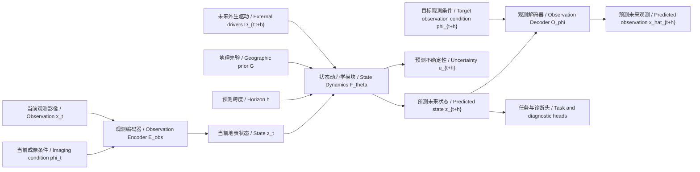

# 36 ObsWorld 主线定稿与实验方案

> **数据协议更新（2026-07-16）：**本篇的世界模型叙事保留；数据和评测一律采用服务器已有的 EarthNet2021x NetCDF 与 EarthNet2021 `train/iid/ood/extreme/seasonal`，不再从旧数据方案取用划分或指标。现行规范见 [48：统一数据协议](48_ObsWorld_EarthNet2021x统一数据协议与主实验规范_20260716.md)。

> 文件定位：这是在 `33_ObsWorld AAAI最终叙事与实验闭环.md`、`34_ObsWorld主线定稿与实验方案_全量整合翻新版.md`、`35_ObsWorld方案关键问答与实现路线_全量整合翻新版.md` 之后形成的主线定稿版。  
> 它不再追求全量归档，而是按照最终叙事和实验闭环重排，用作后续写作、实验实现和结果解释的主依据。

---

## 0. 本版先给结论

ObsWorld 的最终主线应固定为：

> **ObsWorld 是一个面向遥感观测的陆表状态动力学世界模型。它从多源、有偏、带成像条件的遥感像素观测中估计相对稳定的地表状态，在外生驱动、地理先验和预测跨度条件下预测未来地表状态，再利用目标时刻的观测条件把未来状态解码为可验证的未来像素观测。**

一句话更短版本：

> ObsWorld 从带有成像条件的遥感影像中估计陆表状态，并学习该状态在外生驱动、地理背景和预测跨度条件下如何演化。

英文参考，不作为当前阅读重点：

> ObsWorld is an Earth-observation world model for land-surface state dynamics. It estimates latent land-surface states from imaging-conditioned observations and predicts their future transitions under external drivers, geographic priors, and forecast horizons.

本版最重要的判断：

1. ObsWorld 不是 EarthNet2021 精度刷榜模型。
2. EarthNet2021 标准预测是主实验平台，不是全部叙事。
3. 真正的论文闭环是：标准预测 + DGH 消融 + weather-response 诊断 + 不确定性/地理一致性 + 下游迁移。
4. Stage2 第一主线采用 EarthNet2021-only，即 `ObsWorld-E`。
5. EarthNet+SSL4EO 联合 Stage2 训练只作为扩展或附录，即 `ObsWorld-G`，不作为第一张主表默认路线。
6. 文章创新不在 pretrain-finetune，而在“观测条件感知的状态表示 + D/G/h 条件状态动力学 + 机制化实验闭环”。

---

## 1. 与旧 07/34 的关系

旧 07 和 34 的作用是把历史路线全量归档；36 的作用是把已经确定的路线整理成可执行主纲。

| 内容 | 旧 07 / 34 | 本版 36 |
| --- | --- | --- |
| 信息密度 | 全量整合，保留大量历史来源 | 只保留最终执行所需信息 |
| 叙事顺序 | 先总纲，再逐项展开 | 先主张，再方法，再实验闭环 |
| 语言风格 | 解释较多，适合回溯 | 更像后续论文和实验实施的中枢文档 |
| 英文术语 | 已加中文解释 | 继续保留中文优先，英文括注 |
| 实验安排 | 分项完整 | 更强调每个实验支撑哪条主张 |

本版应优先服从。若与 07/30/34 等旧文档冲突，以本版为准。

---

## 2. 英文术语速查

| 英文 | 中文 | 本文中怎么理解 |
| --- | --- | --- |
| Observation | 观测影像 | 卫星实际拍到的像素图 |
| State / latent state | 状态 / 潜在状态 | 模型内部估计的陆表状态，不等同于原始像素 |
| Imaging condition / phi | 成像条件 | 太阳角、云、季节、传感器、有效像素率等影响观测外观的因素 |
| Dynamics | 动力学 | 状态如何随时间和条件变化 |
| State transition | 状态转移 | 从 `z_t` 到 `z_{t+h}` 的变化 |
| External driver / D | 外生驱动 | 降水、温度、VPD、太阳辐射、day_of_year 等推动状态变化的条件 |
| Geographic prior / G | 地理先验 | 海拔等相对稳定的地理背景 |
| Horizon / h | 预测跨度 | 预测未来多少天 |
| Decoder | 解码器 | 把未来状态还原成可评估的未来影像 |
| Weather-response | 天气响应诊断 | 改变天气条件，看模型预测是否随之合理变化 |
| Uncertainty | 不确定性 | 模型认为哪里更难预测 |
| Downstream / Transfer | 下游 / 迁移 | 检查学到的状态能否用于其他任务 |
| ENS | EarthNetScore | EarthNet 综合指标，越高越好，即 `ENS↑` |

使用原则：

- 文档内部优先用中文，英文主要用于和代码、表格、论文术语对齐。
- `decoupling / 解耦` 只在 Stage1.5 技术语境中使用；主线表达优先写“显式处理观测条件”“降低成像捷径”“估计更稳定的地表状态”。
- `dynamics / 动力学` 不代表必须写出完整物理方程，它指状态随时间和外部条件变化的规律。

---

## 3. 核心叙事链条

本文的叙事不应从“我们预测未来影像”开始，而应从遥感世界模型的矛盾开始：

1. 遥感影像不是世界本身，而是地表状态在某个成像条件下的观测。
2. 如果模型直接追求未来像素相似，可能学到云、太阳角、季节均值、地理位置等捷径。
3. 遥感未来变化本质上与外生驱动、地理背景和时间跨度有关。
4. 因此，世界模型应学习地表状态如何在 D/G/h 条件下转移。
5. 未来像素预测仍然必要，但它是检验状态转移是否可观测的评估接口。

对应方法链条：

```text
当前遥感观测 x_t + 当前成像条件 phi_t
        -> 当前陆表状态 z_t

当前状态 z_t + 外生驱动 D + 地理先验 G + 预测跨度 h
        -> 未来陆表状态 z_{t+h}

未来状态 z_{t+h} + 目标时刻观测条件 phi_{t+h}
        -> 可验证的未来观测 x_hat_{t+h}
```

对应实验链条：

```text
EarthNet 标准预测
        -> 证明方法在公开标准任务上可比

DGH 消融
        -> 证明 D/G/h 不是概念包装，而是有效机制

Weather-response 诊断
        -> 证明模型真的响应外生驱动，而不是记忆平均季节

Uncertainty / G consistency
        -> 证明模型知道哪里难，并且地理背景有调节作用

Downstream / transfer
        -> 证明 z 不只是 EarthNet 特化中间特征
```

只做 EarthNet 标准预测，会让文章被困在 Earthformer、Contextformer、EO-WM 的单一精度赛道里。五项合起来，才是 ObsWorld 自己的赛道。

---

## 4. 论文主张与贡献点

### 4.1 核心主张

本文核心主张：

> 未来遥感预测不应只评价未来像素是否相似，而应检验模型是否学到了外生驱动下可诊断、可解释、可校准的陆表状态转移。

更直白地说：

> 预测是入口，状态转移才是主线；像素指标证明能预测，机制实验证明为什么这种预测像世界模型。

### 4.2 三个贡献点

建议贡献写成三条：

1. **问题定义**  
   将遥感世界模型定义为从带成像条件的遥感观测中学习陆表状态动力学，而不是单纯未来像素重建。

2. **方法框架**  
   提出 ObsWorld：通过观测编码器估计当前状态，通过 D/G/h 条件状态动力学预测未来状态，再通过观测解码器生成可验证的未来观测。

3. **评估闭环**  
   设计标准预测、DGH 消融、weather-response、不确定性/地理一致性和下游迁移组成的实验体系，验证模型是否真的学习条件状态转移。

不要把贡献写成：

- 我们用了 SSL4EO。
- 我们用了 ViT。
- 我们用了 EarthNet。
- 我们简单加入了 D/G/h。

这些是实现条件，不是论文贡献。

---

## 5. 方法定义

### 5.1 输入输出

核心输入：

| 记号 | 中文 | 内容 |
| --- | --- | --- |
| `x_t` | 当前观测影像 | 当前时刻遥感图像 |
| `phi_t` | 当前成像条件 | 当前观测的太阳角、云、季节、模态等 |
| `z_t` | 当前地表状态 | 由模型从 `x_t, phi_t` 中估计 |
| `D_{t:t+h}` | 外生驱动 | 未来时间段的天气/物候驱动 |
| `G` | 地理先验 | 海拔等稳定地理背景 |
| `h` | 预测跨度 | 从当前到未来目标时刻的间隔 |
| `phi_{t+h}` | 目标观测条件 | 未来目标时刻的成像条件，若任务可获得则使用 |

核心输出：

| 记号 | 中文 | 内容 |
| --- | --- | --- |
| `z_{t+h}` | 未来地表状态 | 状态动力学模块预测出的未来状态 |
| `u_{t+h}` | 未来不确定性 | 可选输出，用于 uncertainty-error correlation |
| `x_hat_{t+h}` | 未来观测预测 | 解码后的未来遥感图像或目标观测 |
| diagnostic outputs | 诊断输出 | NDVI、response、分层误差、下游特征等 |

### 5.2 核心公式

```text
z_t = E_obs(x_t, phi_t)
z_{t+h}, u_{t+h} = F_theta(z_t, D_{t:t+h}, G, h)
x_hat_{t+h} = O_phi(z_{t+h}, phi_{t+h})
```

中文解释：

- `E_obs` 是观测编码器：从当前影像和成像条件中估计当前地表状态。
- `F_theta` 是状态动力学模块：在 D/G/h 条件下把当前状态推到未来状态。
- `O_phi` 是观测解码器：把未来状态还原为可评价的未来观测。
- `u_{t+h}` 是不确定性，可先做轻量版本，不必一开始复杂化。

---

## 6. 方法流程图



这张图按四步读：

1. **观测到状态**：`x_t` 和 `phi_t` 进入观测编码器，得到当前状态 `z_t`。
2. **状态到未来状态**：`z_t` 和 `D/G/h` 进入状态动力学模块，得到未来状态 `z_{t+h}`。
3. **未来状态到未来观测**：`z_{t+h}` 和 `phi_{t+h}` 进入观测解码器，生成 `x_hat_{t+h}`。
4. **诊断和下游**：未来状态还可用于 NDVI、weather-response、不确定性、G consistency 和下游任务。

图中最重要的关系：

```text
不是 x_t -> x_{t+h}
而是 x_t -> z_t -> z_{t+h} -> x_hat_{t+h}
```

这能避免文章被理解成普通视频预测模型。

---

## 7. 模型模块

| 模块 | 中文名 | 输入 | 输出 | 作用 |
| --- | --- | --- | --- | --- |
| `E_obs` | 观测编码器 | `x_t, phi_t` | `z_t` | 从当前观测中估计地表状态 |
| `E_phi` | 成像条件编码器 | `phi` | phi embedding | 表示观测外观因素 |
| `P` | 状态投影器 | ViT features/tokens | compact state | 把 encoder 特征整理为动力学状态 |
| `F_theta` | 状态动力学模块 | `z_t, D, G, h` | `z_{t+h}, u_{t+h}` | 学习状态转移与不确定性 |
| `O_phi` | 观测解码器 | `z_{t+h}, phi_{t+h}` | `x_hat_{t+h}` | 生成可评估未来观测 |
| `H` | 任务/诊断头 | `z` 或 `z_{t+h}` | NDVI、分类、response 等 | 支撑诊断和下游任务 |

首版实现应保守：

- `F_theta` 采用 residual dynamics，即预测 `delta_z`，再令 `z_{t+h}=z_t+delta_z`。
- D/G/h 通过 MLP 或 FiLM/condition modulation 融入状态动力学。
- 不建议一开始做复杂自回归 rollout，优先 direct multi-horizon prediction。

---

## 8. 训练阶段

### 8.1 总览

| 阶段 | 数据 | 训练目标 | 产物 | 是否核心创新 |
| --- | --- | --- | --- | --- |
| Stage1 | SSL4EO | 遥感表征预训练 | 基础 encoder | 否，是地基 |
| Stage1.5 | SSL4EO + phi | 成像条件建模与状态约束 | 更适合动力学的状态表示 | 辅助创新 |
| Stage2 | EarthNet2021 | D/G/h 条件状态动力学 | `F_theta` 主模型 | 是 |
| Stage3 | EarthNet2021 | 观测解码与预测评估 | `x_hat_{t+h}` 与指标 | 是，作为观测接口 |
| Stage4 | CropHarvest / Sen1Floods11 | 下游迁移 | 状态表示迁移结果 | 辅助支撑 |

### 8.2 Stage1：SSL4EO 表征预训练

定位：

- 让 ViT-S/16 级别 encoder 获得基本遥感表征能力。
- 不把 Stage1 包装成创新点。
- EuroSAT linear probing 只作为健康度参考。

写法：

> Stage1 provides a remote-sensing representation backbone. The novelty of ObsWorld lies in the structured state dynamics after pretraining, not in the pretrain-finetune paradigm itself.

中文：

> Stage1 是遥感表征地基，不是本文创新本身；创新在后续如何把表征组织成状态，并学习 D/G/h 条件下的状态动力学。

### 8.3 Stage1.5：成像条件建模与状态表示约束

定位：

- 显式处理太阳角、云、季节、模态、经纬度等成像条件。
- 减少模型把观测外观捷径当成状态。
- 为 Stage2 的状态动力学提供更干净的 `z_t`。

需要诚实写：

- 60k 优于 30k 的主要证据是 alignment 更好、跨模态一致性更好。
- 非线性 probe 仍可能识别部分成像因素。
- 不能声称完全消除所有成像信息。

推荐 claim：

> Stage1.5 reduces linear imaging-condition leakage and improves cross-modal consistency, providing a cleaner state representation for dynamics learning.

不要写：

> Stage1.5 completely removes all imaging information from the state.

### 8.4 Stage2：EarthNet2021 条件状态动力学

最终首版策略：

- 主线模型：`ObsWorld-E`
- Stage2 数据：EarthNet2021-only
- 训练任务：`z_t + D + G + h -> z_{t+h}`
- 主协议：scenario-conditioned forecasting，即给定未来外生驱动情景预测地表响应

为什么不用 EarthNet+SSL4EO 作为第一主线：

1. EarthNet-only 对比更公平。
2. 联合训练如果效果差，难以判断是方法问题还是多数据负迁移。
3. 主实验的目的不是证明多数据集训练，而是证明 D/G/h 条件状态动力学。

EarthNet+SSL4EO 可以作为 `ObsWorld-G`：

- 放在附录。
- 用于泛化或 OOD 诊断。
- 不进入第一张标准预测主表的默认模型。

### 8.5 Stage3：观测解码与预测评估

定位：

- 把未来状态 `z_{t+h}` 转成可评估未来观测。
- 用 EarthNet 标准指标检验模型是否真的能预测。
- 不把 decoder 能力误写成世界模型核心。

首版建议：

- 先串行训练 dynamics 和 decoder，便于消融。
- 后续可 joint fine-tune 提升像素指标。
- 不能只优化像素指标而牺牲 D/G/h response。

### 8.6 Stage4：下游与迁移

定位：

- 验证 `z` 不只是 EarthNet 预测中间特征。
- 检查状态表示是否对其他地表状态相关任务有用。

优先级：

| 优先级 | 数据集 | 任务 | 作用 |
| --- | --- | --- | --- |
| P0 | CropHarvest | crop classification / agriculture | 与植被、作物、物候更接近 |
| P1 | Sen1Floods11 | flood mapping / disaster | 检查跨任务状态敏感性 |
| P2 | EuroSAT / BigEarthNet | 常规分类 sanity check | 只作补充，不作核心 |

---

## 9. 数据与字段

### 9.1 数据集分工

| 数据集 | 用途 | 主文地位 |
| --- | --- | --- |
| SSL4EO | Stage1/1.5 预训练与成像条件建模 | 方法地基 |
| EarthNet2021 | Stage2/3 标准预测、DGH、response | 主实验核心 |
| CropHarvest | 下游迁移 | 推荐主文或附录 |
| Sen1Floods11 | 下游迁移 | 推荐附录或资源允许时主文 |
| EarthNet+SSL4EO joint | 泛化增强 | 附录/扩展 |
| SkySense / Prithvi / Galileo | foundation model 对比 | 下游表或相关工作，不进 EarthNet 第一主表 |

### 9.2 D：外生驱动

最终 D 字段：

| 字段 | 中文 | 作用 |
| --- | --- | --- |
| `day_of_year` | 年内日 | 季节/物候时间驱动，建议 sin/cos 编码 |
| `precipitation` | 降水 | 水分输入 |
| `temperature` | 温度 | 热量条件 |
| `VPD` | 蒸汽压亏缺 | 水分胁迫 |
| `solar_radiation` | 太阳辐射 | 能量输入 |

明确不放入 D：

- `ndvi_previous`：这是状态反馈或辅助目标，不是外生驱动。
- `sun_elevation`：主要是成像条件，归 phi。
- 离散 `season`：容易与 phi 混淆，Stage2 用 `day_of_year` 替代。

### 9.3 G：地理先验

首版 G：

```text
G = elevation
```

理由：

- 稳定、公开、易对齐。
- 与气候、植被、水分响应有关。
- 字段少，解释更清楚。

G 的叙事不是“强物理定律”，而是“地理背景调节”。如果 elevation 分层后 full model 比 no-G 更稳定，或 response 曲线更合理，就能支撑 G 的作用。

### 9.4 h：预测跨度

原则：

- h 必须作为条件输入。
- 不建议只设一个 h。
- EarthNet 主线应尊重其 5-day lead-time 协议。

推荐两档：

| 方案 | h 取值 | 适用情况 |
| --- | --- | --- |
| 完整协议 | `{5,10,15,...,100}` | 资源允许，最完整 |
| 轻量协议 | `{5,10,20,30,60,100}` | 时间紧张，仍覆盖短中长跨度 |

旧 `{10,20,30,60}` 只作为历史备选或 ablation，不作为最终唯一方案。

### 9.5 未来天气与泄露

使用双协议：

| 协议 | 能否用未来真实 weather / reanalysis | 含义 |
| --- | --- | --- |
| Scenario / oracle forcing | 可以 | 给定未来天气情景，研究地表响应 |
| Deployment forecasting | 不可以 | 真实部署时未来天气不可知，需用 forecast 或 climatology |

主线建议：

- 主文采用 scenario-conditioned forecasting。
- 同时说明部署预测时需要替换为天气预报或气候平均。

不要写：

- “未来 ERA5 一定是泄露。”

应写：

> 在情景条件预测中，未来 meteorological drivers 是外生 forcing；在真实部署预测中，这些 forcing 必须来自可获得的天气预报或气候估计。

---

## 10. 实验闭环总览

每个实验都必须回答一个清晰问题。

| 实验 | 审稿人问题 | 支撑主张 |
| --- | --- | --- |
| EarthNet 标准预测 | 你不是只讲概念吗？ | 方法在公开标准任务上可比 |
| DGH 消融 | D/G/h 是不是包装？ | 条件变量对状态转移有实际贡献 |
| Weather-response 诊断 | 你是不是只记季节平均？ | 模型会随外生驱动变化预测 |
| Uncertainty | world model 是否知道哪里难？ | 高不确定区域对应高误差 |
| G consistency | G 只有 elevation，别人认吗？ | G 是地理背景调节项 |
| Downstream / transfer | z 是状态还是 EarthNet 特化特征？ | 状态表示有迁移价值 |
| 可视化 | 结果是否可解释？ | 展示预测、响应、不确定性和地理调节 |

主文优先级：

```text
P0: EarthNet 标准预测
P0: DGH 消融
P0: Weather-response 诊断
P1: Uncertainty-error correlation
P1: G consistency / elevation stratification
P1: CropHarvest downstream
P2: Sen1Floods11 / foundation model transfer
P2: ObsWorld-G joint training
```

---

## 11. 实验一：EarthNet2021 标准预测

### 11.1 定位

这是第一张主表，也是主实验平台。

它证明：

> ObsWorld 在公开 future EO forecasting benchmark 上具有可比性。

它不证明：

> ObsWorld 是所有像素指标上的绝对第一。

### 11.2 表格设计

**Table 1: EarthNet2021 Standard Forecasting**

| Method | Type | Params | External pretrain | ENS↑ | MAD/MAE↓ | OLS↑ | EMD↑ | SSIM↑ | NDVI-MAE↓ | DHR↑ | Cost |
| --- | --- | ---: | --- | ---: | ---: | ---: | ---: | ---: | ---: | ---: | ---: |
| Persistence | naive | - | no |  |  |  |  |  |  |  |  |
| Climatology / seasonal mean | naive | - | no |  |  |  |  |  |  |  |  |
| ConvLSTM | temporal prediction |  | no |  |  |  |  |  |  |  |  |
| SimVP / PredRNN | video prediction |  | no |  |  |  |  |  |  |  |  |
| Earthformer | spatiotemporal transformer |  | task data |  |  |  |  |  |  |  |  |
| Contextformer / EarthNet2021x | EO forecasting |  | task data |  |  |  |  |  |  |  |  |
| EO-WM | large EO world/forecast model | large | yes |  |  |  |  |  |  |  | high |
| ObsWorld-S | ours | ViT-S scale | SSL4EO |  |  |  |  |  |  |  | lower |
| ObsWorld-M | ours optional | medium | SSL4EO |  |  |  |  |  |  |  |  |

注意：

- `ENS` 是越高越好。
- 必须报告参数量和 external pretrain。
- 如果加入 EO-WM，要明确参数与训练资源差异。
- 第一表可以放 DHR 或 long-horizon 指标，让 ObsWorld 特点有入口。

### 11.3 可接受结果

理想：

- ObsWorld-S 接近或超过 Earthformer/Contextformer。
- NDVI-MAE、DHR、long-horizon 指标有优势。
- 参数和推理成本低于大模型。

可接受：

- ENS 低于 EO-WM，但强于 naive 和轻量 video baseline。
- 与 Earthformer/Contextformer 接近。
- 机制指标明显更好。

危险：

- 弱于 persistence 或 climatology。
- 标准预测不稳定。
- DHR 也没有优势。

---

## 12. 实验二：DGH 消融

### 12.1 定位

这是机制核心表。它回答：

> D、G、h 是否真的影响状态转移？

### 12.2 表格设计

**Table 2: D/G/h and Stage1.5 Ablation**

| Config | D | G | h | Stage1.5 | ENS↑ | NDVI-MAE↓ | DHR↑ | Long-horizon Error↓ | Weather-response↑ |
| --- | --- | --- | --- | --- | ---: | ---: | ---: | ---: | ---: |
| z only | no | no | no | yes |  |  |  |  |  |
| z + h | no | no | yes | yes |  |  |  |  |  |
| z + D + h | yes | no | yes | yes |  |  |  |  |  |
| z + G + h | no | yes | yes | yes |  |  |  |  |  |
| z + D + G + h | yes | yes | yes | yes |  |  |  |  |  |
| full w/o Stage1.5 | yes | yes | yes | no |  |  |  |  |  |
| full single-h | yes | yes | single | yes |  |  |  |  |  |

### 12.3 预期解释

理想：

- 加 D 后，NDVI-MAE、DHR、weather-response 提升。
- 加 h 后，长短期输出更可分，long-horizon error 降低。
- 加 G 后，总体指标可能小幅提升，但 elevation strata 更稳定。
- 去掉 Stage1.5 后，成像条件泄漏、跨条件一致性或 response 稳定性变差。

可接受：

- G 总体增益不大，但分层分析有效。
- Stage1.5 对 ENS 提升不大，但对 leakage / response / transfer 有帮助。

危险：

- D/G/h 都没有贡献。
- 改变 h 输出几乎不变。
- 去掉 D 预测仍然一样。

---

## 13. 实验三：Weather-response 诊断

### 13.1 定位

这是最能体现 ObsWorld 特点的实验。它回答：

> 模型是否真的响应外生驱动，而不是只记住平均季节或地理位置？

### 13.2 设计

| 设计 | 做法 | 意义 |
| --- | --- | --- |
| Forcing sweep | 固定 `z_t, G, h`，改变 precipitation / VPD / temperature / radiation | 检查预测是否随 D 合理变化 |
| Matched pairs | 找状态相近但天气不同的样本对 | 检查模型是否区分不同天气情景 |
| Extreme subsets | drought / wet / heat 子集 | 检查困难场景中的机制价值 |

### 13.3 指标

| 指标 | 中文 | 作用 |
| --- | --- | --- |
| D-sensitivity | D 敏感性 | D 改变后预测是否显著变化 |
| Response sign accuracy | 响应方向准确率 | 降水增加、VPD 下降等情况下方向是否合理 |
| Response monotonicity | 响应单调性 | 驱动连续增强时输出是否大体连续/单调 |
| Extreme subset gain | 极端子集增益 | 干旱、热浪等场景 full 是否优于 no-D |
| DHR | Dynamic Horizon Response | 不同 h 下响应是否合理 |

### 13.4 可接受结果

可接受：

- ENS 不是最高，但 response 指标优于普通预测模型。
- precipitation / VPD sweep 有合理趋势。
- extreme subset 中 full 比 no-D 更稳。

危险：

- 改变 D 输出不变。
- 响应方向经常反常。
- response 图无法解释。

---

## 14. 实验四：不确定性

### 14.1 定位

不确定性不是第一贡献，但能增强 world model 可信度。它回答：

> 模型是否知道哪些未来更难预测？

### 14.2 首版实现

推荐轻量实现：

- dynamics head 输出 `mu` 和 `logvar`。
- 使用 heteroscedastic Gaussian loss 或 NLL。
- 若不稳定，可用 dropout/ensemble 作为备选。

### 14.3 指标与图

| 指标 | 中文 | 作用 |
| --- | --- | --- |
| uncertainty-error correlation | 不确定性-误差相关 | 不确定性越高，真实误差是否越大 |
| calibration bins | 校准分桶 | 按不确定性分桶后误差是否上升 |
| high-uncertainty localization | 高不确定区域定位 | 高不确定是否出现在云、边界、极端天气、长期预测区域 |

图：

```text
prediction error map | uncertainty map | overlap / calibration bins
```

可接受：

- uncertainty 和 error 正相关。
- 长 horizon、极端天气、云/缺失区域不确定性更高。

危险：

- 不确定性几乎常数。
- 不确定性和误差无关。

---

## 15. 实验五：G consistency / 地理先验分析

### 15.1 定位

G 的作用是提供地理背景，不是强行构造物理定律。首版只用 elevation 也可以成立。

### 15.2 设计

| 设计 | 做法 | 意义 |
| --- | --- | --- |
| Elevation strata | 按海拔分桶评估 full vs no-G | 看不同海拔段是否受益 |
| Response by elevation | 不同海拔层做 weather-response sweep | 看同样 D 在不同 G 下响应是否不同 |
| Error over elevation | 可视化误差与海拔关系 | 检查地理背景是否解释误差 |
| G perturbation | 小幅扰动 elevation | 检查模型是否真的使用 G |

### 15.3 可接受结果

可接受：

- 总体 ENS 提升小，但高海拔/复杂区域提升明显。
- no-G 在某些海拔段误差偏大。
- response 曲线在 elevation strata 中有可解释差异。

危险：

- G perturbation 完全不影响输出。
- G 让所有分层都变差。

---

## 16. 实验六：Downstream / Transfer

### 16.1 定位

下游任务回答：

> 学到的 `z` 是否有超出 EarthNet 的地表状态语义？

它不是主实验，但能补强“状态表示”的可信度。

### 16.2 数据与协议

| 数据集 | 优先级 | 协议 | 作用 |
| --- | --- | --- | --- |
| CropHarvest | P0 | frozen linear probe + light fine-tune | 与农业、物候、植被状态贴近 |
| Sen1Floods11 | P1 | frozen / adapter | 跨灾害任务迁移 |
| EuroSAT / BigEarthNet | P2 | sanity check | 常规分类，不作主贡献 |

比较对象：

- Stage1-only
- Stage1.5
- Stage2 full
- 可选 foundation models：SkySense / Prithvi / Galileo

核心问题：

```text
Stage2 dynamics 是否让状态表示更适合地表状态相关任务？
```

而不是：

```text
ObsWorld 是否全面超过所有 foundation model？
```

---

## 17. 可视化体系

主文建议保留 4-5 张图。

| 图 | 内容 | 支撑点 |
| --- | --- | --- |
| Fig. 1 | 方法流程图 | 解释 `x_t -> z_t -> z_{t+h} -> x_hat` |
| Fig. 2 | EarthNet 标准预测 | 展示输入、GT、预测、baseline、error map、NDVI curve |
| Fig. 3 | Weather-response sweep | 展示改变 precipitation / VPD 后输出变化 |
| Fig. 4 | Uncertainty map | 展示 error map 与 uncertainty map 是否重合 |
| Fig. 5 | G/h 可视化 | 展示 elevation strata 或不同 h 的状态变化 |

可视化原则：

- 不只放 RGB。
- 必须放 error map、NDVI、response curve 或 uncertainty。
- 每张图回答一个审稿问题。

---

## 18. 主文表格安排

AAAI 篇幅有限，建议主文表格这样安排：

| 表 | 主文地位 | 内容 | 作用 |
| --- | --- | --- | --- |
| Table 1 | 必须 | EarthNet 标准预测 | 证明公开任务可比 |
| Table 2 | 必须 | DGH + Stage1.5 消融 | 证明机制变量有效 |
| Table 3 | 必须 | Weather-response | 证明响应外生驱动 |
| Table 4 | 推荐 | Uncertainty + G consistency | 证明可信度和地理背景 |
| Table 5 | 可主文/附录 | Downstream / Transfer | 证明状态表示可迁移 |

如果篇幅紧：

- Table 4 可拆为两个小表或放部分附录。
- Downstream 主文只放 CropHarvest，Sen1Floods11 入附录。
- ObsWorld-G 入附录，不进入主表核心。

---

## 19. 对比对象放置

### 19.1 EO-WM

EO-WM 是重要强基线，但不是唯一中心。

放置：

- 如果有同协议 EarthNet 结果，放 Table 1。
- 明确参数量、训练数据、推理成本。
- Discussion 中承认其在像素生成或大模型能力上的优势。

写法：

> EO-WM represents a large-scale visual forecasting route, while ObsWorld focuses on explicit driver-conditioned state transitions and diagnostic evaluation.

中文：

> EO-WM 代表大规模视觉预测路线，ObsWorld 关注显式外生驱动条件下的状态转移和机制诊断。

### 19.2 SkySense / Prithvi / Galileo

放置：

- Related Work
- Downstream / Transfer 表
- foundation model 对比讨论

不建议放入 EarthNet 第一主表，除非真的实现同协议预测。

### 19.3 数据集专用预测模型

Earthformer、Contextformer、ConvLSTM、PredRNN、SimVP 等放 Table 1。

它们回答：

> 标准预测平台上 ObsWorld 是否够强？

不回答：

> 谁更像世界模型？

---

## 20. 成功标准、容错与失败线

### 20.1 能强力支撑叙事的结果

如果结果满足以下情况，AAAI 叙事较稳：

- Table 1：标准预测强于 naive 和轻量 video baseline，接近主流 transformer。
- Table 2：D/h 有明显增益，G 至少在分层中有效。
- Table 3：weather-response 清楚，D 改变会改变未来状态。
- Table 4：uncertainty 与 error 正相关。
- Table 5：CropHarvest 或状态相关任务优于 Stage1-only。

### 20.2 可容错结果

仍可接受：

- ENS 低于 EO-WM，但 response、DHR、NDVI dynamics 更好。
- G 总体增益小，但分层有效。
- Stage1.5 没有完全去除非线性泄漏，但比无 phi 条件建模更稳。
- 小模型不是像素第一，但机制实验更完整。

### 20.3 必须复盘的结果

如果出现以下情况，应先修模型或调整叙事：

- 标准预测输给 persistence / climatology。
- D/G/h 消融无差异。
- 改变 D 后输出几乎不变。
- uncertainty 与 error 无关。
- Stage2 训练后下游表示全面变差。

---

## 21. 当前实现优先级

P0 必须先完成：

1. EarthNet2021 loader。
2. 样本构造：`x_t, x_future, phi_t, phi_future, D, G, h, mask, meta`。
3. D 字段构造：`day_of_year, precipitation, temperature, VPD, solar_radiation`。
4. G 字段构造：`elevation`。
5. h embedding：优先 `{5,10,20,30,60,100}`，资源允许扩展到 `{5,10,15,...,100}`。
6. State dynamics module 接入真实 D/G/h。
7. EarthNet 指标脚本，确认 `ENS↑`。
8. DGH 消融开关。
9. Weather-response sweep 脚本。
10. 预测可视化脚本。

P1：

1. uncertainty head。
2. elevation strata / G consistency。
3. CropHarvest downstream。

P2：

1. Sen1Floods11。
2. ObsWorld-G 联合训练。
3. foundation model + ObsWorld dynamics plug-in。
4. ObsWorld-M 中等规模版本。

---

## 22. 最小可投稿闭环

时间紧时，最小闭环应是：

```text
ObsWorld-S
EarthNet standard prediction
D/G/h/Stage1.5 ablation
Weather-response diagnostic
Stage1.5 leakage/alignment evidence
Prediction + response visualization
```

这套可以支撑：

> ObsWorld 不是单纯像素预测模型，而是在标准预测平台上验证外生驱动条件下的陆表状态动力学。

如果资源允许，完整闭环增加：

```text
uncertainty-error correlation
G elevation strata
CropHarvest downstream
ObsWorld-G generalization
ObsWorld-M scale-up
```

---

## 23. 写作口径

### 23.1 Introduction 逻辑

1. 遥感 foundation models 和 forecasting models 已经能做强表征和强预测。
2. 但未来像素相似不等于模型理解了地表状态如何变化。
3. 遥感观测混合了地表状态与成像条件。
4. 地表变化受天气、地理背景和预测跨度影响。
5. 因此需要一个面向遥感观测的陆表状态动力学世界模型。
6. ObsWorld 通过标准预测和机制诊断共同验证这一点。

### 23.2 方法章节口径

强调：

- observation 是观测，不是世界本身。
- state 是模型内部估计的陆表状态。
- phi 是观测条件。
- D/G/h 是状态转移条件。
- decoder 是评估接口。

避免：

- 把所有变量都说成强物理定律。
- 反复喊“解耦”但不解释怎么验证。
- 把 pretrain-finetune 说成创新。

### 23.3 实验章节口径

建议开头：

> Our experiments are designed to answer whether ObsWorld is competitive under a standard EO forecasting protocol, whether its predictions depend on D/G/h-conditioned state transitions, and whether the learned state remains useful beyond the forecasting benchmark.

中文：

> 我们的实验不是只比较预测精度，而是依次验证：ObsWorld 是否能在标准遥感预测协议上工作，预测是否来自 D/G/h 条件状态转移，以及学到的状态是否具有超出 EarthNet 的可复用价值。

---

## 24. 明确不采用的旧路线

| 旧路线 | 现在处理 |
| --- | --- |
| 把论文写成 EarthNet leaderboard 刷榜 | 不采用 |
| Stage2 第一主线 EarthNet+SSL4EO 联合训练 | 改为附录 `ObsWorld-G` |
| D 中加入 `ndvi_previous` | 改为状态反馈或辅助目标 |
| D 中加入 `sun_elevation` | 归 phi，不归 D |
| 离散 `season` 同时放 phi 和 D | D 用 `day_of_year`，phi 可保留 season |
| G 首版堆 slope/aspect/flow | 首版只用 elevation |
| 固定 `h={10,20,30,60}` 作为最终方案 | 改为 EarthNet lead-time 协议 |
| `ENS↓` | 错误，改为 `ENS↑` |
| 未来 ERA5 一概视为泄露 | 改为 scenario vs deployment 双协议 |
| 大模型 + ours 作为主线 | 改为可选 plug-in 实验 |

---

## 25. 最终判断

当前路线可以支撑 AAAI 级别叙事，但前提是实验闭环必须完整。

最稳的主线不是：

```text
我们在 EarthNet 上做了一个更强预测模型。
```

而是：

```text
我们提出一个面向遥感观测的陆表状态动力学世界模型，
在标准预测任务上验证可比性，
并通过 DGH 消融、weather-response、不确定性、地理一致性和下游迁移，
证明模型学习到的是可诊断的条件状态转移。
```

最终执行原则：

1. 先把 EarthNet-only 的 `ObsWorld-E` 做扎实。
2. 不要让 EO-WM 或大模型对比牵走主线。
3. 不要只追 ENS，一定要做 DGH 和 response。
4. 不要夸大 Stage1.5，诚实写“减少泄漏、改善一致性”。
5. 不要把 G 写成强物理定律，写成地理背景调节。
6. 结果略低于大模型可以接受，机制实验无效不可接受。
